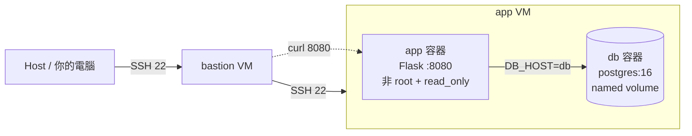

# 期末實作

## 目標

1. 在期中留下的「bastion → app」底座上，部署一個 app + db 的雙服務 stack，全程用宣告式 `compose.yaml` 管理
2. 自己寫 Dockerfile：依 layer 快取原則排序、跑非 root，並用兩次 build 的對照證明快取真的生效
3. 用 named volume + healthcheck + `condition: service_healthy` 處理資料持久化與啟動順序，用「砍掉重練」實驗證明資料還在
4. 為服務加上四類生產化設定——log rotation、資源上限、權限階梯、健康檢查——並從 `/sys/fs/cgroup/` 讀出對應數值，證明設定確實生效
5. 面對「症狀相似、根因不同」的故障，能把 timeout / connection refused / HTTP 503 三種症狀對應到正確的層，寫出推理鏈
6. 用 README 把整個流程寫成可重現的文件

## 先備知識

- W01–W04（期中已驗）：VM、雙網卡、SSH 金鑰 + ProxyJump、ufw、systemctl / journalctl
- W05：namespace、cgroup v2 控制檔、OOM kill 與 exit code 137
- W06：Dockerfile 指令、layer 快取排序、`CMD` vs `ENTRYPOINT`、`USER`、multi-stage
- W07：compose.yaml、named volume vs bind mount、`depends_on` + `healthcheck`
- W08：log rotation、`mem_limit` / `cpus` / `pids_limit`、權限階梯四階、`docker stats` / `inspect` / `events`

## 問題情境

期中那台 nginx 撐過了主管的週五突襲。這次他的要求升級了：

> 玩具下架。我要一個會連資料庫的 web 服務，跑在期中那台 app 機上。
> 條件：服務自己會回報健康、log 不准吃光硬碟、程式失控不准拖死整台機器、攻擊者打進容器也拿不到 root。
> 資料庫的資料，容器砍掉重建之後必須還在。
> 週五我一樣會隨便弄壞一個東西——而且這次症狀會長得很像，你要分得出來。

你有三小時。

## 架構總覽



| 元件        | 跑在哪   | 設定重點                                                  |
| ----------- | -------- | --------------------------------------------------------- |
| `bastion` | 期中那台 | 不動，只當跳板                                             |
| `app` 容器  | app VM   | 自己 build、非 root、read_only、cap_drop ALL、有 healthcheck |
| `db` 容器   | app VM   | postgres:16、named volume、pg_isready healthcheck           |

---

## 操作參考

### Part A｜底座復用與基準點

1. 確認期中底座還活著：從 Host 一次 `ssh app` 進到 app VM，中間不輸入密碼
2. 確認工具版本：

   ```bash
   docker --version             # >= 20.10
   docker compose version       # v2.x（注意：是 docker compose，不是 docker-compose）
   ```
3. 開始操作前先拍一張 snapshot，命名 `final-baseline`——這是 W01 建立的習慣，後續操作失誤時從這個基準點回復

**交付**：`ssh app` 成功證據 + 版本輸出 + snapshot 截圖

### Part B｜Dockerfile 與快取證據

1. 在 app VM 建 `~/final/app/`，放三個檔案：

   `app.py`（沿用 W07 的 Flask app，兩處修改：**`/` 回應必須含你的學號**；**監聽 8080 而非 80**）：

   ```python
   from flask import Flask
   import os, socket, psycopg2

   app = Flask(__name__)

   def db_conn():
       return psycopg2.connect(
           host=os.environ["DB_HOST"],
           user=os.environ["DB_USER"],
           password=os.environ["DB_PASSWORD"],
           dbname=os.environ["DB_NAME"],
       )

   @app.route("/")
   def hello():
       with db_conn() as conn, conn.cursor() as cur:
           cur.execute("SELECT NOW()")
           now = cur.fetchone()[0]
       return f"<學號> from {socket.gethostname()} | db time = {now}\n"

   @app.route("/healthz")
   def healthz():
       try:
           with db_conn() as conn, conn.cursor() as cur:
               cur.execute("SELECT 1")
           return "ok", 200
       except Exception as e:
           return f"db unreachable: {e}", 503

   if __name__ == "__main__":
       app.run(host="0.0.0.0", port=8080)
   ```

   `requirements.txt`：

   ```
   flask==3.0.3
   psycopg2-binary==2.9.9
   ```

   `Dockerfile`——**自己寫**，要求：
   - 指令順序符合 W06 的快取原則（變動少的放前面）
   - 建立非 root 使用者並以 `USER` 切換
   - `CMD` 用 exec form
2. 加 `.dockerignore`（至少擋掉 `.env`、`__pycache__`）
3. 快取證據：build 兩次，中間只改 `app.py` 一行（例如改回應文字），記錄對照：

   ```bash
   docker build -t final-app .          # 第一次，完整 build
   # 改 app.py 一行
   docker build -t final-app .          # 第二次
   ```

   第二次 build 中，`pip install` 那層應該顯示 `CACHED`。如果它重跑了，表示你的指令順序排錯——這是評分點。

**必答**：為什麼這版 app 改聽 8080 而不是 80？提示：W04 的權限模型 + 你的 `USER` 指令。

**交付**：`Dockerfile`、`.dockerignore`、兩次 build 輸出對照（標出哪些層 `CACHED`）

### Part C｜Compose 化與資料持久化

1. 在 `~/final/` 寫 `compose.yaml`：`app` + `db` 兩個 service，要求：
   - `db` 用 `postgres:16`，資料掛 named volume `db-data`
   - 密碼與 DB 名抽到 `.env`，repo 只放 `.env.example`，`.gitignore` 擋 `.env`
   - `db` 加 healthcheck（`pg_isready`），`app` 的 `depends_on` 用 `condition: service_healthy`

   db 的 healthcheck 參考（注意 `$$`——這是 W07 那個陷阱）：

   ```yaml
   healthcheck:
     test: ["CMD-SHELL", "pg_isready -U postgres -d $${POSTGRES_DB}"]
     interval: 5s
     timeout: 3s
     retries: 10
     start_period: 10s
   ```
2. 啟動並驗證：

   ```bash
   docker compose up -d --build
   docker compose ps        # 兩個 service 都要 Up，db 要 (healthy)
   curl -s http://localhost:8080/        # 看到你的學號 + db time
   ```
3. 資料持久化實驗——往 db 寫一筆**含你學號**的資料：

   ```bash
   docker compose exec db sh -c 'psql -U postgres -d $POSTGRES_DB'
   ```

   進 psql 後：

   ```sql
   CREATE TABLE IF NOT EXISTS exam (note text);
   INSERT INTO exam VALUES ('<你的學號>');
   SELECT * FROM exam;
   ```

   然後做三段對照：

   | 階段 | 命令 | `SELECT * FROM exam` 結果 |
   | ---- | ---- | ------------------------- |
   | 砍容器重建 | `docker compose down && docker compose up -d` | 應該**還在** |
   | 連 volume 一起砍 | `docker compose down -v && docker compose up -d` | 應該**消失** |
   | 重寫 | 再 INSERT 一次 | 重新出現 |

**必答**：`down` 跟 `down -v` 差在哪？named volume 的生命週期跟著誰？

**交付**：`compose.yaml`、`.env.example`、三段對照的 psql 輸出

### Part D｜生產化加固

把 `compose.yaml` 升級成 production-ready。`app` service 要加上全部四類，`db` 至少要有 log rotation 與資源上限：

| 類別 | 設定 | 驗證命令 |
| ---- | ---- | -------- |
| Log rotation | `logging:` 加 `max-size: "10m"` + `max-file: "3"` | `docker inspect` 看 LogConfig |
| 資源上限 | `mem_limit: 256m`、`cpus: "0.5"`、`pids_limit: 200` | `docker stats --no-stream` |
| 權限階梯 | `user: "1000:1000"` 或 Dockerfile `USER`、`read_only: true` + `tmpfs: /tmp`、`cap_drop: [ALL]`、`no-new-privileges:true` | 下方第 2 步 |
| 健康檢查 | `app` 加 `/healthz` 的 healthcheck | `docker compose ps` 顯示 (healthy) |

1. 套用後完整重起，**服務必須仍然能跑**——加固加到服務起不來，不算完成：

   ```bash
   docker compose down
   docker compose up -d --build
   sleep 15
   docker compose ps                      # 兩個都 Up (healthy)
   curl -s http://localhost:8080/healthz  # ok
   ```
2. 權限驗證：

   ```bash
   docker compose exec app sh -c "id; cat /proc/self/status | grep -E 'CapEff|NoNewPrivs'"
   ```

   預期：uid 非 0、`CapEff: 0000000000000000`、`NoNewPrivs: 1`
3. cgroup 取證（連回 W05）——證明 yaml 裡的數字真的寫進了 kernel：

   ```bash
   PID=$(docker inspect --format='{{.State.Pid}}' $(docker compose ps -q app))
   CGPATH=$(cat /proc/$PID/cgroup | head -1 | cut -d: -f3)
   cat /sys/fs/cgroup$CGPATH/memory.max   # 268435456
   cat /sys/fs/cgroup$CGPATH/cpu.max      # 50000 100000
   cat /sys/fs/cgroup$CGPATH/pids.max     # 200
   ```

**必答**：`268435456` 跟 `50000 100000` 各自怎麼對回你 yaml 裡寫的值？

**交付**：最終版 `compose.yaml` + 權限驗證輸出 + cgroup 三個檔案的讀值

### Part E｜故障演練（四選二）

從下表挑兩個故障，每個都要記錄**故障前 / 故障中 / 回復後**三階段證據（命令 + 輸出）。

| 編號 | 故障注入 | 預期你會看到 | 考點 |
| ---- | -------- | ------------ | ---- |
| F1 | `docker compose stop db` | `/healthz` 回 503；約 30 秒內 `docker compose ps` 把 app 標成 (unhealthy)——但 app 容器還是 Up | unhealthy ≠ dead；healthcheck 與相依層 |
| F2 | `docker compose stop app` | `curl :8080` 回 connection refused | 容器層 vs 應用層 |
| F3 | `docker run --rm --memory 128m python:3.12-slim python -c "x = bytearray(256 * 1024 * 1024)"; echo "exit code = $?"` | `exit code = 137`；`sudo dmesg -T` 看到 `Memory cgroup out of memory` | cgroup OOM；128 + 9 = 137 |
| F4 | 把 db healthcheck 的 `$${POSTGRES_DB}` 改成單一 `$` 後 `down` + `up -d` | compose 警告 `POSTGRES_DB variable is not set`；db 持續標示 (unhealthy)，app 停在 Created，compose 回報 `dependency failed to start` | healthcheck 寫錯 vs 服務真的故障 |

**關鍵寫作要求**（不管你選哪兩個，README 必答）：

> 期中你分辨過「timeout vs connection refused」。現在加上第三種：「HTTP 503」。
> 三種症狀各自指向哪一層？給一張表：症狀 → 最可能的層 → 第一條驗證命令。

提示可用的工具：`curl -v`、`docker compose ps`、`docker compose logs`、`docker inspect`、`ss -tlnp`、`sudo dmesg -T`，但要說明**推理鏈**，不是貼命令。

---

## Checkpoint

在繳交前檢查：

- [ ] `ssh app`（從 Host）一次成功，snapshot `final-baseline` 存在
- [ ] 第二次 build 的 `pip install` 層是 `CACHED`，且能解釋為什麼
- [ ] `docker compose ps` 兩個 service 都 Up (healthy)
- [ ] 含學號的資料列在 `down` + `up` 後仍存在，且能解釋 `down -v` 為什麼會刪除該筆資料
- [ ] `id` 非 root、`CapEff` 全零、`NoNewPrivs: 1`、cgroup 三檔讀值與 yaml 對得上
- [ ] 兩次故障都有三階段對照證據
- [ ] README 有「timeout / refused / 503」三症狀分層表
- [ ] 反思 200 字寫完

## 交付清單

```
final_<學號>/
├── README.md
├── compose.yaml
├── .env.example               # 不要交 .env！
├── .gitignore
├── app/
│   ├── Dockerfile
│   ├── .dockerignore
│   ├── app.py
│   └── requirements.txt
└── screenshots/
    ├── ssh-and-versions.png
    ├── build-cache-diff.png
    ├── volume-3-stages.png
    ├── hardening-verify.png
    ├── fault-A-before.png
    ├── fault-A-during.png
    ├── fault-A-after.png
    ├── fault-B-before.png
    ├── fault-B-during.png
    └── fault-B-after.png
```

## README 繳交模板

```markdown
# 期末實作 — <學號> <姓名>

## 1. 架構總覽
<Mermaid 圖 + 一段話說明>

## 2. Part A：底座與基準點
<ssh 證據 + 版本 + snapshot>

## 3. Part B：Dockerfile 與快取
<Dockerfile + 兩次 build 對照>
### 為什麼聽 8080 不聽 80？

## 4. Part C：Compose 與資料持久化
<compose.yaml 重點 + 三段對照>
### down vs down -v

## 5. Part D：生產化加固
<權限驗證輸出 + cgroup 讀值對照表>
### yaml 的值怎麼對回 cgroup 檔案？

## 6. Part E：故障演練
### 故障 1：<F1–F4 擇一>
- 注入方式：
- 故障前：
- 故障中：
- 回復後：
- 診斷推論：

### 故障 2：<另一個>
（同上）

### 三症狀分層表（必答）
| 症狀 | 最可能的層 | 第一條驗證命令 |
| ---- | ---------- | -------------- |
| timeout |  |  |
| connection refused |  |  |
| HTTP 503 |  |  |

## 7. 反思（200 字）
這學期從 VM 做到 production-ready 容器，「隔離」這個概念在 VM、namespace、
cgroup、權限階梯四個地方各出現一次——它們在防的東西一樣嗎？

## 8. Bonus（選做）
```

## 評分（100 分 + 最多 15 分加分）

| 項目                                          | 分數 |
| --------------------------------------------- | ---: |
| Part A 底座復用與基準點                       |   10 |
| Part B Dockerfile 排序、非 root、快取證據     |   15 |
| Part C Compose、healthcheck、資料持久化實驗   |   20 |
| Part D 四類加固齊全且服務仍健康、cgroup 取證  |   25 |
| Part E 兩次故障三階段完整性 + 三症狀分層表    |   20 |
| README 結構與反思                             |   10 |
| **Bonus 1** Multi-stage 瘦身            |  +10 |
| **Bonus 2** Namespace 取證              |   +5 |

## Bonus 1｜Multi-stage 瘦身

把 Part B 的 Dockerfile 改成 multi-stage（W06 步驟 22 的做法）：builder stage 裝依賴，runtime stage 用 `python:3.12-slim` 只 `COPY --from=builder` 搬產物。

```bash
docker build -t final-app:multi .
docker images | grep final-app
```

**交付**：multi-stage 版 `Dockerfile`、單階段 vs 多階段的 SIZE 對照、一段話解釋 builder 層去了哪裡（提示：`docker images -a` 還找得到它們）。服務要能用新 image 正常起來。

## Bonus 2｜Namespace 取證

證明 app 與 db 兩個容器活在不同的 namespace 裡：

```bash
PID_APP=$(docker inspect --format='{{.State.Pid}}' $(docker compose ps -q app))
PID_DB=$(docker inspect --format='{{.State.Pid}}' $(docker compose ps -q db))
sudo ls -l /proc/$PID_APP/ns/ /proc/$PID_DB/ns/
```

**交付**：兩組 ns 連結的截圖，指出哪些 namespace 編號不同（至少 pid、net、mnt），加一句話：這跟 W05 講的「容器不是輕量 VM」有什麼關係？

## 常見錯誤與診斷

| 症狀 | 可能原因 | 下一步 |
| ---- | -------- | ------ |
| 第二次 build `pip install` 還是重跑 | `COPY . .` 放在 `RUN pip install` 之前——改一行 app.py 就讓快取從 COPY 那層全斷 | 把 `COPY requirements.txt .` + `RUN pip install` 移到 `COPY . .` 前面 |
| `read_only: true` 之後 app 起不來 | app 需要寫暫存檔，唯讀 rootfs 回 errno 30 | 加 `tmpfs: - /tmp`，用 `docker compose logs app` 確認是哪個路徑寫入失敗 |
| app 啟動後立即結束，log 顯示無法綁定 port | 非 root + `cap_drop: [ALL]` 無法綁定 1024 以下的 port | 改聽 8080（這就是 Part B 那題必答的答案） |
| db 持續 (unhealthy)，但手動 `psql` 可以連線 | healthcheck 裡的變數寫 `${...}`，被 Compose 在 host 端先展開了 | 改 `$${...}`，讓變數留到容器內展開 |
| 想用「改錯 `-U` 使用者」製造 unhealthy，db 卻還是 healthy | `pg_isready` 只檢查 server 是否接受連線，**不驗證身分**——使用者名稱錯了它照樣回傳 0 | 想讓 healthcheck 失敗，要從「連得上 / 連不上」下手，不是帳號密碼 |
| `docker compose up` 報 dependency failed | `condition: service_healthy` 等不到 db healthy | 先 `docker compose ps` 看 db 狀態，再 `docker inspect` 看 Health.Log 最後幾筆 |
| `curl :8080` connection refused，但 `docker compose ps` 顯示 Up | 容器在跑不代表應用程式在監聽——可能 app crash 後被 restart 拉起又再次結束 | `docker compose logs app` + 觀察 restart 次數 |
| OOM 實驗 exit code 不是 137 | 用了 stress-ng 之類有 supervisor 的工具，worker 被殺 parent 還活著 | 照 F3 用單程序（Python bytearray）當 PID 1 |
