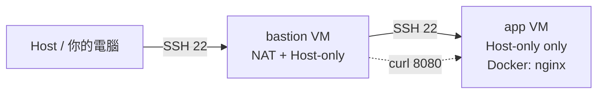

# 期中實作

## 目標

1. 從既有 VM 複製 / snapshot 出兩台角色不同的機器，並配對應的網卡模式
2. 用 SSH 金鑰 + ufw + ProxyJump 搭出「跳板 → 應用」的最小暴露架構
3. 在應用機跑一個 Docker 容器服務，並從跳板端驗證可達
4. 面對「症狀相似、根因不同」的故障，能用分層診斷把問題定位到網路層 / 防火牆 / 服務層
5. 用 README 把整個流程寫成可重現的文件

## 先備知識

- W01：VM 建置、snapshot、Docker 安裝
- W02：NAT / Host-only 雙網卡、L2→L3→L4 排錯
- W03：SSH 金鑰、ufw、ProxyJump、timeout vs refused
- W04：systemctl / journalctl、service vs process
- W05–W06（選做加分）：cgroup 限制、Dockerfile

## 問題情境

你被丟進一個新團隊，主管說：

> 我要一個簡單的內網服務：一台跳板機對外收 SSH，一台應用機只跑 nginx，對外什麼都不開。
> 週五我會隨便關掉一個東西，你要能當場診斷出是什麼壞了、為什麼壞、怎麼修。

你有兩小時。

## 架構總覽



| VM          | 網卡            | 對外           | 對內           | 角色     |
| ----------- | --------------- | -------------- | -------------- | -------- |
| `bastion` | NAT + Host-only | 收 Host 的 SSH | 轉送到 `app` | 唯一入口 |
| `app`     | Host-only only  | 無             | 跑 nginx 容器  | 實際服務 |

---

## 操作參考

### Part A｜VM 與網路

1. 從 W01/W02 留下的 Ubuntu VM clone 或 full snapshot 出兩台，分別命名 `bastion` 與 `app`
2. `bastion` 加兩張網卡：`NAT` + `Host-only`
3. `app` 只留一張網卡：`Host-only`
4. 兩台開機，記錄 IP：

   ```bash
   ip -4 addr show
   ```
5. 從 `app` ping `bastion` 的 Host-only IP，從 `bastion` ping `app`，兩端都要通

**交付**：IP 表 + Mermaid 或截圖的網路拓樸

### Part B｜金鑰、防火牆、ProxyJump

1. 在 Host 生 SSH 金鑰（若還沒有）：
   ```bash
   ssh-keygen -t ed25519
   ```
2. 用 `ssh-copy-id` 分別佈到 `bastion` 跟 `app`，然後把兩台的 `PasswordAuthentication no` 關掉並重啟 sshd
3. ufw：
   - `bastion`：只放行 22/tcp
     ```bash
     sudo ufw default deny incoming
     sudo ufw allow 22/tcp
     sudo ufw enable
     ```
   - `app`：只放行「來自 bastion Host-only IP」的 22/tcp
     ```bash
     sudo ufw default deny incoming
     sudo ufw allow from <BASTION_HOSTONLY_IP> to any port 22 proto tcp
     sudo ufw enable
     ```
4. 在 Host 的 `~/.ssh/config` 加：
   ```
   Host bastion
       HostName <BASTION_NAT_IP>
       User <你的帳號>
   Host app
       HostName <APP_HOSTONLY_IP>
       User <你的帳號>
       ProxyJump bastion
   ```
5. 驗證：`ssh app` 應該直接進到 app VM

**交付**：防火牆規則表 + `ssh app` 成功截圖

### Part C｜在 app 上跑容器服務

1. 在 `app` 安裝 Docker（照 W01 流程）
2. 確認 daemon 活著：

   ```bash
   systemctl status docker
   ```
3. 跑 nginx：

   ```bash
   docker run -d --name web -p 8080:80 nginx
   ```
4. 從 `bastion` 測試：

   ```bash
   curl -I http://<APP_HOSTONLY_IP>:8080
   ```

   應該拿到 `HTTP/1.1 200 OK`

> 注意：`app` 的 ufw 預設擋了 8080，這裡**故意不開**——只從 bastion 用 curl 測試 Host-only 網段內部流量即可；若你擋到連 bastion→app:8080 都不通，請思考 ufw 規則要怎麼補（這也是評分點）。

**交付**：`systemctl status docker` 與 `curl` 輸出

### Part D｜故障演練（三選二）

從下表挑兩個故障，每個都要記錄**故障前 / 故障中 / 回復後**三階段證據（命令 + 輸出）。

| 編號 | 故障注入                                                   | 預期你會看到                                                          | 考點               |
| ---- | ---------------------------------------------------------- | --------------------------------------------------------------------- | ------------------ |
| F1   | `app`：`sudo ip link set <host-only if> down`          | `ssh app` timeout                                                   | L2/L3              |
| F2   | `app`：`sudo ufw default deny incoming` 並刪除 22 規則 | `ssh app` 也是 timeout                                              | 防火牆 vs 網路層   |
| F3   | `app`：`sudo systemctl stop docker`                    | 還能 SSH，但 `docker ps` 回 `Cannot connect to the Docker daemon` | service vs process |

**關鍵寫作要求**：如果你選了 F1 + F2，README 必須回答——

> 兩個故障在 Host 端看到的症狀都是「ssh timeout」，你怎麼判斷是介面掛了還是防火牆把你擋了？

提示可用的工具：`ping`、`ss -tlnp`、`ip link`、`sudo ufw status`，但要說明**推理鏈**，不是貼命令。

---

## Checkpoint

在繳交前檢查：

- [ ] `ssh app`（從 Host）一次成功，中間不用輸入密碼
- [ ] `curl http://app:8080`（從 bastion）回 200
- [ ] 兩次故障都有三階段對照證據
- [ ] README 有回答「症狀相似怎麼分辨」那題
- [ ] 反思 200 字寫完

## 交付清單

```
midterm_<學號>/
├── README.md
├── network-diagram.png        # 或直接用 Mermaid 寫在 README 裡
├── screenshots/
│   ├── ssh-proxyjump.png
│   ├── docker-running.png
│   ├── fault-A-before.png
│   ├── fault-A-during.png
│   ├── fault-A-after.png
│   ├── fault-B-before.png
│   ├── fault-B-during.png
│   └── fault-B-after.png
├── Dockerfile                 # Bonus 1 才需要
└── index.html                 # Bonus 1 才需要
```

## README 繳交模板

```markdown
# 期中實作 — <學號> <姓名>

## 1. 架構與 IP 表
<Mermaid 圖 + 表格>

## 2. Part A：VM 與網路
<命令 + 關鍵輸出>

## 3. Part B：金鑰、ufw、ProxyJump
<防火牆規則表 + ssh app 成功證據>

## 4. Part C：Docker 服務
<systemctl status docker + curl 輸出>

## 5. Part D：故障演練
### 故障 1：<F1/F2/F3 擇一>
- 注入方式：
- 故障前：
- 故障中：
- 回復後：
- 診斷推論：

### 故障 2：<另一個>
（同上）

### 症狀辨識（若選 F1+F2 必答）
兩個都 timeout，我怎麼分？

## 6. 反思（200 字）
這次做完，對「分層隔離」或「timeout 不等於壞了」的理解有什麼改變？

## 7. Bonus（選做）
```

## 評分（100 分 + 最多 15 分加分）

| 項目                                  | 分數 |
| ------------------------------------- | ---: |
| Part A 網路配置正確                   |   20 |
| Part B 金鑰 + ufw + ProxyJump         |   25 |
| Part C Docker 服務可達                |   15 |
| Part D 兩次故障三階段完整性與診斷推理 |   25 |
| README 結構與反思                     |   15 |
| **Bonus 1** Dockerfile 優化     |  +10 |
| **Bonus 2** Cgroup 限制觀察     |   +5 |

## Bonus 1｜Dockerfile 優化

在 `app` 上建一個資料夾，放 `Dockerfile` 和 `index.html`（內容含你的**學號**），取代直接跑 `nginx`：

```dockerfile
FROM nginx:alpine
COPY index.html /usr/share/nginx/html/index.html
EXPOSE 80
```

加上 `.dockerignore`，然後：

```bash
docker build -t midterm-web .
docker run -d --name web2 -p 8081:80 midterm-web
docker history midterm-web
```

**交付**：`Dockerfile`、`.dockerignore`、`docker history` 輸出、從 bastion `curl http://<APP>:8081` 看到你學號的證據。在 README 說明每一層做什麼、為什麼 `COPY index.html` 要放在 `FROM` 後面（快取考量）。

## Bonus 2｜Cgroup 限制觀察

```bash
docker run -d --name limited --memory=64m nginx
docker inspect limited | grep -i -E 'memory|cgroup'
# 找到這個容器的 cgroup 路徑後
cat /sys/fs/cgroup/.../memory.max   # 或 memory.limit_in_bytes
```

**交付**：限制值截圖 + 一句話說明「64m 在 cgroup 裡是多少 bytes」。

## 常見錯誤與診斷

| 症狀                                                     | 可能原因                                           | 下一步                                                      |
| -------------------------------------------------------- | -------------------------------------------------- | ----------------------------------------------------------- |
| `ssh app` timeout                                      | F1 介面 down / F2 防火牆 deny / 路由錯             | 先 `ping`，不通就是網路層；通但 ssh 不行就是防火牆或 sshd |
| `ssh app` connection refused                           | sshd 沒跑，或 bastion 能到但 app 沒開 22           | `ss -tlnp \| grep 22` on app                               |
| `curl` 回 `Connection refused`                       | 容器沒跑 / port 沒 publish                         | `docker ps`、`docker logs web`                          |
| `docker ps` 回 `Cannot connect to the Docker daemon` | daemon 停了或 socket 權限壞掉（W04）               | `systemctl status docker` + `journalctl -u docker`      |
| `ssh -J` 卡住                                          | bastion ssh config 沒寫對 / bastion 不能 reach app | 先手動 `ssh bastion` 再從 bastion 手動 `ssh app` 拆段測 |
