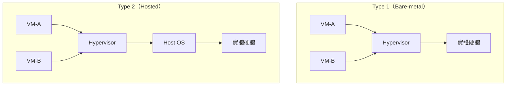
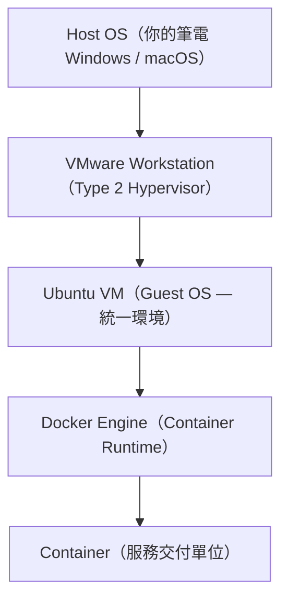
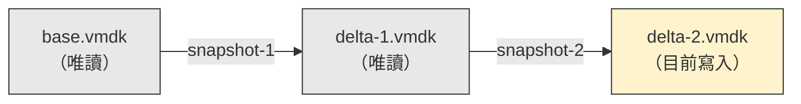
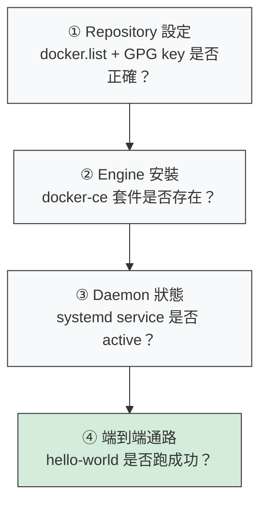

# W01｜虛擬化概論、環境建置與 Snapshot 機制

## 學習目標

1. 說明虛擬化的核心價值，區分 Type 1 / Type 2 Hypervisor 的架構與適用場景。
2. 以多維度對照 VM 與 Container 的差異，解釋本課為何採用「VM 內跑 Docker」路線。
3. 說明 vCPU 時間分片、記憶體分配、磁碟 provisioning 的運作原理。
4. 說明 snapshot 的技術機制與邊界，完成一次故障注入與回復演練。
5. 在 VMware 建立 Ubuntu VM，完成 Docker 安裝與四層驗證，並留下可重現交付。

## 先備知識

- 已在 Host OS 完成 VMware Workstation Pro 安裝並可正常啟動
  - 若尚未安裝，請先參閱 [VMware Workstation Pro 安裝補充指南](./vmware-workstation-pro-installation-supplement.zh-TW.md)（含 Windows/Linux 主機安裝流程與 Mac 替代路徑）
- 能操作 Linux 終端機，輸入命令並觀察輸出。
- 已建立本學期工作資料夾（建議 `~/virt-container-labs/`）以集中彙整作業。

## 問題情境

開學第一週最常見的失敗不是「不會打指令」，而是每組環境不一致，導致助教無法重跑你交的結果。更常見的後續問題是「改壞了不知道哪裡壞」，最後整台重灌。

本週要完成兩件事：把你的電腦變成可驗收的共同基礎（VM + Docker），然後學會用 snapshot 保護這個底座，讓你之後可以安心實驗。

---

## 核心概念

### 一、虛擬化原理與 Hypervisor

#### 什麼是虛擬化？

虛擬化（Virtualization）是在一台實體機上模擬出多個獨立運算環境的技術。核心價值有兩個：

- **隔離（Isolation）：** 每個虛擬環境互不干擾。一個 VM 裡的操作不會影響另一個 VM，也不會弄壞你的 Host OS。最壞的情況就是刪掉 VM 重來。
- **可重現（Reproducibility）：** 相同的 VM 設定可以產出相同的環境。你在家做好的東西，助教可以在自己的電腦上重跑、驗證。

在教學場景中，虛擬化讓全班用同一套環境上課，不因個人電腦的作業系統、已安裝軟體、版本差異而產生「只有我跑不過」的問題。

#### Hypervisor 的兩種類型

Hypervisor 是負責建立和管理虛擬機的軟體，依照安裝位置分成兩類：

**Type 1（Bare-metal Hypervisor）**

- 直接安裝在實體硬體上，不需要先有作業系統。
- 範例：VMware ESXi、Microsoft Hyper-V Server、Xen。
- 特性：效能高、延遲低，VM 透過 Hypervisor 直接與硬體溝通。
- 適用場景：企業資料中心、雲端基礎設施（AWS EC2 底層就是 Type 1）。

**Type 2（Hosted Hypervisor）**

- 安裝在現有作業系統之上，像一般應用程式一樣執行。
- 範例：VMware Workstation、VirtualBox、Parallels、VMware Fusion。
- 特性：方便安裝在個人電腦，但多一層 Host OS，效能略低。
- 適用場景：個人開發、教學、本機測試。

**本課選擇 Type 2（VMware Workstation）的理由：** 學生可以在自己的筆電上安裝，不需要專用伺服器硬體。教學環境只需要「一致」和「可回復」，不需要資料中心等級的效能。



> Type 1 少一層 OS，效能更好；Type 2 多一層 Host OS，但安裝方便，適合教學。

---

### 二、VM vs Container

VM 和 Container 都提供「隔離的執行環境」，但隔離的層級完全不同：

- **VM 虛擬的是「硬體」：** 每台 VM 包含自己的 Guest OS（完整核心 + 系統工具），隔離很完整，但啟動慢、資源佔用大。
- **Container 虛擬的是「OS 資源」：** 所有容器共用 Host 的 kernel，只隔離程序看到的檔案系統、網路、PID 等，啟動快、資源省，但隔離邊界取決於 kernel。

| 維度     | 虛擬機器（VM）                       | 容器（Container）                       |
| -------- | ------------------------------------ | --------------------------------------- |
| 隔離層   | 完整 Guest OS + Hypervisor           | 共用 Host OS kernel                     |
| 啟動速度 | 數分鐘（要開整個 OS）                | 數秒（只啟動程序）                      |
| 資源佔用 | 重（每台需獨立 OS，通常 1+ GB）      | 輕（單機可跑數百個，MB 等級）           |
| 封裝內容 | 完整 OS + 應用程式 + 設定            | 應用程式 + 函式庫 + 相依項              |
| 映像大小 | 數 GB                                | 數十 MB ~ 數百 MB                       |
| 核心技術 | Hypervisor（VMware / KVM / Hyper-V） | Container Engine（Docker / containerd） |
| 回復方式 | Snapshot 還原                        | 重新拉取映像 / 重新部署                 |

#### 為什麼「VM 裡跑 Docker」？

本課的技術堆疊：



兩層各有職責，不能混用：

- **VM 是「環境邊界」：** 統一每個人的底層 OS（Ubuntu 24.04），消除 Windows / macOS / Linux 之間的差異。出問題可以用 snapshot 整台回復。
- **Container 是「服務交付邊界」：** 在統一的底座上，用 Docker 交付可重現的應用程式環境。映像壞了刪掉重拉，不影響 VM。

**如果直接在 Host OS 跑 Docker 會怎樣？**

- Windows 需要 WSL2 或 Docker Desktop，版本與設定差異大，排錯成本高。
- macOS 的 Docker Desktop 跑在隱藏 VM 裡（LinuxKit），行為與原生 Linux Docker 不完全一致。
- 先統一到 VM 裡的 Ubuntu 再裝 Docker，是性價比最高的做法。

---

### 三、VM 資源配置原理

#### vCPU — 不是切一顆 CPU 出來，是排班表

當你在 VMware 設定 2 vCPU，Hypervisor 並不是把實體 CPU「切」兩塊給 VM。實際運作是**時間分片（time-slicing）**：

- Hypervisor 維護一張排班表（scheduler），輪流讓每個 VM 使用實體 CPU 的時間片段。
- 當 VM-A 的時間片段用完，Hypervisor 會暫停 VM-A、切換到 VM-B（context switch）。
- 從 VM 內部看，它以為自己獨佔 2 顆 CPU；從 Host 看，多個 VM 在共用同一組實體核心。

**過度配置（Overcommit）的問題：**

- 如果你在 4 核心的筆電上開兩台 VM 各設 4 vCPU（共 8 vCPU），就超過了實體核心數。
- Hypervisor 必須更頻繁地切換，每個 VM 拿到的實際 CPU 時間變少，效能下降、延遲增加。
- 建議做法：vCPU 總數不超過實體核心的 50-75%。4 核心筆電開 1 台 VM 建議設 2 vCPU。

#### 記憶體 — 預留、共享與不足的徵兆

VM 的記憶體來自 Host RAM，由 Hypervisor 管理分配：

- **靜態預留（Reservation）：** VM 開機時，Hypervisor 從 Host RAM 直接扣掉對應容量。4 GB VM = Host 少 4 GB。最穩定但最浪費。
- **動態調整（Ballooning）：** Hypervisor 在 VM 內安裝一個「氣球驅動」（balloon driver），需要回收記憶體時，氣球膨脹佔用 VM 內記憶體，VM 的 Guest OS 被迫把頁面換出到 swap。VM 不會知道是 Hypervisor 要求的。
- **換頁到磁碟（Swapping）：** 最後手段——Hypervisor 把 VM 的記憶體頁面寫到 Host 磁碟上的 `.vswp` 檔案。效能極差，通常代表 Host 記憶體嚴重不足。

**記憶體不足的徵兆（在 VM 內觀察）：**

- `free -h` 顯示 `available` 很低、`Swap` 大量使用。
- 系統回應遲鈍，命令執行有明顯延遲。
- `dmesg | grep -i oom` 出現 OOM（Out of Memory）killer 紀錄。

建議做法：單 VM 設 4 GB，Host 至少保留 4 GB 給自己。同時跑兩台 VM 的話，Host 建議 16 GB 以上。

#### 磁碟 — Thick vs Thin

VM 的虛擬磁碟是 Host 上的一個或多個 `.vmdk` 檔案：

- **Thick Provisioning（厚配置）：** 建立 VM 時立即在 Host 磁碟上分配完整空間（40 GB VM → Host 立刻少 40 GB）。效能穩定，但即使 VM 只用了 5 GB，Host 也佔了 40 GB。
- **Thin Provisioning（薄配置）：** VM 初始只佔用實際使用的空間，隨著寫入資料才逐漸成長。節省初期空間，但如果 Host 磁碟滿了，VM 會直接凍結。

---

### 四、Snapshot 機制

#### Snapshot 的技術本質

Snapshot 凍結的是某一時刻的**磁碟狀態**（透過差異磁碟）和可選的**記憶體狀態**（寫入 `.vmem` 檔）。它不是把整台 VM 複製一份——它只記錄「從這個時間點開始的變更」。

每建一個 snapshot，VMware 會建立一個**差異磁碟（delta disk）**。之後所有寫入都寫到差異磁碟，原始磁碟變成唯讀。



> snapshot 越多，差異磁碟鏈越長，每次讀取都要沿著鏈往回找，磁碟 I/O 效能下降。這就是為什麼 snapshot 不能無限制累積。

#### Snapshot 不等於備份

| 面向     | Snapshot（還原點）    | Backup（備份）  |
| -------- | --------------------- | --------------- |
| 目的     | 快速回到已知狀態      | 長期資料保存    |
| 儲存位置 | 與 VM 同一磁碟        | 異地 / 外部儲存 |
| 磁碟壞了 | Snapshot 也沒了       | 備份還在        |
| 效能影響 | 累積越多越慢          | 無持續影響      |
| 保留時間 | 短期（建議 3 個以內） | 長期            |

Snapshot 的邊界（不保護的東西）：不保護 Host 端的檔案、不跨 VM 同步、不保護 VM 被刪除的情況。

#### 回復策略三要素

**命名規範（帶語意）：** `clean-baseline`（OS 健康 + Docker 安裝前）、`docker-ready`（Docker 驗證通過）。壞名稱如 `snap1`、`snap2`，時間久了完全無法判斷能不能安全回復。

**保留上限：** 建議最多 3 個活躍 snapshot。差異磁碟鏈過長會拖慢整台 VM。

**回復決策門檻：** 排錯 10 分鐘內找到根因就繼續修。超過 10 分鐘且根因不明就回復 snapshot 再重做。回復後必須重跑同一組驗證命令，不能只說「感覺正常」。

#### 關機回復 vs 熱回復

- **關機回復（Cold Revert）：** 先 `poweroff`，再回復 snapshot。狀態最乾淨，無記憶體態殘留。建議優先使用。
- **熱回復（Live Revert）：** 不關機直接回復。速度快但可能有記憶體狀態不一致的風險。

---

### 五、APT 套件管理的正確順序

Ubuntu 使用 APT（Advanced Package Tool）管理套件。兩個最常用的命令必須按順序執行：

- **`apt update`**：更新「套件索引」（像是目錄），讓系統知道最新有哪些套件、在哪裡下載。這個命令**不安裝任何東西**。
- **`apt upgrade`**：根據索引，把已安裝的套件升級到最新版。

如果跳過 `apt update` 直接 `apt upgrade`，系統會根據過期索引去找套件，可能下載到舊版、找不到新版、甚至版本衝突。這是本課後續每週安裝新工具時的通用原則。

---

### 六、Docker 安裝的四層驗證鏈

安裝 Docker 不是「裝完就好」，你需要驗證四層才算完成：



> 每一層失敗都會阻擋後面的層。排錯時從上往下逐層檢查，不要跳到最底層重裝。

---

## 操作參考

### Part A：環境建置

#### 步驟 0：確認 VMware Workstation Pro 已安裝

- 目的：確保 Host OS 上已有可用的 VMware 環境。
- 操作：若已安裝且可正常啟動，**直接跳到步驟 1**。若尚未安裝，請完成安裝補充指南。Mac 使用者改用 VMware Fusion。
- 預期輸出：可開啟 VMware 並進入 New VM 精靈。

#### 步驟 1：建立 Ubuntu VM（2 vCPU / 4 GB / 40 GB）

- 目的：建立統一實驗環境。
- 操作：在 VMware 建立新 VM，命名 `vct-w01-<學號>`，掛載 Ubuntu Desktop 24.04 ISO。
- 預期輸出：VM 可進入 Ubuntu 安裝流程。
- 失敗時：先檢查 BIOS 虛擬化支援（Intel VT-x / AMD-V）與 ISO 掛載路徑。

#### 步驟 2：完成 Ubuntu 安裝與登入

- 命令：

```bash
whoami
hostnamectl
```

- 預期輸出：正確顯示使用者與主機名稱。

#### 步驟 3：盤點 VM 硬體資源

- 目的：確認 VMware 分配的資源與 VM 內部看到的一致。（對應概念三）
- 命令：

```bash
lscpu | grep -E "^CPU\(s\)|^Model name|^Thread|^Hypervisor"
free -h
df -h /
cat /proc/meminfo | grep -E "MemTotal|MemFree|MemAvailable|SwapTotal"
lsblk
```

- 預期輸出：CPU = 2，`Hypervisor vendor` = VMware，記憶體約 4 GB，磁碟約 40 GB。
- 失敗時：回 VMware VM Settings 確認硬體配置。

<details><summary>free -h 欄位說明</summary>

- `total`：VM 被分配的記憶體總量。
- `available`：系統估計不需要 swap 就能給新程序用的量，比 `free` 更有參考價值。
- `Swap`：如果 `Swap used` > 0 且 `available` 很低，代表記憶體不足。

</details>

#### 步驟 4：檢查網路連線與 DNS

- 命令：

```bash
ip address show
ip route show
ping -c 4 8.8.8.8
ping -c 4 google.com
```

- 預期輸出：有 IP、有預設路由、`ping` 至少各成功 1 次。
- 失敗時的分流判斷：
  - 無 IP → 回 VMware 網卡設定。
  - 有 IP 但 `ping 8.8.8.8` 失敗 → 路由問題。
  - `ping 8.8.8.8` 成功但 `google.com` 失敗 → DNS 問題。

#### 步驟 5：更新套件索引與系統套件

- 目的：（對應概念五：APT 套件管理）
- 命令：

```bash
sudo apt update
sudo apt -y upgrade
```

- 失敗時：鎖檔 → `sudo lsof /var/lib/dpkg/lock-frontend`；來源不可達 → 回步驟 4 查網路。

#### 步驟 6：安裝 Docker 前置套件

- 命令：

```bash
sudo apt -y install ca-certificates curl gnupg
sudo install -m 0755 -d /etc/apt/keyrings
```

#### 步驟 7：加入 Docker GPG key 與 APT source

- 目的：（對應四層驗證 ①）
- 操作：**逐行執行，不要一次貼整段。**
- 命令：

```bash
curl -fsSL https://download.docker.com/linux/ubuntu/gpg \
  | sudo gpg --dearmor -o /etc/apt/keyrings/docker.gpg

sudo chmod a+r /etc/apt/keyrings/docker.gpg

echo \
  "deb [arch=$(dpkg --print-architecture) signed-by=/etc/apt/keyrings/docker.gpg] \
  https://download.docker.com/linux/ubuntu \
  $(. /etc/os-release && echo $VERSION_CODENAME) stable" \
  | sudo tee /etc/apt/sources.list.d/docker.list > /dev/null

sudo apt update
```

- 預期輸出：`apt update` 輸出中可看到 `https://download.docker.com` 來源。
- 失敗時：確認 `docker.gpg` 權限（`ls -la /etc/apt/keyrings/docker.gpg`）與 `docker.list` 內容（`cat /etc/apt/sources.list.d/docker.list`）。

#### 步驟 8：驗證 Repository 設定（四層驗證 ①）

- 命令：

```bash
cat /etc/apt/sources.list.d/docker.list
apt-cache policy docker-ce | head -5
```

- 預期輸出：`docker.list` 內容正確，`docker-ce` 有候選版本。

#### 步驟 9：安裝 Docker Engine（四層驗證 ②）

- 命令：

```bash
sudo apt -y install docker-ce docker-ce-cli containerd.io docker-buildx-plugin docker-compose-plugin
```

#### 步驟 10：驗證 Docker 服務（四層驗證 ③）

- 命令：

```bash
sudo systemctl status docker --no-pager
sudo docker --version
docker compose version
```

- 預期輸出：service 為 `active (running)`，版本資訊可讀。
- 失敗時：`sudo systemctl start docker`，再用 `journalctl -u docker --no-pager -n 20` 看日誌。

#### 步驟 11：執行 hello-world（四層驗證 ④）

- 命令：

```bash
sudo docker run hello-world
```

- 預期輸出：出現 `Hello from Docker!`。

<details><summary>範例輸出（看到此訊息才算成功）</summary>

```
Hello from Docker!
This message shows that your installation appears to be working correctly.

To generate this message, Docker took the following steps:
 1. The Docker client contacted the Docker daemon.
 2. The Docker daemon pulled the "hello-world" image from the Docker Hub.
 3. The Docker daemon created a new container from that image which runs the
    executable that produces the output you are currently reading.
 4. The Docker daemon streamed that output to the Docker client, which sent it
    to your terminal.
```

</details>

#### 步驟 12：觀察容器與映像狀態

- 命令：

```bash
sudo docker ps -a
sudo docker images
```

- 重點：容器是「映像的執行實例」——映像是模板，容器是跑起來的東西。

#### 步驟 13：清理容器、觀察映像生命週期

- 命令：

```bash
sudo docker rm $(sudo docker ps -aq)
sudo docker ps -a          # 容器消失了
sudo docker images          # 但映像還在

sudo docker run --rm hello-world
sudo docker ps -a          # 沒有殘留容器
```

- 重點：映像不會因容器刪除而消失。`--rm` 適合一次性驗證。

#### 步驟 14：拉取更多映像並比較大小

- 目的：觀察不同映像的大小差異。
- 命令：

```bash
sudo docker pull nginx:latest
sudo docker pull alpine:latest
sudo docker images
```

- 重點：alpine 通常只有幾 MB，nginx 數十 MB，hello-world 不到 50 KB。映像大小取決於包了多少東西。

#### 步驟 15：用 nginx 跑一個簡單 web server

- 目的：體驗「拉映像 → 跑容器 → 對外服務」的完整流程。
- 命令：

```bash
# 啟動 nginx，把容器的 80 port 對應到 VM 的 8080 port
sudo docker run -d --name my-nginx -p 8080:80 nginx:latest

# 確認容器正在跑
sudo docker ps

# 用 curl 驗證 web server 可存取
curl http://localhost:8080

# 看 nginx 的日誌
sudo docker logs my-nginx

# 停止並刪除
sudo docker stop my-nginx
sudo docker rm my-nginx
```

- 重點：
  - `-d` 代表背景執行（detach）。
  - `-p 8080:80` 是埠號對應：Host 的 8080 → Container 的 80。
  - `docker logs` 可以看容器內程式的標準輸出。

#### 步驟 16：用 alpine 進入互動式容器

- 目的：進入容器內部操作，理解容器是獨立的檔案系統環境。
- 命令：

```bash
sudo docker run -it --rm alpine /bin/sh

# 在容器內執行：
hostname
cat /etc/os-release
ls /
whoami
exit
```

- 重點：容器內的 hostname、OS、檔案系統都和你的 Ubuntu VM 不同，但共用 VM 的 kernel。

---

### Part A Checkpoint

1. **Checkpoint A1**：VM 可開機，資源盤點與 VMware 設定一致

   - 通過標準：`whoami`、`hostnamectl`、`lscpu`、`free -h` 可正常輸出且數值正確。
   - 未通過：先查虛擬化啟用與 VMware 硬體設定。
2. **Checkpoint A2**：Docker 四層驗證全部通過，容器操作實作完成

   - 通過標準：`hello-world` 成功、nginx 可 `curl`、alpine 可進入互動式 shell。
   - 未通過：四層驗證逐層排查。

---

### Part B：Snapshot 與故障演練

#### 步驟 17：建立 `clean-baseline` snapshot

- 目的：建立第一個可回復基線。**建 snapshot 之前必須先確認環境健康。**
- 前置驗證（全部通過才建點）：

```bash
hostnamectl
ip route
sudo docker --version
docker compose version
sudo systemctl status docker --no-pager
sudo docker run --rm hello-world
```

- 操作：VMware → VM → Snapshot → Take Snapshot，名稱填 `clean-baseline`，描述填建立時間與狀態。
- 預期輸出：Snapshot Manager 可見 `clean-baseline`。

#### 步驟 18：建立 `docker-ready` snapshot

- 前置驗證：

```bash
sudo systemctl status docker --no-pager
sudo docker run --rm hello-world
sudo docker images    # 確認 nginx、alpine 映像都在
```

- 操作：驗證通過後建 snapshot `docker-ready`。

#### 步驟 19：觀察 Snapshot Manager 結構

- 操作：開啟 VMware Snapshot Manager，觀察 snapshot 樹的層級、「You Are Here」標記、各節點的建立時間。
- 在 Host 端觀察虛擬磁碟檔案（路徑因人而異）：

```bash
ls -lh /path/to/your/vm/*.vmdk
```

- 重點：delta vmdk 的出現驗證了概念四說的差異磁碟機制。

#### 步驟 20：故障注入 — 移走 Docker repository

- 目的：建立可觀測、可回復的失敗案例。故障要可控，不做不可逆破壞。
- 命令：

```bash
# 故障前基線
echo "=== 故障前 ==="
ls /etc/apt/sources.list.d/
apt-cache policy docker-ce | head -10

# 注入故障
sudo mv /etc/apt/sources.list.d/docker.list /etc/apt/sources.list.d/docker.list.broken
sudo apt update
```

#### 步驟 21：觀測故障證據

- 命令：

```bash
echo "=== 故障中 ==="
ls /etc/apt/sources.list.d/
apt-cache policy docker-ce | head -10
sudo apt -y install docker-ce 2>&1 | tail -5
```

- 預期輸出：`docker.list` 不見了；`apt-cache policy` 無候選版本；重裝嘗試失敗。

#### 步驟 22：手動修復（體驗修復成本）

- 命令：

```bash
sudo mv /etc/apt/sources.list.d/docker.list.broken /etc/apt/sources.list.d/docker.list
sudo apt update
apt-cache policy docker-ce | head -5
```

- 重點：這次故障簡單，手動修復 30 秒就好。但如果故障更複雜（改壞了多個設定檔、不知道改了什麼），手動修復成本會急劇上升——這時 snapshot 回復更划算。

#### 步驟 23：再次注入故障

- 命令：

```bash
sudo mv /etc/apt/sources.list.d/docker.list /etc/apt/sources.list.d/docker.list.broken
sudo apt update
```

#### 步驟 24：關機回復到 `docker-ready`

- 命令：

```bash
sudo poweroff
```

- 操作：VM 關機後 → Snapshot Manager → 選 `docker-ready` → Revert → 開機。

#### 步驟 25：回復後完整驗證

- 命令：

```bash
echo "=== 回復後 ==="
ls /etc/apt/sources.list.d/
cat /etc/apt/sources.list.d/docker.list
sudo apt update

sudo systemctl status docker --no-pager
sudo docker --version
docker compose version
sudo docker run --rm hello-world
sudo docker images

free -h
df -h /
```

- 預期輸出：所有檢查與步驟 17 的基線一致，nginx 和 alpine 映像也在。
- 重點：「回復不是結束，驗證才是結束。」

#### 步驟 26：回復後再跑 nginx 驗證完整功能

- 命令：

```bash
sudo docker run -d --name test-nginx -p 8080:80 nginx:latest
curl http://localhost:8080
sudo docker stop test-nginx
sudo docker rm test-nginx
```

- 預期輸出：`curl` 回傳 nginx 歡迎頁面，與步驟 15 結果一致。

#### 步驟 27：撰寫 snapshot 保留策略

- 操作：在 README 寫下條件句格式的策略，例如：
  - **新增條件：** 每次安裝新工具或大改設定前，且當前狀態已驗證通過時。
  - **保留上限：** 最多 3 個活躍 snapshot。
  - **刪除條件：** 已有更新節點且舊節點確認不再需要時，刪最舊的。

#### 步驟 28：建立交付資料夾與收斂

- 命令：

```bash
mkdir -p ~/virt-container-labs/w01
cd ~/virt-container-labs/w01
```

---

### Part B Checkpoint

3. **Checkpoint B1**：兩個 snapshot 已建立，故障注入有三階段證據

   - 通過標準：`clean-baseline` 和 `docker-ready` 皆出現在 Snapshot Manager；有故障前、故障中、回復後的命令輸出對照。
4. **Checkpoint B2**：snapshot 回復後完整驗證通過

   - 通過標準：`docker.list` 回來、`hello-world` 成功、nginx 可 `curl`、映像列表與回復前一致。

---

## 交付清單

必交：`w01/README.md` + `w01/vm-vs-container.md`

`README.md` 必須包含：

- VM 規格（CPU / RAM / 磁碟）與 VMware 設定的對照表
- Docker / Compose 版本
- 四層驗證輸出（Repository、Engine、Daemon、hello-world）
- nginx `curl` 輸出 + alpine 互動式容器體驗紀錄
- `clean-baseline`、`docker-ready` 的建立時機與用途
- 故障前 / 故障中 / 回復後三階段對照證據（至少 2 組命令）
- 手動修復 vs snapshot 回復的成本比較（自己的觀察）
- snapshot 保留/刪除策略（條件句格式）
- 至少 1 則排錯紀錄（症狀 → 定位 → 修正 → 驗證）
- 可重跑最小命令鏈：

```bash
ls /etc/apt/sources.list.d/
apt-cache policy docker-ce | head -5
sudo systemctl status docker --no-pager
sudo docker run --rm hello-world
sudo docker images
```

`vm-vs-container.md` 必須包含：

- 至少四個維度的 VM vs Container 對照
- 本課選擇「VM 裡跑 Docker」的理由（用自己的話寫）
- Hypervisor Type 1 vs Type 2 的差異與本課的選擇

---

## README 繳交模板

複製到 `~/virt-container-labs/w01/README.md`，補齊各欄位：

```markdown
# W01｜虛擬化概論、環境建置與 Snapshot 機制

## 環境資訊
- Host OS：（例：Windows 11 / macOS 14）
- VM 名稱：（例：vct-w01-41012345）
- Ubuntu 版本：（貼上 `lsb_release -a` 輸出）
- Docker 版本：（貼上 `sudo docker --version` 輸出）
- Docker Compose 版本：（貼上 `docker compose version` 輸出）

## VM 資源配置驗證

| 項目 | VMware 設定值 | VM 內命令 | VM 內輸出 |
|---|---|---|---|
| CPU | 2 vCPU | `lscpu \| grep "^CPU(s)"` | （填入） |
| 記憶體 | 4 GB | `free -h \| grep Mem` | （填入） |
| 磁碟 | 40 GB | `df -h /` | （填入） |
| Hypervisor | VMware | `lscpu \| grep Hypervisor` | （填入） |

## 四層驗收證據
- [ ] ① Repository：`cat /etc/apt/sources.list.d/docker.list` 輸出
- [ ] ② Engine：`dpkg -l | grep docker-ce` 輸出
- [ ] ③ Daemon：`sudo systemctl status docker` 顯示 active
- [ ] ④ 端到端：`sudo docker run hello-world` 成功輸出
- [ ] Compose：`docker compose version` 可執行

## 容器操作紀錄
- [ ] nginx：`sudo docker run -d -p 8080:80 nginx` + `curl localhost:8080` 輸出
- [ ] alpine：`sudo docker run -it --rm alpine /bin/sh` 內部命令與輸出
- [ ] 映像列表：`sudo docker images` 輸出

## Snapshot 清單

| 名稱 | 建立時機 | 用途說明 | 建立前驗證 |
|---|---|---|---|
| clean-baseline | （時間點） | （此節點代表的狀態） | （列出建點前做了哪些驗證） |
| docker-ready | （時間點） | （此節點代表的狀態） | （列出建點前做了哪些驗證） |

## 故障演練三階段對照

| 項目 | 故障前（基線） | 故障中（注入後） | 回復後 |
|---|---|---|---|
| docker.list 存在 | 是 | 否 | （填入） |
| apt-cache policy 有候選版本 | 是 | 否 | （填入） |
| docker 重裝可行 | 是 | 否 | （填入） |
| hello-world 成功 | 是 | N/A | （填入） |
| nginx curl 成功 | 是 | N/A | （填入） |

## 手動修復 vs Snapshot 回復

| 面向 | 手動修復 | Snapshot 回復 |
|---|---|---|
| 所需時間 | （你的實測） | （你的實測） |
| 適用情境 | （你的判斷） | （你的判斷） |
| 風險 | （你的判斷） | （你的判斷） |

## Snapshot 保留策略
- 新增條件：
- 保留上限：
- 刪除條件：

## 最小可重現命令鏈
（列出讓他人能重現故障注入與回復驗證的命令序列）

## 排錯紀錄
- 症狀：
- 診斷：（你首先查了什麼？）
- 修正：（做了什麼改動？）
- 驗證：（如何確認修正有效？）

## 設計決策
（說明本週至少 1 個技術選擇與取捨）
```

---

## 常見錯誤與診斷

- 錯誤：直接裝 Docker 但未先 `apt update`，造成套件版本衝突。
  診斷：確認 `apt update` 的時間點與輸出。
- 錯誤：GPG key 匯入失敗，`apt update` 出現 `NO_PUBKEY`。
  診斷：重跑 key 匯入命令，確認 `/etc/apt/keyrings/docker.gpg` 存在且權限為 `644`。
- 錯誤：`docker.list` 設好但 `Unable to locate package docker-ce`。
  診斷：`cat /etc/apt/sources.list.d/docker.list` 確認內容正確，特別注意 `VERSION_CODENAME`。
- 錯誤：`docker run` 出現 `permission denied ... docker.sock`。
  診斷：本週先統一用 `sudo docker`，不做 `usermod`（後續週次會講權限原理）。
- 錯誤：`docker run hello-world` 拉取映像逾時。
  診斷：回步驟 4 查網路。`ping 8.8.8.8` 成功但 `google.com` 失敗 → DNS 問題。
- 錯誤：在基線未驗證的情況下就建 snapshot → snapshot 本身就是壞的。
  診斷：步驟 17 的前置驗證未通過時，不要建 snapshot，先修好再建。
- 錯誤：回復後直接宣布成功，不重跑驗證。
  診斷：「感覺正常」不算驗收，必須用同一組命令做前後對照。
- 錯誤：回到錯誤的 snapshot 節點。
  診斷：回復前先在 Snapshot Manager 確認「You Are Here」與目標節點。

### 延伸閱讀

- `[R1]` VMware Workstation Pro 17 官方使用手冊：VM 建立、硬體設定、Snapshot 管理。（[來源連結](https://techdocs2-prod.adobecqms.net/content/dam/broadcom/techdocs/us/en/pdf/vmware/desktop-hypervisors/workstation/vmware-workstation-pro-17-0.pdf)）
- `[R2]` Ubuntu Server 套件管理指南：`apt update/upgrade` 流程與套件索引原理。（[來源連結](https://documentation.ubuntu.com/server/how-to/software/package-management/)）
- `[R3]` Docker Engine 在 Ubuntu 上的官方安裝步驟：GPG key、APT repository 設定。（[來源連結](https://docs.docker.com/engine/install/ubuntu/)）
- `[R4]` Docker 安裝後配置指南：daemon 啟動、非 root 設定、服務管理。（[來源連結](https://docs.docker.com/engine/install/linux-postinstall/)）
- `[R5]` Docker 官方入門指南：容器化概念與 hello-world 流程。（[來源連結](https://docs.docker.com/get-started/)）
- `[R6]` AWS 容器 vs 虛擬機器比較。（[來源連結](https://aws.amazon.com/tw/compare/the-difference-between-containers-and-virtual-machines/)）
- `[R7]` Google Cloud 容器 vs 虛擬機器介紹。（[來源連結](https://cloud.google.com/discover/containers-vs-vms?hl=zh-TW)）
- `[R8]` Linux `free` 命令詳解：MemAvailable 的計算方式。（[來源連結](https://man7.org/linux/man-pages/man1/free.1.html)）
