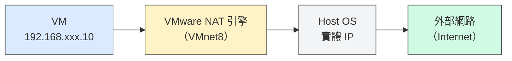
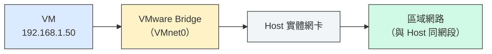
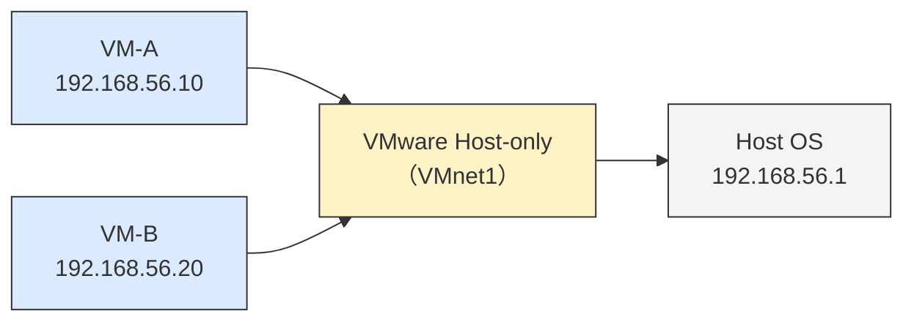
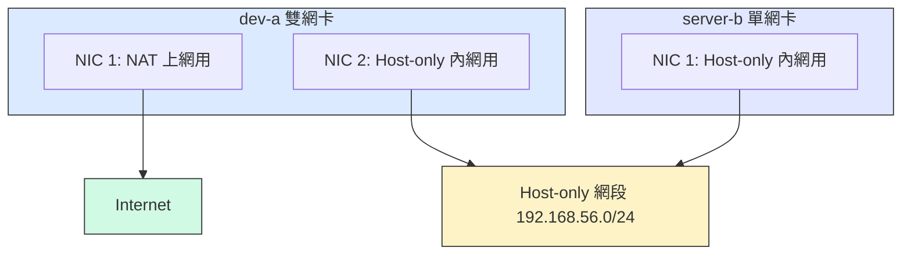

# W02｜VMware 網路模式：NAT / Bridged / Host-only 與雙 VM 排錯

## 學習目標

1. 搞懂 VMware 虛擬網路交換器怎麼運作，分得出 NAT、Bridged、Host-only 三種模式差在哪。
2. 講得出來為什麼兩台 VM 要配雙網卡（NAT 負責外網、Host-only 負責內網），也能畫出對應的網路拓樸。
3. 用 `ip address`、`ip route`、`ping`、`ss`、`ssh`，按 L2→L3→L4 排錯順序抓出連線問題在哪一層。
4. 親手搞壞一次網路再修回來，留下可重現的排錯證據。

## 先備知識

- 已完成 W01 環境建置，Docker 在 VM 內可正常執行，且至少有一個可回復的 snapshot。
- 能使用基本 Linux 網路命令（`ip`、`ping`）。
- 理解 IP 位址與子網路遮罩的基本概念（例如 `192.168.56.0/24` 代表什麼）。

## 問題情境

兩台 VM 都「看起來正常」但就是互連失敗——你可能會問：明明兩台都開著，怎麼就是 ping 不到？通常不是服務壞掉，而是網路模式選錯。本週要建立可控內網：明確區分 NAT 與 Host-only，並用固定排錯順序讓連線問題可定位、可回復。

---

## 核心概念

### 一、虛擬網路到底是什麼

VMware 在 Host 上建立**虛擬交換器（Virtual Switch）**，VM 的虛擬網卡（vNIC）連接到這些交換器，形成不同的網路拓樸。講白了就是一台看不見的 switch——它不是實體設備，而是 VMware 在軟體層模擬出來的。

VMware 預設建立三個虛擬交換器：

| 虛擬交換器 | 對應模式  | 預設網段（可能因環境而異） |
| ---------- | --------- | -------------------------- |
| VMnet8     | NAT       | 192.168.xxx.0/24           |
| VMnet0     | Bridged   | 與 Host 實體網路同網段     |
| VMnet1     | Host-only | 192.168.yyy.0/24           |

### 二、三種網路模式的運作原理

#### NAT（Network Address Translation）



VM 拿到的是私有 IP（例如 192.168.xxx.10），外網看到的來源 IP 是 Host 的實體 IP。VM 可以**主動連出去**（上網、拉套件），但外部無法主動連進 VM。同一 NAT 網段的 VM 之間理論上可互通，但經過 NAT 引擎，行為不如 Host-only 直接。適合 VM 需要上網但不需要被外部存取的場景。

#### Bridged（橋接）



VM 的虛擬網卡直接橋接到 Host 的實體網卡，拿到與 Host **同網段**的 IP。區域網路上的其他裝置可以直接看到 VM，就像它是一台實體機——適合需要讓其他電腦連入的場景。不過要注意：在教室共用網路中使用 Bridged，所有同學的 VM 都在同一網段，可能互相干擾。

#### Host-only（僅主機）



VM 只能與 Host 及同網段的其他 VM 通訊，**無法上網**。因為不受外部 DHCP 影響，IP 配置穩定，很適合做可重現的隔離實驗環境。

#### 三種模式比較

| 面向          | NAT               | Bridged              | Host-only    |
| ------------- | ----------------- | -------------------- | ------------ |
| VM 可上網     | 可以              | 可以                 | 不行         |
| 外部可連入 VM | 不行（預設）      | 可以                 | 不行         |
| VM 之間互通   | 可（但繞 NAT）    | 可（同網段）         | 可（同網段） |
| IP 穩定性     | 中（DHCP 可能變） | 低（受實體網路影響） | 高           |
| 教學適用性    | 適合上網用途      | 需注意網段衝突       | 適合內網實驗 |

### 三、為什麼需要雙網卡設計

單靠一種模式無法同時滿足「上網」和「VM 互連」。想像一下：只用 NAT，VM 之間的互連要繞過 NAT 引擎，不夠直接；只用 Host-only，VM 互通但無法上網裝套件。雙網卡設計（NAT + Host-only）讓 NAT 負責外網、Host-only 負責內網，職責分離，各管各的。



> `dev-a` 有兩張網卡：NAT 讓它能上網裝套件，Host-only 讓它跟 `server-b` 互通。`server-b` 只需要 Host-only，因為它不需要直接上網。

> **想一想**：如果 `dev-a` 只設一張 NAT 網卡，它能跟 `server-b` 互通嗎？為什麼？

### 四、L2 → L3 → L4 排錯分層模型

網路排錯必須**由下往上逐層排除**，不要跳層：

| 層級               | 檢查內容                         | 工具                          | 常見問題               |
| ------------------ | -------------------------------- | ----------------------------- | ---------------------- |
| L2（介面層）       | 介面是否 UP？有沒有拿到 IP？     | `ip address show`           | 介面 DOWN、未配 IP     |
| L3（網路層）       | 路由是否正確？封包能否到達對端？ | `ip route show` → `ping` | 無預設路由、目標不可達 |
| L4+（傳輸/服務層） | 服務是否在監聽？連線是否被拒？   | `ss -tlnp` → `ssh`       | 服務未啟動、防火牆擋住 |

`ping` 成功只代表 L3 可達，不代表服務（如 SSH）一定能連。排錯時先確認介面和路由沒問題，最後才查服務。

---

## 操作參考

### Part A：架兩台 VM、把網卡接好

#### 步驟 1：準備兩台 VM

- 操作：
  - 方案 A（推薦）：複製 W01 的 VM，分別命名為 `dev-a` 和 `server-b`。
  - 方案 B：用 W01 的 VM 當 `dev-a`，另建一台最小安裝的 Ubuntu VM 當 `server-b`。
- 命令（兩台都要做）：

```bash
# 修改 hostname（複製 VM 後 hostname 會重複）
sudo hostnamectl set-hostname dev-a    # 在第一台
sudo hostnamectl set-hostname server-b  # 在第二台

# 驗證
hostnamectl
```

- `hostnamectl` 應分別顯示 `dev-a` 和 `server-b`。

#### 步驟 2：設定 dev-a 雙網卡（NAT + Host-only）

- 操作（VMware GUI）：
  1. VM → Settings → Network Adapter（原有）→ 確認為 NAT。
  2. Add → Network Adapter → 選 Host-only → OK。
- 驗證：

```bash
ip address show
```

- 應看到兩張網卡（例如 `ens33` 和 `ens36`），各自有不同網段的 IP。

#### 步驟 3：設定 server-b 單網卡（Host-only）

- 操作（VMware GUI）：VM → Settings → Network Adapter → 改為 Host-only。
- 驗證：

```bash
ip address show
```

- 應只看到一張網卡，IP 在 Host-only 網段內。

#### 步驟 4：確認 dev-a 的 NAT 介面可上網

- 命令（在 `dev-a` 上執行）：

```bash
# 找出哪張卡是 NAT（通常是原本的那張）
ip address show
ip route show

# 測試外網
ping -c 4 8.8.8.8
ping -c 4 google.com
```

- 應有預設路由指向 NAT 閘道，且 ping 成功。如果不通，確認 NAT 網卡設定正確，用 `ip route` 看有沒有 `default via ...`。

#### 步驟 5：確認 dev-a 和 server-b 的 Host-only IP

- 命令（兩台都執行）：

```bash
ip address show
# 找出 Host-only 介面的 IP，記下來
```

- 兩台 VM 的 Host-only 介面都應有 IP，且在同一網段（例如 `192.168.56.x`）。
- IP 為空 → 檢查 VMware 的 Host-only 網段是否啟用 DHCP。不同網段 → 確認兩台都連到同一個 VMnet1。

#### 步驟 6：雙向互 ping

- 命令：

```bash
# 在 dev-a 上 ping server-b
ping -c 4 <server-b-host-only-ip>

# 在 server-b 上 ping dev-a
ping -c 4 <dev-a-host-only-ip>
```

- 雙向都應成功。單向通 → 檢查對端防火牆（`sudo ufw status`）與介面狀態。雙向不通 → 回步驟 5 確認兩台在同一 Host-only 網段。

#### 步驟 7：在 server-b 裝好 SSH 服務並開起來

有了 SSH，`dev-a` 就能遠端管理 `server-b`。

- 命令（在 `server-b` 上執行）：

```bash
# server-b 如果沒有網路可以先臨時切成 NAT 裝完再切回 Host-only
sudo apt update
sudo apt -y install openssh-server
sudo systemctl status ssh --no-pager
sudo systemctl enable ssh
```

- `ssh` 服務應為 `active (running)`。如果不是，用 `sudo systemctl start ssh` 啟動，再查 `journalctl -u ssh --no-pager -n 10`。

#### 步驟 8：確認 SSH 服務正在監聽

在嘗試連線之前，先確認服務層（L4）已就緒——不要只靠 ping 判斷。

- 命令（在 `server-b` 上執行）：

```bash
ss -tlnp | grep :22
```

- 看到 `0.0.0.0:22` 或 `*:22` 表示 SSH 正在監聽所有介面的 port 22。記住：`ping` 驗證的是 L3 可達性，`ss` 驗證的是 L4 服務就緒，兩者不可互相替代。

#### 步驟 9：從 dev-a SSH 到 server-b

- 命令（在 `dev-a` 上執行）：

```bash
ssh <server-b-user>@<server-b-host-only-ip>

# 進入後驗證你確實在 server-b
hostname
ip address show
exit
```

- 成功登入後 `hostname` 應顯示 `server-b`。
- 失敗時的分層排錯：
  1. `ping` 對端 → 不通 → L3 問題，回步驟 6。
  2. `ping` 通但 SSH 被拒（`Connection refused`） → L4 問題，回步驟 7-8 查 SSH 服務。
  3. `ping` 通且 SSH 回應但認證失敗 → 帳號密碼問題。

#### 步驟 10：從 dev-a 用 SSH 在 server-b 遠端跑命令

SSH 也可以不進入互動 shell，直接在遠端跑命令。

- 命令（在 `dev-a` 上執行）：

```bash
ssh <server-b-user>@<server-b-host-only-ip> "hostname && ip address show && uptime"
```

- 應回傳 `server-b` 的 hostname、網路資訊和系統運行時間。

#### 步驟 11：用 SCP 在兩台 VM 之間傳檔

- 命令（在 `dev-a` 上執行）：

```bash
# 建立一個測試檔案
echo "Hello from dev-a" > /tmp/test-from-dev.txt

# 從 dev-a 傳到 server-b
scp /tmp/test-from-dev.txt <server-b-user>@<server-b-host-only-ip>:/tmp/

# 確認 server-b 收到了
ssh <server-b-user>@<server-b-host-only-ip> "cat /tmp/test-from-dev.txt"
```

- server-b 上應顯示 `Hello from dev-a`。

#### 步驟 12：測試 server-b 不能上網（驗證 Host-only 隔離）

`server-b` 只有 Host-only 網卡，應該無法上網。

- 命令（在 `server-b` 上執行）：

```bash
ping -c 4 8.8.8.8
ip route show
```

- `ping` 應失敗（`Network is unreachable` 或全部 timeout），且沒有指向外網的預設路由。

---

> ✅ **Checkpoint A1** — 雙 VM 網卡配好了
> - `dev-a` 有兩張網卡（NAT + Host-only），`server-b` 有一張（Host-only）
> - 用 `ip address show` 確認

> ✅ **Checkpoint A2** — 連線驗證跑完了
> - `dev-a` 可上網、雙向互 ping 成功、`dev-a` 可 SSH 到 `server-b`、SCP 傳檔成功、`server-b` 無法上網

---

### Part B：故意搞壞網路再修回來

#### 步驟 13：記錄故障前基線

- 命令（在 `server-b` 上執行）：

```bash
echo "=== server-b 故障前基線 ==="
ip address show
ip route show
ss -tlnp | grep :22
```

- 命令（在 `dev-a` 上執行）：

```bash
echo "=== dev-a 到 server-b 故障前 ==="
ping -c 2 <server-b-host-only-ip>
ssh <server-b-user>@<server-b-host-only-ip> "hostname"
```

- 全部應成功。把輸出記錄下來，作為故障後的比對基準。

#### 步驟 14：故障注入 — 停用 server-b 的 Host-only 介面

- 命令（在 `server-b` 上執行）：

```bash
# 先確認 Host-only 介面名稱
ip address show

# 停用介面（把 <hostonly-iface> 換成實際名稱，例如 ens36）
sudo ip link set <hostonly-iface> down

# 觀測故障
ip address show <hostonly-iface>
```

- 介面狀態會從 `UP` 變成 `DOWN`，IP 可能仍在但介面不通。

#### 步驟 15：從 dev-a 觀測故障

- 命令（在 `dev-a` 上執行）：

```bash
echo "=== dev-a 到 server-b 故障中 ==="
ping -c 4 <server-b-host-only-ip>
ssh <server-b-user>@<server-b-host-only-ip> "hostname" 2>&1
```

- `ping` 應失敗（timeout 或 unreachable），SSH 也連不上。注意觀察：一個 L2 層的問題（介面 DOWN）會連帶拖垮 L3 和 L4。如果你由下往上排查，在 L2 就能發現根因。

#### 步驟 16：在 server-b 回復介面

- 命令（在 `server-b` 上執行）：

```bash
sudo ip link set <hostonly-iface> up

# 等幾秒讓 DHCP 重新取得 IP（如果用 DHCP）
sleep 5

# 驗證介面回復
ip address show <hostonly-iface>
```

- 介面狀態應回到 `UP`，IP 重新出現。如果使用 DHCP，回復後 IP 可能會變——先用 `ip address show` 確認新 IP 再繼續。

#### 步驟 17：回復後驗證

- 命令（在 `dev-a` 上執行）：

```bash
echo "=== dev-a 到 server-b 回復後 ==="
ping -c 4 <server-b-host-only-ip>
ssh <server-b-user>@<server-b-host-only-ip> "hostname"
```

- 結果應與步驟 13 的基線一致。

#### 步驟 18：第二次故障注入 — 模擬 SSH 服務停止

這次要製造「ping 通但 SSH 不通」的情境，親身感受 L3 正常但 L4 故障時的差異。

- 命令（在 `server-b` 上執行）：

```bash
# 記錄故障前
echo "=== SSH 故障前 ==="
ss -tlnp | grep :22

# 停止 SSH 服務
sudo systemctl stop ssh

# 觀測
ss -tlnp | grep :22
```

- 停止後 `ss` 應看不到 port 22 的監聽。

#### 步驟 19：從 dev-a 觀測 L3 通但 L4 不通

- 命令（在 `dev-a` 上執行）：

```bash
# L3 — 預期成功
ping -c 2 <server-b-host-only-ip>

# L4 — 預期失敗
ssh <server-b-user>@<server-b-host-only-ip> "hostname" 2>&1
```

- `ping` 應成功，但 SSH 會出現 `Connection refused`。這就是分層排錯的價值所在。

> **想一想**：如果你跳過 L2/L3 直接看 SSH 錯誤訊息，能不能分出「介面 DOWN 導致不通」跟「服務沒開導致被拒」？兩種的修法完全不同，所以排錯一定要從底層開始。

#### 步驟 20：回復 SSH 服務

- 命令（在 `server-b` 上執行）：

```bash
sudo systemctl start ssh
ss -tlnp | grep :22
```

- 命令（在 `dev-a` 上驗證）：

```bash
ssh <server-b-user>@<server-b-host-only-ip> "hostname"
```

- SSH 服務回來後，連線應恢復正常。

#### 步驟 21：畫出你的網路拓樸圖

拓樸圖不只是作業附件——排錯時一張好的拓樸圖能讓你快速定位問題在哪一段。

- 操作：用你習慣的工具（draw.io、手繪掃描、Mermaid）畫出以下資訊：
  - 兩台 VM 的名稱與角色
  - 每張網卡的模式（NAT / Host-only）
  - 每張網卡的 IP 位址
  - 網段標記（例如 192.168.56.0/24）
  - 流量方向（哪些路徑可通、哪些不通）
- 存檔為 `w02/network-diagram.png`（或 `.md` 用 Mermaid）。

#### 步驟 22：建立交付資料夾與收斂

- 命令：

```bash
mkdir -p ~/virt-container-labs/w02
cd ~/virt-container-labs/w02
```

- 操作：整理 `w02/README.md`，確認包含網路配置、連線驗證、兩次故障演練的三階段對照。

---

> ✅ **Checkpoint B1** — 介面故障注入有三階段證據
> - 有故障前基線、故障中（ping/SSH 失敗）、回復後（恢復正常）的命令輸出對照

> ✅ **Checkpoint B2** — SSH 故障注入展示 L3/L4 分層差異
> - ping 通但 SSH 出現 `Connection refused`，且能說出排錯時為什麼要分層

---

## 交付清單

必交：`w02/README.md` + `w02/network-diagram.png`（或 `.md`）

`README.md` 必須包含：

- 雙 VM 網卡配置表（VM 名稱、網卡模式、IP、用途）
- NAT / Bridged / Host-only 三種模式的差異摘要（用自己的話寫）
- 為什麼本週採用 NAT + Host-only 雙網卡設計的理由
- dev-a 上網驗證 + 雙向互 ping + SSH 連線 + SCP 傳檔的輸出
- server-b 不能上網的驗證輸出
- 故障演練一：介面停用（故障前 / 故障中 / 回復後對照）
- 故障演練二：SSH 停止（ping 通但 SSH 不通的證據）
- 排錯順序說明（L2 → L3 → L4）
- 至少 1 則排錯紀錄（症狀 → 定位 → 修正 → 驗證）
- 可重跑最小命令鏈：

```bash
ip address show
ip route show
ping -c 2 <peer-host-only-ip>
ss -tlnp | grep :22
ssh <user>@<peer-host-only-ip> "hostname"
```

`network-diagram.png`（或 `.md`）必須包含：

- 兩台 VM 名稱與角色
- 每張網卡的模式與 IP
- 網段標記
- 流量方向

---

## README 繳交模板

複製到 `~/virt-container-labs/w02/README.md`，補齊各欄位：

```markdown
# W02｜VMware 網路模式與雙 VM 排錯

## 網路配置

| VM | 網卡 | 模式 | IP | 用途 |
|---|---|---|---|---|
| dev-a | NIC 1 | NAT | （填入） | 上網 |
| dev-a | NIC 2 | Host-only | （填入） | 內網互連 |
| server-b | NIC 1 | Host-only | （填入） | 內網互連 |

## 連線驗證紀錄

- [ ] dev-a NAT 可上網：`ping google.com` 輸出
- [ ] 雙向互 ping 成功：貼上雙方 `ping` 輸出
- [ ] SSH 連線成功：`ssh <user>@<ip> "hostname"` 輸出
- [ ] SCP 傳檔成功：`cat /tmp/test-from-dev.txt` 在 server-b 上的輸出
- [ ] server-b 不能上網：`ping 8.8.8.8` 失敗輸出

## 故障演練一：介面停用

| 項目 | 故障前 | 故障中 | 回復後 |
|---|---|---|---|
| server-b 介面狀態 | UP | DOWN | （填入） |
| dev-a ping server-b | 成功 | 失敗 | （填入） |
| dev-a SSH server-b | 成功 | 失敗 | （填入） |

## 故障演練二：SSH 服務停止

| 項目 | 故障前 | 故障中 | 回復後 |
|---|---|---|---|
| ss -tlnp grep :22 | 有監聽 | 無監聽 | （填入） |
| dev-a ping server-b | 成功 | 成功 | （填入） |
| dev-a SSH server-b | 成功 | Connection refused | （填入） |

## 排錯順序
（寫出你的 L2 → L3 → L4 排錯步驟與每層使用的命令）

## 網路拓樸圖
（嵌入或連結 network-diagram.png）

## 排錯紀錄
- 症狀：
- 診斷：（你首先查了什麼？用了哪個命令？）
- 修正：（做了什麼改動？）
- 驗證：（如何確認修正有效？）

## 設計決策
（說明本週至少 1 個技術選擇與取捨，例如：為什麼 server-b 只設 Host-only 不給 NAT？）
```

---

## 常見錯誤與診斷

- 錯誤：新增網卡後 VM 內看不到新介面。
  診斷：重啟 VM 後重新用 `ip address show` 檢查。
- 錯誤：兩台 VM 的 Host-only IP 不在同一網段。
  診斷：確認兩台都接到同一個 VMnet（通常是 VMnet1）。在 VMware → Edit → Virtual Network Editor 中檢查。
- 錯誤：`ping` 成功就認為 SSH 可用，跳過服務層驗證。
  診斷：`ping` 只測 L3，SSH 是 L4。必須用 `ss -tlnp | grep :22` 確認服務在監聽。
- 錯誤：互 ping 單向通、單向不通。
  診斷：檢查不通方向的防火牆（`sudo ufw status`）；如果啟用了 ufw，`sudo ufw allow from 192.168.56.0/24`。
- 錯誤：故障回復後 IP 改變，但還用舊 IP 去 ping/SSH。
  診斷：DHCP 可能重新分配 IP。回復後先 `ip address show` 確認新 IP 再繼續。
- 錯誤：`server-b` 只有 Host-only 但需要裝套件。
  診斷：臨時在 VMware 加一張 NAT 網卡，裝完再移除。或者從 `dev-a` 用 SCP 傳安裝包過去。
- 錯誤：只有結果截圖，缺少排錯過程。
  診斷：README 要寫出你在每一層（L2/L3/L4）做了什麼檢查、看到什麼結果。

### 排查方向

- 由下往上：先看介面（L2），再看路由（L3），最後看服務（L4）。
- 每層用對應工具：L2 用 `ip address`、L3 用 `ip route` + `ping`、L4 用 `ss` + `ssh`。
- 不要跳層：ping 不通就不要急著查 SSH，先從 L2 開始排。
- 改一個變因就驗證一次，不要同時改兩個東西。
- 拓樸圖是排錯利器：畫出來才能快速看出「問題不在服務而在路由」。

---

做完這週，你手上就有一個可控的雙 VM 內網環境，而且知道怎麼用 L2→L3→L4 系統化地抓問題。下週開始在這個基礎上跑服務的時候，網路不通你不會再瞎猜——直接照順序排就對了。

### 延伸閱讀

- `[R1]` VMware Workstation Pro 17 官方使用手冊：NAT/Bridged/Host-only 模式與虛擬網路設定。（[來源連結](https://techdocs2-prod.adobecqms.net/content/dam/broadcom/techdocs/us/en/pdf/vmware/desktop-hypervisors/workstation/vmware-workstation-pro-17-0.pdf)）
- `[R2]` VMware 虛擬網路元件說明：虛擬交換器、NAT 引擎、DHCP。（[來源連結](https://techdocs.broadcom.com/us/en/vmware-cis/desktop-hypervisors/workstation-pro/17-0/using-vmware-workstation-pro/configuring-network-connections/understanding-virtual-networking-components.html)）
- `[R3]` VMware 常見網路配置說明。（[來源連結](https://techdocs.broadcom.com/us/en/vmware-cis/desktop-hypervisors/workstation-pro/17-0/using-vmware-workstation-pro/configuring-network-connections/understanding-common-networking-configurations.html)）
- `[R4]` `ip-address(8)` man page：介面與 IP 檢查。（[來源連結](https://man7.org/linux/man-pages/man8/ip-address.8.html)）
- `[R5]` `ip-route(8)` man page：路由檢查與 default route 判讀。（[來源連結](https://man7.org/linux/man-pages/man8/ip-route.8.html)）
- `[R6]` `ssh(1)` man page：SSH 連線與基本用法。（[來源連結](https://man.openbsd.org/ssh)）
- `[R7]` Ubuntu OpenSSH Server 指南：sshd 安裝與服務管理。（[來源連結](https://documentation.ubuntu.com/server/how-to/security/openssh-server/)）
- `[R8]` Ubuntu 網路設定說明：Netplan 與介面管理。（[來源連結](https://documentation.ubuntu.com/server/explanation/networking/configuring-networks/)）
