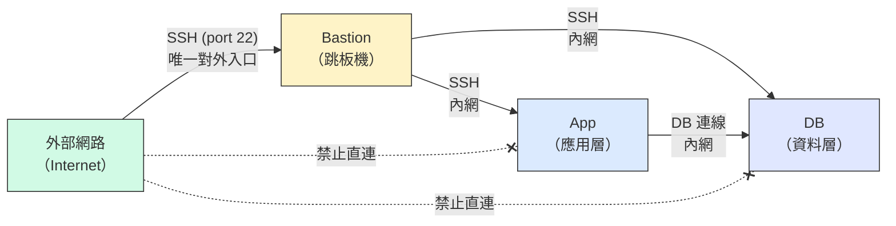
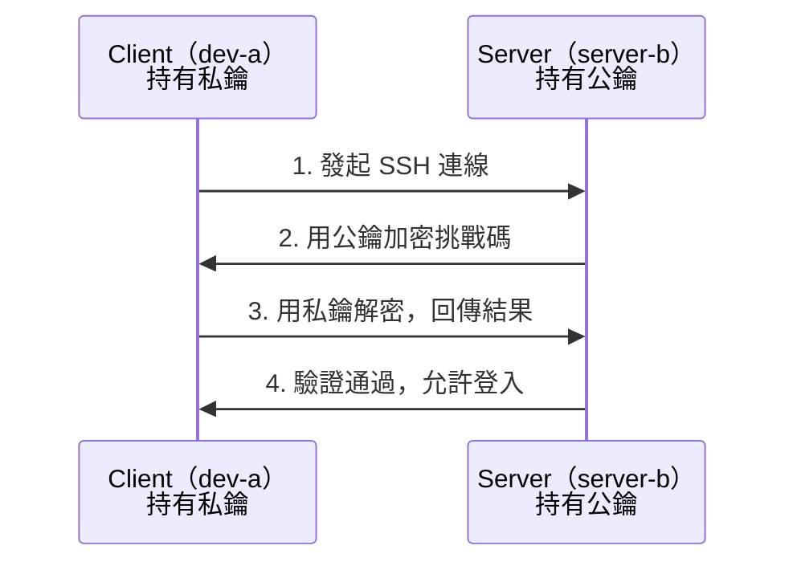
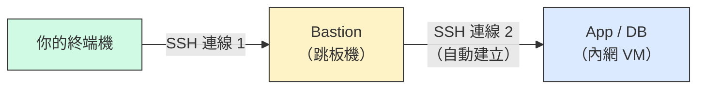

# W03｜多 VM 架構：分層管理、跳板機與最小暴露設計

## 學習目標

1. 說明分層架構（Bastion → App → DB）的安全邏輯與「最小暴露原則」。
2. 解釋 SSH 金鑰認證的運作原理，比較金鑰與密碼認證的安全性差異。
3. 使用 `ufw` 設定防火牆規則，實作「預設拒絕 + 明確允許」的策略。
4. 透過 SSH ProxyJump 完成跳板連線，驗證內網 VM 不需暴露到外網。
5. 完成一次防火牆故障注入與回復，留下可重現的排錯證據。

## 先備知識

- 已完成 W02 雙 VM 網路配置，`dev-a` 可 SSH 到 `server-b`。
- 理解 NAT / Host-only 的用途，能用 L2→L3→L4 排錯順序定位問題。
- 能使用 `ip address`、`ping`、`ssh`、`ss` 等基本網路命令。

## 問題情境

W02 的雙 VM 環境中，所有連線都用密碼認證、沒有防火牆限制。這在教學環境勉強可用，但在真實場景中等於「每台機器都對外開門」。本週要把這個環境升級成分層管理架構：只有跳板機對外，內網機器藏在後面，並用金鑰認證取代密碼。

---

## 核心概念

### 一、分層架構的安全邏輯

在真實的伺服器環境中，不同角色的機器有不同的暴露等級：



**三層模型：**

- **Bastion（跳板機）：** 唯一對外開放 SSH 的入口。所有管理流量都必須先經過 Bastion 才能進入內網。
- **App（應用層）：** 跑應用服務的機器，只接受來自內網的連線。
- **DB（資料層）：** 存放資料的機器，只接受來自 App 的連線。

**最小暴露原則（Principle of Least Exposure）：**

- 每台機器只開放「執行其角色所必須」的埠和連線來源。
- 不需要對外的機器就不對外，減少**攻擊面（attack surface）**。
- 攻擊面的概念：每多開一個埠、每多一台直接對外的機器，攻擊者可嘗試的入口就多一個。

**為什麼不讓每台 VM 都直接對外？**

- 如果 App 和 DB 都開放 SSH 到外網，任何人都可以嘗試暴力破解密碼。
- 集中管理入口到 Bastion 一台，只需要保護好一個點。
- 即使 Bastion 被攻破，App 和 DB 的防火牆還能擋住直接存取。

### 二、SSH 金鑰認證 vs 密碼認證

#### 密碼認證的風險

- 密碼可被暴力破解（brute-force）：攻擊者可以自動嘗試數百萬組密碼。
- 密碼可被側錄（keylogger）或社交工程取得。
- 同一密碼被多處使用時，一處洩漏全部失守。

#### 金鑰認證的原理

SSH 金鑰認證使用**非對稱加密**：產生一對金鑰（公鑰 + 私鑰），公鑰放在伺服器端，私鑰留在你的本機。



**關鍵：認證過程中不傳輸密碼，也不傳輸私鑰。** 即使網路被竊聽，攻擊者也拿不到可以登入的憑證。

#### 金鑰認證的基本流程

1. **產生金鑰對：** `ssh-keygen` 在 Client 端產生公鑰和私鑰。
2. **部署公鑰：** `ssh-copy-id` 把公鑰複製到 Server 的 `~/.ssh/authorized_keys`。
3. **連線驗證：** SSH 自動使用金鑰認證，不再問密碼。

### 三、防火牆基礎概念

#### ufw（Uncomplicated Firewall）

Ubuntu 預設的防火牆工具，底層是 iptables/nftables，但提供簡單的命令介面。

**「先封後開」的邏輯：**

1. 預設拒絕所有進入的連線（`default deny incoming`）。
2. 明確允許需要的埠（`allow 22/tcp`）。
3. 沒有明確允許的全部被擋。

**為什麼「先封後開」比「先開後封」安全？**

- 「先開後封」的風險：你可能漏封某個埠，而那個埠恰好有漏洞。
- 「先封後開」的安全：預設全擋，只有你明確知道需要的才放行。忘記開的最多是服務不通（立刻會發現），不會是被偷偷攻擊。

#### 防火牆規則的範圍控制

不只可以控制「開哪個埠」，還可以控制「從哪裡來的才放行」：

- `ufw allow 22/tcp`：所有來源都可以連 port 22。
- `ufw allow from 192.168.56.0/24 to any port 22`：只有 Host-only 網段的來源可以連 port 22。

後者更安全——即使埠開著，也只有指定網段的機器能連。

### 四、SSH ProxyJump（跳板連線）

SSH ProxyJump 讓你透過 Bastion 跳板連接內網 VM，不需要把內網 VM 暴露到外網。



指令格式：`ssh -J bastion-user@bastion-ip target-user@target-ip`

這條指令做了兩件事：先 SSH 到 Bastion，再透過 Bastion 建立第二條 SSH 到內網目標。你的終端機直接看到內網 VM 的 shell，中間的跳轉是自動完成的。

---

## 操作參考

### Part A：三節點架構建置

#### 步驟 1：準備三台 VM

- 目的：建立 bastion / app / db 三節點架構。
- 操作：
  - 用 W02 的 `dev-a` 改名為 `bastion`（或新建一台）。
  - 用 W02 的 `server-b` 改名為 `app`（或新建）。
  - 再複製或新建一台 `db`。
- 命令（三台都要做）：

```bash
sudo hostnamectl set-hostname bastion   # 第一台
sudo hostnamectl set-hostname app       # 第二台
sudo hostnamectl set-hostname db        # 第三台

# 各自驗證
hostnamectl
```

#### 步驟 2：設定網路架構

- 目的：bastion 雙網卡（NAT + Host-only），app 和 db 只有 Host-only。
- 操作（VMware GUI）：
  - `bastion`：NIC 1 = NAT、NIC 2 = Host-only。
  - `app`：NIC 1 = Host-only。
  - `db`：NIC 1 = Host-only。
- 驗證（三台都執行）：

```bash
ip address show
ip route show
```

- 預期輸出：
  - `bastion` 有兩張卡，一張 NAT IP（可上網）、一張 Host-only IP。
  - `app` 和 `db` 各一張 Host-only IP，在同一網段。

#### 步驟 3：確認 bastion 可上網、三台互 ping

- 命令：

```bash
# bastion 上網測試
ping -c 2 google.com          # 在 bastion 上

# 三台互 ping（用 Host-only IP）
ping -c 2 <app-host-only-ip>  # 在 bastion 上
ping -c 2 <db-host-only-ip>   # 在 bastion 上
ping -c 2 <bastion-host-only-ip>  # 在 app 上
ping -c 2 <db-host-only-ip>       # 在 app 上
```

- 預期輸出：bastion 可上網，三台 Host-only 互 ping 全通。

#### 步驟 4：確認三台都有 SSH 服務

- 命令（三台都執行）：

```bash
sudo apt update  # bastion 可直接跑；app/db 臨時加 NAT 網卡或用 SCP 傳套件
sudo apt -y install openssh-server
sudo systemctl enable ssh
sudo systemctl status ssh --no-pager
ss -tlnp | grep :22
```

- 預期輸出：三台的 port 22 都在監聽。

#### 步驟 5：從 bastion SSH 到 app 和 db

- 命令（在 bastion 上執行）：

```bash
ssh <app-user>@<app-host-only-ip> "hostname && uptime"
ssh <db-user>@<db-host-only-ip> "hostname && uptime"
```

- 預期輸出：分別回傳 `app` 和 `db` 的 hostname。

---

### Part B：SSH 金鑰認證

#### 步驟 6：在 bastion 上產生 SSH 金鑰對

- 命令（在 bastion 上執行）：

```bash
ssh-keygen -t ed25519 -C "bastion-key"
# 提示 passphrase 時可先按 Enter 跳過（教學用，生產環境建議設定）
```

- 預期輸出：在 `~/.ssh/` 下產生 `id_ed25519`（私鑰）和 `id_ed25519.pub`（公鑰）。
- 驗證：

```bash
ls -la ~/.ssh/
cat ~/.ssh/id_ed25519.pub
```

- 重點：
  - `ed25519` 是目前推薦的演算法，比 RSA 更短更快更安全。
  - 私鑰（`id_ed25519`）**絕對不能外傳**，公鑰（`.pub`）可以放到任何你想連的伺服器上。

#### 步驟 7：部署公鑰到 app 和 db

- 命令（在 bastion 上執行）：

```bash
ssh-copy-id <app-user>@<app-host-only-ip>
ssh-copy-id <db-user>@<db-host-only-ip>
```

- 預期輸出：提示輸入密碼一次（最後一次需要密碼），然後顯示 key 已新增。
- 驗證（在 bastion 上，這次不該問密碼了）：

```bash
ssh <app-user>@<app-host-only-ip> "echo '金鑰認證成功'"
ssh <db-user>@<db-host-only-ip> "echo '金鑰認證成功'"
```

- 預期輸出：直接登入不問密碼，回傳「金鑰認證成功」。

#### 步驟 8：驗證金鑰已部署

- 命令（在 app 上確認）：

```bash
cat ~/.ssh/authorized_keys
```

- 預期輸出：看到 bastion 的公鑰內容（結尾有 `bastion-key` 標記）。
- 重點：`authorized_keys` 這個檔案是 SSH daemon 查看「哪些公鑰可以登入」的依據。

#### 步驟 9：（選做）停用密碼認證

- 目的：強制只能用金鑰登入，進一步降低暴力破解風險。
- 命令（在 app 上執行）：

```bash
sudo cp /etc/ssh/sshd_config /etc/ssh/sshd_config.bak  # 先備份

# 修改設定
sudo sed -i 's/^#PasswordAuthentication yes/PasswordAuthentication no/' /etc/ssh/sshd_config
sudo sed -i 's/^PasswordAuthentication yes/PasswordAuthentication no/' /etc/ssh/sshd_config

# 重啟 SSH
sudo systemctl restart ssh
```

- 驗證（在 bastion 上）：

```bash
# 金鑰認證應該仍然可用
ssh <app-user>@<app-host-only-ip> "hostname"

# 強制用密碼認證應該被拒
ssh -o PubkeyAuthentication=no <app-user>@<app-host-only-ip> 2>&1
```

- 預期輸出：金鑰登入成功，密碼登入出現 `Permission denied (publickey)`。
- 注意：做這步之前確保金鑰認證可用，否則會把自己鎖在外面。如果真的鎖住了，可以從 VMware 的 console 直接進 VM 修復。

---

### Part C：防火牆設定

#### 步驟 10：在 app 上啟用 ufw 並設定規則

- 目的：實作「預設拒絕 + 只允許內網 SSH」的策略。
- 命令（在 app 上執行）：

```bash
# 查看目前防火牆狀態
sudo ufw status

# 設定預設規則
sudo ufw default deny incoming
sudo ufw default allow outgoing

# 只允許 Host-only 網段連 SSH
sudo ufw allow from 192.168.56.0/24 to any port 22 proto tcp

# 啟用防火牆
sudo ufw enable

# 確認規則
sudo ufw status verbose
```

- 預期輸出：`Status: active`，規則顯示只有 `192.168.56.0/24` 的 port 22 被允許。
- 注意：`ufw enable` 會提示可能中斷現有 SSH 連線——因為我們已經設了 allow 規則，所以不會斷。

#### 步驟 11：在 db 上設定更嚴格的規則

- 目的：db 只接受來自 app 和 bastion 的連線。
- 命令（在 db 上執行）：

```bash
sudo ufw default deny incoming
sudo ufw default allow outgoing

# 只允許 app 的 IP 連 SSH
sudo ufw allow from <app-host-only-ip> to any port 22 proto tcp

# 也允許 bastion 的 IP（管理需要）
sudo ufw allow from <bastion-host-only-ip> to any port 22 proto tcp

sudo ufw enable
sudo ufw status verbose
```

#### 步驟 12：驗證防火牆規則生效

- 命令（在 bastion 上執行）：

```bash
# 應該成功
ssh <app-user>@<app-host-only-ip> "echo 'bastion -> app OK'"
ssh <db-user>@<db-host-only-ip> "echo 'bastion -> db OK'"
```

- 命令（在 app 上執行）：

```bash
# 應該成功
ssh <db-user>@<db-host-only-ip> "echo 'app -> db OK'"
```

#### 步驟 13：驗證防火牆確實在擋東西

- 目的：證明防火牆不只是「開著」，而是真的在過濾。
- 命令（在 app 上執行）：

```bash
# 臨時跑一個簡單的 HTTP server
python3 -m http.server 8080 &
ss -tlnp | grep :8080
```

- 命令（在 bastion 上執行）：

```bash
# 嘗試連 app 的 8080 — 應該被防火牆擋住
curl -m 5 http://<app-host-only-ip>:8080 2>&1
```

- 預期輸出：`curl` timeout 或 connection refused（因為 ufw 只允許 port 22，8080 被擋）。
- 收尾（在 app 上）：

```bash
kill %1   # 停止背景 HTTP server
```

---

### Part D：SSH ProxyJump 跳板連線

#### 步驟 14：用 ProxyJump 連到 app

- 命令（在 bastion 上，模擬從 bastion 透過自己跳到內網）：

```bash
# 從 bastion 直接連 app（一跳）
ssh <app-user>@<app-host-only-ip> "hostname"

# 透過 app 再跳到 db（兩跳）
ssh -J <app-user>@<app-host-only-ip> <db-user>@<db-host-only-ip> "hostname"
```

- 預期輸出：成功登入目標 VM 並顯示其 hostname。

#### 步驟 15：設定 SSH config 簡化跳板連線

- 目的：把常用的跳板設定寫進設定檔，之後只要 `ssh app` 就好。
- 命令（在 bastion 上）：

```bash
mkdir -p ~/.ssh
cat >> ~/.ssh/config << 'EOF'
Host app
    HostName <app-host-only-ip>
    User <app-user>

Host db
    HostName <db-host-only-ip>
    User <db-user>
    ProxyJump app
EOF

chmod 600 ~/.ssh/config
```

- 驗證：

```bash
ssh app "hostname"
ssh db "hostname"
```

- 預期輸出：直接用 `ssh app` 就能連到，不用每次打完整參數。

#### 步驟 16：用 SCP 透過跳板傳檔

- 命令：

```bash
echo "Test file via ProxyJump" > /tmp/proxy-test.txt

# 如果已設定 SSH config
scp /tmp/proxy-test.txt app:/tmp/
ssh app "cat /tmp/proxy-test.txt"

# 傳到 db（透過 app 跳板）
scp /tmp/proxy-test.txt db:/tmp/
ssh db "cat /tmp/proxy-test.txt"
```

- 預期輸出：app 和 db 上都顯示 `Test file via ProxyJump`。

---

### Part E：防火牆故障注入與排錯

#### 步驟 17：記錄故障前基線

- 命令（在 bastion 上執行）：

```bash
echo "=== 故障前基線 ==="
ssh app "hostname && sudo ufw status | head -10"
ssh db "hostname && sudo ufw status | head -10"
ssh app "echo 'bastion -> app OK'"
ssh db "echo 'bastion -> db OK'"
```

#### 步驟 18：故障注入 — 在 app 上重設防火牆為全部拒絕

- 命令（在 app 的 **VMware console** 上執行，因為 SSH 會被斷）：

```bash
# 注意：這會中斷所有 SSH 連線
sudo ufw reset
sudo ufw default deny incoming
sudo ufw default deny outgoing   # 連出去也擋
sudo ufw enable
sudo ufw status verbose
```

- 預期輸出：防火牆啟用，所有進出都被封鎖。

#### 步驟 19：從 bastion 觀測故障

- 命令（在 bastion 上執行）：

```bash
echo "=== 故障中 ==="
ping -c 4 <app-host-only-ip>
ssh -o ConnectTimeout=5 <app-user>@<app-host-only-ip> "hostname" 2>&1
```

- 預期輸出：SSH timeout 或 connection refused。
- 重點：防火牆在 L3/L4 之間作用——ping 可能通過（ICMP 不一定被 ufw 預設擋），但 SSH 被擋。

#### 步驟 20：在 app 上回復防火牆規則

- 命令（在 app 的 **VMware console** 上執行）：

```bash
sudo ufw reset
sudo ufw default deny incoming
sudo ufw default allow outgoing
sudo ufw allow from 192.168.56.0/24 to any port 22 proto tcp
sudo ufw enable
sudo ufw status verbose
```

#### 步驟 21：回復後驗證

- 命令（在 bastion 上執行）：

```bash
echo "=== 回復後 ==="
ssh <app-user>@<app-host-only-ip> "hostname && sudo ufw status | head -10"
ssh <db-user>@<db-host-only-ip> "hostname"
```

- 預期輸出：與步驟 17 的基線一致。

#### 步驟 22：繪製網路拓樸圖

- 包含以下資訊：
  - 三台 VM 的名稱、角色、網卡模式與 IP
  - 防火牆規則摘要（哪些埠對誰開放）
  - SSH 連線路徑（直連 vs 跳板）
  - 哪些連線被防火牆擋住
- 存檔為 `w03/network-diagram.png`（或 `.md`）。

#### 步驟 23：建立交付資料夾與收斂

- 命令：

```bash
mkdir -p ~/virt-container-labs/w03
cd ~/virt-container-labs/w03
```

---

## Checkpoint 總覽

1. **Checkpoint A**：三節點網路架構就緒

   - 通過標準：bastion 可上網，三台 Host-only 互 ping，bastion 可 SSH 到 app 和 db。
2. **Checkpoint B**：金鑰認證可用

   - 通過標準：bastion 免密碼 SSH 到 app 和 db。
3. **Checkpoint C**：防火牆規則生效

   - 通過標準：SSH 可通、非允許埠被擋（步驟 13 的 curl 8080 失敗）。
4. **Checkpoint D**：防火牆故障注入有三階段證據 + ProxyJump 可用

   - 通過標準：故障前/中/後對照完整，ProxyJump 連線成功。

---

## 交付清單

必交：`w03/README.md` + `w03/network-diagram.png`（或 `.md`）

`README.md` 必須包含：

- 三節點網路配置表（VM 名稱、角色、網卡模式、IP）
- 分層架構與最小暴露原則的說明（用自己的話寫）
- SSH 金鑰認證設定過程與驗證輸出
- 防火牆規則表（每台 VM 的 `ufw status` 輸出）
- 防火牆確實在擋東西的驗證（步驟 13 的 curl 失敗紀錄）
- ProxyJump 跳板連線 + SCP 傳檔驗證
- 防火牆故障前/中/後三階段對照證據
- 至少 1 則排錯紀錄（症狀 → 定位 → 修正 → 驗證）
- 可重跑最小命令鏈：

```bash
ip address show
sudo ufw status
ssh <app-user>@<app-ip> "hostname"
ssh -J bastion <app-user>@<app-ip> "hostname"
```

---

## README 繳交模板

複製到 `~/virt-container-labs/w03/README.md`，補齊各欄位：

```markdown
# W03｜多 VM 架構：分層管理與最小暴露設計

## 網路配置

| VM | 角色 | 網卡 | 模式 | IP | 開放埠與來源 |
|---|---|---|---|---|---|
| bastion | 跳板機 | NIC 1 | NAT | （填入） | SSH from any |
| bastion | 跳板機 | NIC 2 | Host-only | （填入） | — |
| app | 應用層 | NIC 1 | Host-only | （填入） | SSH from 192.168.56.0/24 |
| db | 資料層 | NIC 1 | Host-only | （填入） | SSH from app + bastion |

## SSH 金鑰認證

- 金鑰類型：（例：ed25519）
- 公鑰部署到：（例：app 和 db 的 ~/.ssh/authorized_keys）
- 免密碼登入驗證：
  - bastion → app：（貼上輸出）
  - bastion → db：（貼上輸出）

## 防火牆規則

### app 的 ufw status
（貼上 `sudo ufw status verbose` 輸出）

### db 的 ufw status
（貼上 `sudo ufw status verbose` 輸出）

### 防火牆確實在擋的證據
（貼上步驟 13 的 curl 8080 失敗輸出）

## ProxyJump 跳板連線
- 指令：（貼上你使用的 ssh -J 或 ssh config 設定）
- 驗證輸出：（貼上連線成功的 hostname 輸出）
- SCP 傳檔驗證：（貼上結果）

## 防火牆故障演練

| 項目 | 故障前 | 故障中 | 回復後 |
|---|---|---|---|
| app ufw status | active + rules | deny all | （填入） |
| bastion ping app | 成功 | （填入） | （填入） |
| bastion SSH app | 成功 | timeout | （填入） |

## 網路拓樸圖
（嵌入或連結 network-diagram）

## 排錯紀錄
- 症狀：
- 診斷：（你首先查了什麼？）
- 修正：（做了什麼改動？）
- 驗證：（如何確認修正有效？）

## 設計決策
（說明本週至少 1 個技術選擇與取捨，例如：為什麼 db 允許 bastion 直連而不是只允許從 app 跳？）
```

---

## 常見錯誤與診斷

- 錯誤：`ufw enable` 後 SSH 立刻斷線。
  診斷：啟用前忘了加 `ufw allow 22/tcp`。從 VMware console 登入 VM，加規則或 `ufw disable`。
- 錯誤：金鑰認證設好了但還是問密碼。
  診斷：檢查 `~/.ssh/authorized_keys` 的權限（應為 `644`）和 `~/.ssh` 目錄權限（應為 `700`）。另外確認 `/etc/ssh/sshd_config` 中 `PubkeyAuthentication` 不是 `no`。
- 錯誤：ProxyJump 失敗，跳板機可連但目標機不行。
  診斷：確認 bastion 可以 SSH 到目標機（不透過 ProxyJump 直連測試）。如果直連可以但 ProxyJump 不行，檢查 `~/.ssh/config` 的設定格式。
- 錯誤：三台 VM 的 Host-only IP 不在同一網段。
  診斷：確認三台都連到同一個 VMnet（VMnet1），在 VMware Virtual Network Editor 中檢查。
- 錯誤：app/db 沒網路無法裝 openssh-server。
  診斷：臨時在 VMware 加一張 NAT 網卡，裝完再移除。或從 bastion 用 SCP 傳 `.deb` 套件過去。
- 錯誤：防火牆故障注入後無法從 SSH 回復。
  診斷：防火牆故障注入必須從 VMware console 操作，不要只靠 SSH。

### 排查方向

- 沿用 W02 的 L2→L3→L4 分層排錯，新增 L3.5：防火牆。
  - L2：介面 UP？有 IP？
  - L3：路由正確？ping 到？
  - L3.5：防火牆放行了嗎？（`ufw status`）
  - L4：服務在監聽？（`ss -tlnp`）
- 防火牆問題的典型徵兆：ping 通但服務 timeout（不是 refused）。
  - `Connection refused` → 服務沒跑或埠錯 → L4 問題。
  - `Connection timeout` → 封包被丟棄（drop）→ 防火牆問題。
- 金鑰認證問題三查：權限（`~/.ssh` 700、`authorized_keys` 644）、設定（`sshd_config`）、金鑰匹配（公鑰內容是否正確）。

---

### 延伸閱讀

- `[R1]` VMware Workstation Pro 17 官方使用手冊：網路模式與虛擬交換器設定。（[來源連結](https://techdocs2-prod.adobecqms.net/content/dam/broadcom/techdocs/us/en/pdf/vmware/desktop-hypervisors/workstation/vmware-workstation-pro-17-0.pdf)）
- `[R2]` Ubuntu OpenSSH Server 指南：sshd 安裝、金鑰認證設定、安全強化。（[來源連結](https://documentation.ubuntu.com/server/how-to/security/openssh-server/)）
- `[R3]` `ssh(1)` man page：SSH 連線、ProxyJump、config 檔案。（[來源連結](https://man.openbsd.org/ssh)）
- `[R4]` `ssh-keygen(1)` man page：金鑰對產生與管理。（[來源連結](https://man.openbsd.org/ssh-keygen)）
- `[R5]` `ssh_config(5)` man page：SSH client 設定檔格式與 ProxyJump。（[來源連結](https://man.openbsd.org/ssh_config)）
- `[R6]` Ubuntu UFW 指南：防火牆設定、規則管理、除錯。（[來源連結](https://documentation.ubuntu.com/server/how-to/security/firewalls/)）
- `[R7]` NIST SP 800-123 Guide to General Server Security：最小暴露原則與伺服器安全架構。（[來源連結](https://csrc.nist.gov/pubs/sp/800/123/final)）
