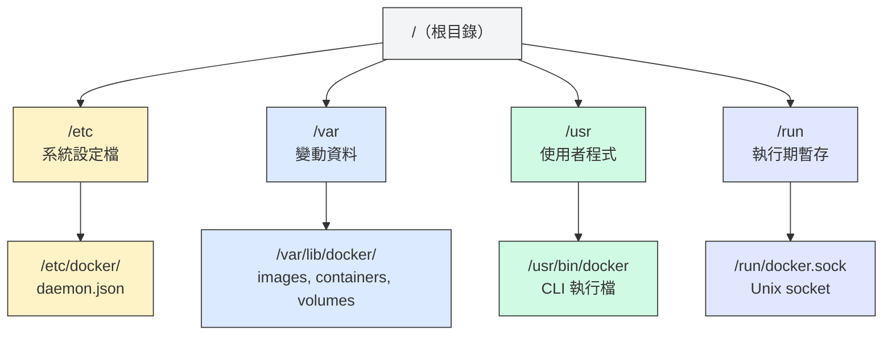
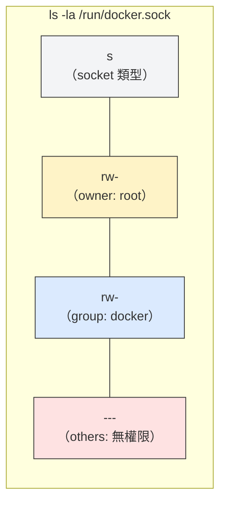
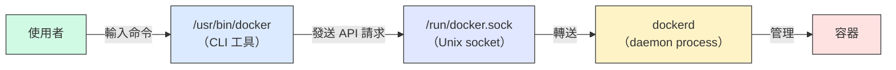
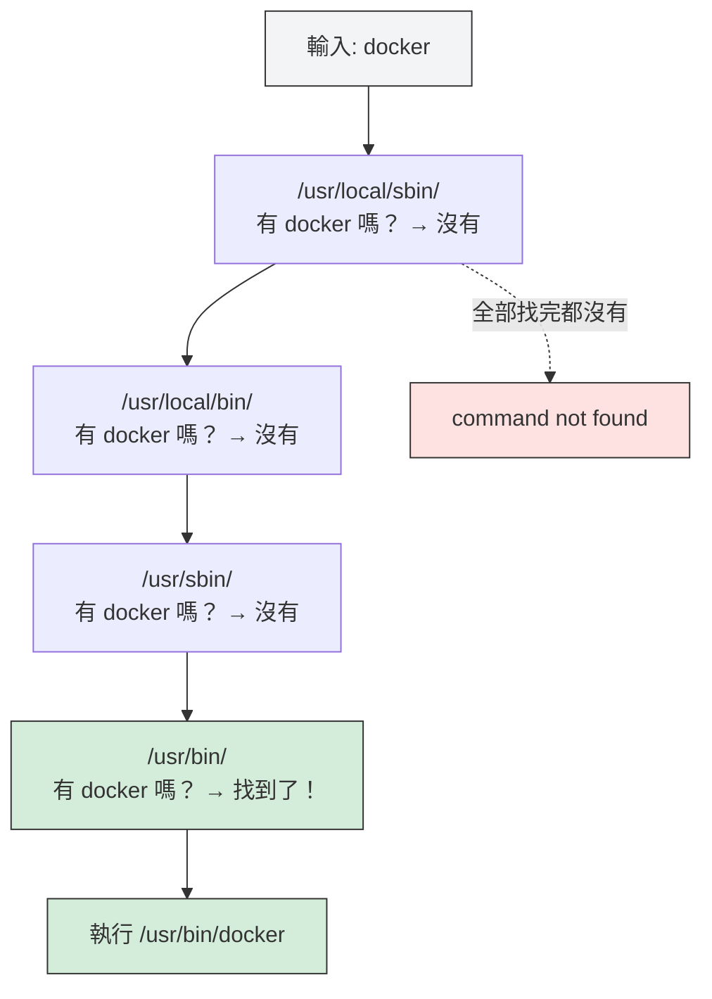

# W04｜Linux 系統基礎：檔案系統、權限、程序與服務管理

## 學習目標

1. 搞懂 Linux 目錄結構（FHS），講得出 Docker 的設定檔、資料、執行檔各放在哪、為什麼。
2. 看懂 Linux 的權限欄位（owner/group/others × rwx），搞清楚 Docker socket 的權限設計，說明 `usermod -aG docker $USER` 的安全意涵。
3. 分得出 process 跟 service 的差別，用 `ps`/`systemctl`/`journalctl` 抓 Docker daemon 狀態。
4. 知道 `$PATH` 怎麼運作，碰到 `command not found` 不會慌。
5. 親手搞壞兩次（停 daemon + 改 socket 權限），搞清楚 `Cannot connect` 跟 `permission denied` 差在哪。

## 先備知識

- 已完成 W03 三節點架構，bastion/app/db 三台 VM 運作正常。
- 理解 W01 的 Docker 四層驗證（Repository → Engine → Daemon → hello-world）。
- 能使用 `systemctl status`、`ssh`、`sudo` 等基本系統命令。

## 問題情境

W01 裝好 Docker 用 sudo 一路順暢，W03 三台 VM 也跑起來了。但某天登入 bastion 打 `docker ps` 回 `permission denied`；同學打 `docker` 直接 `command not found`；另一台 VM 重開機後 daemon 沒起來，`docker run` 回 `Cannot connect to the Docker daemon`。

三種錯誤、三個根因——權限、$PATH、服務。不搞懂 Linux 系統骨架就只能貼錯誤訊息碰運氣，跟擲骰子沒兩樣。

---

## 核心概念

### 一、Linux 檔案系統階層（FHS）

#### FHS 是什麼？

FHS（Filesystem Hierarchy Standard）是 Linux 社群的共同約定，規定每類檔案應該放在哪裡。有了這個約定，不管是哪個發行版，系統設定都在 `/etc/`、變動資料都在 `/var/`、執行檔都在 `/usr/bin/`——你換一台 Linux 機器也能立刻找到東西。

把它想成圖書館的分類法：小說區、參考書區、期刊區各有位置，不會因為換了一間圖書館就全部打亂。

#### Docker 在 FHS 中的位置

Docker 乖乖照 FHS 的規矩來。每個路徑都不是隨便挑的，而是由該路徑在 FHS 中的定義決定：



| FHS 路徑 | FHS 定義 | Docker 用途 | 說明 |
|---|---|---|---|
| `/etc/docker/` | 系統級設定檔 | `daemon.json`（Docker daemon 設定） | 設定檔放 `/etc/` 是 FHS 約定，所有系統服務都這樣 |
| `/var/lib/docker/` | 程式的持久性狀態資料 | 映像、容器、volumes | `/var/lib/` 放「程式運行產生的持久資料」，不是日誌（日誌在 `/var/log/`） |
| `/usr/bin/docker` | 使用者可執行檔 | Docker CLI 工具 | `/usr/bin/` 放的是安裝的應用程式執行檔 |
| `/run/docker.sock` | 執行期暫存（PID/socket） | Docker daemon 的 Unix socket | 開機時由 daemon 建立，關機就消失 |

搞懂 FHS 的好處：要改 Docker 設定，直覺就知道去 `/etc/docker/`；想清理映像佔用的空間，直覺知道去看 `/var/lib/docker/`；想確認 Docker CLI 裝在哪，用 `which docker` 會指向 `/usr/bin/docker`。

### 二、權限模型與 Docker Socket

#### owner/group/others × rwx

Linux 的每個檔案都有三組權限，分別控制三種身份的存取：

- **owner（擁有者）**：檔案的主人，通常是建立檔案的使用者。
- **group（群組）**：檔案所屬的群組，群組成員共享這組權限。
- **others（其他人）**：不是 owner 也不在 group 裡的所有人。

每組權限由三個位元組成：

- **r（read）**：讀取內容。
- **w（write）**：修改內容。
- **x（execute）**：執行（檔案）或進入（目錄）。



#### Docker Socket 的權限意義

Docker daemon 監聽在 `/run/docker.sock`（Unix socket），CLI 靠這個 socket 發送請求。它的權限是 `srw-rw---- root:docker`：

- **owner = root**：root 有讀寫權限。
- **group = docker**：docker 群組成員有讀寫權限。
- **others = 無權限**：不是 root 也不在 docker 群組的使用者完全無法存取。

這就是為什麼 W01 必須用 `sudo docker`——普通使用者不在 docker 群組裡，沒有權限存取 socket。

#### `sudo docker` vs `usermod -aG docker $USER`

| 面向 | `sudo docker`（每次提權） | `usermod -aG docker $USER`（加入群組） |
|---|---|---|
| 操作方式 | 每條 Docker 命令前加 `sudo` | 一次性把使用者加入 docker 群組 |
| 方便性 | 麻煩，每次都要打 | 方便，之後不用 sudo |
| 安全性 | 每次操作有意識地提權 | **docker group 成員等同 root 權限** |
| 適用場景 | 對安全要求高的環境 | 開發/教學環境 |

為什麼 docker group 大約等於 root？因為 Docker daemon 以 root 權限運行，能存取 socket 就等於能指揮 daemon 做任何事——包括掛載 Host 的任意目錄、讀取任意檔案。在 Part B 會實際示範這一點。

### 三、程序與服務管理

#### Process vs Service

- **Process（程序）**：正在記憶體中執行的程式實例，有 PID（程序 ID）和 UID（執行身份）。任何在跑的東西都是 process。
- **Service（服務）**：由 systemd 管理的長期運行 daemon。Service 是一種特殊的 process——它在背景跑、開機自動啟動、掛掉可以自動重啟。

簡單說：process 是「正在跑的程式」，service 是「有人幫它顧著的 process」。

#### Docker 的 CLI vs Daemon



| 面向 | Docker CLI（`/usr/bin/docker`） | Docker Daemon（`dockerd`） |
|---|---|---|
| 本質 | 一般的命令列工具 | systemd 管理的背景服務 |
| 執行時機 | 你打指令時才跑 | 開機就在跑 |
| 依賴關係 | 需要 daemon 才能做事 | 不依賴 CLI |
| daemon 停了會怎樣 | `docker --version` 正常，但 `docker ps` 失敗 | 所有容器操作都不行 |

這就是為什麼 `docker --version` 正常不代表 Docker 能用——`--version` 只是 CLI 自己印出版本資訊，不需要跟 daemon 溝通。

> **想一想**：`docker --version` 正常回傳版本，能不能代表 Docker 可以正常用？為什麼？

#### systemd 管理 Docker daemon

systemd 是 Linux 的服務管理員，負責啟動、停止、監控所有系統服務。Docker daemon 就是一個 systemd service：

- `systemctl status docker`：查看 daemon 目前狀態（active/inactive/failed）。
- `systemctl start docker`：啟動 daemon。
- `systemctl stop docker`：停止 daemon。
- `systemctl enable docker`：設定開機自動啟動。
- `systemctl is-enabled docker`：確認是否設定了開機啟動。
- `journalctl -u docker`：查看 Docker daemon 的 systemd 日誌。

### 四、環境變數與 Shell 基礎

#### `$PATH` 的搜尋機制

當你在 shell 輸入一個指令（例如 `docker`），shell 不會去搜尋整台機器的所有目錄——它只會按順序搜尋 `$PATH` 中列出的目錄：



`command not found` 不一定代表程式沒裝——可能只是程式的路徑不在 `$PATH` 裡。

#### 常用身份變數

| 變數 | 用途 | 範例值 |
|---|---|---|
| `$PATH` | shell 搜尋指令的目錄清單 | `/usr/local/sbin:/usr/local/bin:/usr/sbin:/usr/bin` |
| `$HOME` | 當前使用者的家目錄 | `/home/student` |
| `$USER` | 當前使用者名稱 | `student` |
| `$SHELL` | 當前使用者的預設 shell | `/bin/bash` |

#### command not found 診斷表

| 症狀 | 可能原因 | 診斷命令 | 解法 |
|---|---|---|---|
| `docker: command not found` | Docker 未安裝 | `dpkg -l \| grep docker-ce` | 回 W01 安裝 |
| `docker: command not found` | `$PATH` 不含執行檔路徑 | `echo $PATH`、`ls /usr/bin/docker` | 修正 `$PATH` 或用絕對路徑 `/usr/bin/docker` |
| `xxx: command not found`（自裝工具） | 安裝路徑不在 `$PATH` | `find / -name xxx 2>/dev/null` | 加入 `$PATH` 或建 symlink |

---

## 操作參考

### Part A：摸清 Linux 目錄結構

以下操作在 bastion 上執行。

#### 步驟 1：瀏覽 FHS 主要目錄

- 命令：

```bash
ls /
ls /etc/ | head -20
ls /var/ | head -10
ls /usr/bin/ | head -20
```

- 觀察：根目錄下的每個子目錄都有特定用途，不是隨意分類。

#### 步驟 2：檢視 Docker 設定檔目錄

- 命令：

```bash
ls -la /etc/docker/
cat /etc/docker/daemon.json 2>/dev/null || echo "daemon.json 不存在（使用預設設定）"
```

- `/etc/docker/` 可能只有幾個檔案，甚至 `daemon.json` 不存在——因為 Docker 可以用預設值運行，只有需要自訂設定時才建立這個檔案。

#### 步驟 3：檢視 Docker 資料目錄結構

- 命令：

```bash
sudo ls -la /var/lib/docker/
sudo du -sh /var/lib/docker/
```

- 預期輸出：看到 `image/`、`containers/`、`volumes/`、`overlay2/` 等子目錄，以及整個目錄的總大小。
- 注意：`/var/lib/docker/` 歸 root 所有，普通使用者需要 `sudo` 才能讀取。

#### 步驟 4：用 `docker info` 觀察系統資訊

- 命令：

```bash
sudo docker info
```

- 重點觀察：
  - `Storage Driver`：通常是 `overlay2`，是 Docker 用來管理映像層的檔案系統驅動。
  - `Docker Root Dir`：應指向 `/var/lib/docker`。
  - `Images`/`Containers`：當前系統的映像和容器數量。

#### 步驟 5：拉取映像前後對比磁碟使用量

- 命令：

```bash
sudo du -sh /var/lib/docker/
sudo docker pull nginx:latest
sudo du -sh /var/lib/docker/
```

- 預期輸出：拉取映像後 `/var/lib/docker/` 佔用空間增加——映像資料確實存放在這裡。

#### 步驟 6：定位 Docker CLI 執行檔

- 命令：

```bash
which docker
ls -la $(which docker)
file $(which docker)
```

- 預期輸出：`which docker` 回傳 `/usr/bin/docker`，這是 FHS 規定的使用者程式路徑。

---

### Part B：搞懂權限——誰能碰 Docker？

#### 步驟 7：解讀 Docker Socket 權限

- 命令：

```bash
ls -la /var/run/docker.sock
stat /var/run/docker.sock
```

- 預期輸出：

```
srw-rw---- 1 root docker 0 ... /var/run/docker.sock
```

- 逐欄解讀：
  - `s`：檔案類型是 socket（不是普通檔案 `-`，也不是目錄 `d`）。
  - `rw-`：owner（root）有讀寫權限。
  - `rw-`：group（docker）有讀寫權限。
  - `---`：others 完全沒有權限。

#### 步驟 8：檢查當前使用者的群組

- 命令：

```bash
whoami
id
groups
```

- 觀察：如果輸出中沒有 `docker`，你的使用者不在 docker 群組裡，無法直接存取 socket。

#### 步驟 9：未加入 docker group 時觀察錯誤

- 命令（不加 `sudo`）：

```bash
docker ps
```

- 預期輸出：出現 `permission denied while trying to connect to the Docker daemon socket`。
- 這就是 others 那三個 `---` 的效果——你不是 root、不在 docker 群組，socket 不讓你碰。

#### 步驟 10：加入 docker group 並驗證

- 命令：

```bash
# 加入 docker 群組
sudo usermod -aG docker $USER

# 立刻測試（預期仍然失敗）
docker ps
```

- 預期輸出：仍然 `permission denied`。
- 原因：群組變更需要新的 session 才生效。目前的 shell 還在用舊的 token。

```bash
# 重新登入（登出再登入）
exit
# 重新 SSH 回 bastion 後：
id
groups
docker ps
```

- 預期輸出：`groups` 現在包含 `docker`，`docker ps` 不加 sudo 也能執行。

#### 步驟 11：安全示範——docker group 用戶的權力

- 命令：

```bash
# docker group 的使用者可以靠容器讀取 Host 的敏感檔案
docker run --rm -v /etc/shadow:/host-shadow:ro alpine cat /host-shadow
```

- 預期輸出：看到 Host 的 `/etc/shadow` 內容（密碼雜湊）。
- 這證明了 docker group 大約等於 root：能操作 Docker 就等於能存取 Host 上的任何東西。在生產環境中，不應該隨意把使用者加入 docker group。

#### 步驟 12：驗證 hello-world 不需 sudo

- 命令：

```bash
docker run --rm hello-world
```

- 預期輸出：出現 `Hello from Docker!`，不需要 `sudo`。

#### 步驟 13：檢視其他 Docker 檔案的權限

- 命令：

```bash
ls -la /etc/docker/
sudo ls -la /var/lib/docker/ | head -10
ls -la /usr/bin/docker
```

- 觀察：`/etc/docker/` 歸 root、`/var/lib/docker/` 歸 root（只有 root 能讀寫）、`/usr/bin/docker` 是所有人可執行的。權限設計各有不同的安全考量。

---

### Part C：找到 Docker daemon 在哪、活著沒

#### 步驟 14：觀察 Docker daemon process

- 命令：

```bash
ps aux | grep dockerd
```

- 預期輸出：看到 `root ... dockerd` 的行——Docker daemon 以 root 身份運行。
- `ps aux` 欄位解讀：`USER`（執行者）、`PID`（程序 ID）、`%CPU`、`%MEM`、`COMMAND`（指令）。

#### 步驟 15：用 systemctl 完整解讀 Docker 服務狀態

- 命令：

```bash
systemctl status docker --no-pager
```

- 預期輸出解讀：
  - `Loaded: loaded ... enabled`：服務設定已載入，且開機會自動啟動。
  - `Active: active (running)`：目前正在運行。
  - `Main PID: ...`：daemon 的 PID，應與 `ps aux` 看到的一致。
  - 下方日誌行：最近的 daemon 事件紀錄。

#### 步驟 16：確認 Docker 開機自動啟動

- 命令：

```bash
systemctl is-enabled docker
```

- 預期輸出：`enabled`。如果是 `disabled`，開機後 daemon 不會自動啟動。

#### 步驟 17：查看 Docker daemon 日誌

- 命令：

```bash
journalctl -u docker --since "1 hour ago" --no-pager | tail -30
```

- `journalctl` 是 systemd 的日誌查看工具，`-u docker` 只看 Docker 服務的日誌。
- `--since` 限制時間範圍，避免被大量舊日誌淹沒。

#### 步驟 18：跑容器並觀察 process（Host vs Container 視角）

- 命令：

```bash
# 啟動一個 nginx 容器
docker run -d --name test-nginx nginx:latest

# Host 視角：看到 nginx process
ps aux | grep nginx

# Container 視角：容器內的 PID 1 就是 nginx
docker exec test-nginx ps aux

# 清理
docker stop test-nginx && docker rm test-nginx
```

- 觀察：同一個 nginx process，在 Host 上有一個 PID（例如 12345），在容器內看到的 PID 是 1。這就是 Linux Namespace 的效果（W05 會深入講）。

#### 步驟 19：用 top 查看系統資源使用

- 命令：

```bash
# 跑一個容器
docker run -d --name test-nginx nginx:latest

# 用 top 觀察（按 q 退出）
top -b -n 1 | head -20

# 清理
docker stop test-nginx && docker rm test-nginx
```

- `top` 即時顯示 CPU 和記憶體使用最多的 process。容器內的 process 在 Host 的 `top` 中也會出現。

#### 步驟 20：用 systemctl 管理 Docker 生命週期（觀察用）

- 命令：

```bash
# 查看所有 Docker 相關的 systemd unit
systemctl list-units | grep docker
```

- 預期輸出：至少看到 `docker.service` 和 `docker.socket` 兩個 unit。`docker.socket` 負責 socket activation——即使 daemon 沒跑，有請求到 socket 時 systemd 會自動啟動 daemon。

---

### Part D：$PATH 跟 command not found

#### 步驟 21：查看身份變數

- 命令：

```bash
echo "PATH:  $PATH"
echo "HOME:  $HOME"
echo "USER:  $USER"
echo "SHELL: $SHELL"
```

#### 步驟 22：定位 Docker CLI 路徑

- 命令：

```bash
which docker
type docker
```

- `which` 顯示完整路徑，`type` 還會告訴你它是外部程式、shell 內建指令還是 alias。

#### 步驟 23：檢視 `$PATH` 搜尋順序

- 命令：

```bash
echo $PATH | tr ':' '\n'
```

- 預期輸出：每行一個目錄，shell 會從上到下依序搜尋。`/usr/bin/docker` 所在的 `/usr/bin` 應該在列表中。

#### 步驟 24：對比容器內外的環境變數

- 命令：

```bash
# Host 的環境
echo "--- Host ---"
env | grep -E "^(PATH|HOME|USER|SHELL)="

# Container 的環境
echo "--- Container ---"
docker run --rm alpine env
```

- 觀察：容器內有自己獨立的環境變數，`$HOME`、`$PATH` 都和 Host 不同。容器是隔離的執行環境，不會繼承 Host 的 shell 設定。

---

### Part E：故意搞壞 Docker 再修回來

#### 故障場景一：停止 Docker Daemon

#### 步驟 25：記錄故障前基線

- 命令：

```bash
echo "=== 故障前基線（Daemon）==="
systemctl status docker --no-pager | head -5
docker ps
docker run --rm hello-world
```

- 預期輸出：daemon 是 active，`docker ps` 正常，`hello-world` 成功。

#### 步驟 26：故障注入——停止 Docker daemon 和 socket

- 命令：

```bash
sudo systemctl stop docker && sudo systemctl stop docker.socket
```

- 必須同時停止 `docker.socket`，否則 socket activation 會在你下一次執行 docker 命令時自動重啟 daemon。

#### 步驟 27：觀測故障——區分 CLI 與 Daemon

- 命令：

```bash
echo "=== 故障中（Daemon 停止）==="

# CLI 本身仍然正常（不依賴 daemon）
docker --version

# 需要 daemon 的操作全部失敗
docker ps
docker run --rm hello-world

# 確認 daemon process 不存在
ps aux | grep dockerd | grep -v grep

# 確認 systemd 狀態
systemctl status docker --no-pager | head -5
```

- 預期輸出：
  - `docker --version` 正常回傳版本——CLI 是獨立的執行檔，不需要 daemon。
  - `docker ps` 回傳 `Cannot connect to the Docker daemon at unix:///var/run/docker.sock`。
  - `ps aux | grep dockerd` 沒有結果。
  - `systemctl status` 顯示 `inactive (dead)`。

#### 步驟 28：回復 Docker daemon

- 命令：

```bash
sudo systemctl start docker
```

#### 步驟 29：回復後驗證

- 命令：

```bash
echo "=== 回復後（Daemon）==="
systemctl status docker --no-pager | head -5
docker ps
docker run --rm hello-world
```

- 預期輸出：與步驟 25 的基線一致。

---

#### 故障場景二：破壞 Docker Socket 權限

#### 步驟 30：記錄故障前基線

- 命令：

```bash
echo "=== 故障前基線（Socket 權限）==="
ls -la /var/run/docker.sock
docker ps
```

- 預期輸出：socket 權限是 `srw-rw---- root docker`，`docker ps` 不加 sudo 正常。

#### 步驟 31：故障注入——改壞 socket 權限

- 命令：

```bash
sudo chmod 600 /var/run/docker.sock
ls -la /var/run/docker.sock
```

- 預期輸出：權限從 `srw-rw----` 變成 `srw-------`——group（docker）的讀寫權限被拿掉了。

#### 步驟 32：觀測故障——permission denied vs Cannot connect

- 命令：

```bash
echo "=== 故障中（Socket 權限破壞）==="

# 不加 sudo → 權限不足
docker ps

# 加 sudo → 仍然成功（root 是 owner，有權限）
sudo docker ps

# 確認 daemon 仍在跑
systemctl status docker --no-pager | head -3
```

- 預期輸出：
  - `docker ps`（不加 sudo）回傳 `permission denied while trying to connect to the Docker daemon socket`。
  - `sudo docker ps` 正常。
  - daemon 是 `active (running)`。

> **想一想**：場景一跟場景二的錯誤訊息不一樣，`sudo docker ps` 的結果也不同。你能不能只靠這兩條線索，判斷問題出在 daemon 還是權限？

#### 步驟 33：回復 socket 權限

- 命令：

```bash
sudo chmod 660 /var/run/docker.sock
sudo chown root:docker /var/run/docker.sock
```

#### 步驟 34：回復後驗證

- 命令：

```bash
echo "=== 回復後（Socket 權限）==="
ls -la /var/run/docker.sock
docker ps
```

- 預期輸出：與步驟 30 的基線一致。

#### 步驟 35：兩場景對比（教學重點）

兩次故障的錯誤訊息不同，根因不同，診斷方向也不同：

| 錯誤訊息 | 根因 | Daemon 狀態 | `sudo docker` 可用？ | 診斷方向 |
|---|---|---|---|---|
| `Cannot connect to the Docker daemon` | daemon 沒在跑 | inactive | 不可用 | `systemctl status docker` → 啟動 daemon |
| `permission denied…docker.sock` | daemon 在跑但無權存取 socket | active | 可用 | `ls -la /var/run/docker.sock` + `id` → 檢查權限/群組 |

這延伸了 W03 的錯誤對比模式：

| W03 錯誤 | W04 錯誤 | 共同邏輯 |
|---|---|---|
| `Connection timed out`（防火牆擋） | `Cannot connect`（daemon 沒跑） | 目標「不存在」或「不可達」 |
| `Connection refused`（服務沒跑） | `permission denied`（有服務但無權限） | 目標「存在但拒絕」 |

讀懂錯誤訊息就能判斷該往哪個方向查，不需要亂試。

#### 步驟 36：建立交付資料夾

- 命令：

```bash
mkdir -p ~/virt-container-labs/w04
cd ~/virt-container-labs/w04
```

---

## Checkpoint 總覽

> **Checkpoint A** — FHS 探索完成：FHS 路徑表完成，`docker info` 輸出已記錄，能說明 `/var/lib/` 的用途。

> **Checkpoint B** — 權限模型理解：`docker run --rm hello-world` 不加 sudo 可執行；能解讀 socket 權限欄位；安全意涵（docker group 大約等於 root）已說明。

> **Checkpoint C** — 服務管理理解：`systemctl status docker` 顯示 active；`journalctl` 日誌已記錄；能區分 CLI vs daemon 的差異。

> **Checkpoint D** — 環境變數理解：`$PATH` 內容已記錄；`which docker` 指向正確路徑。

> **Checkpoint E1** — daemon 停止故障有三階段證據：故障前/中/後對照完整；`docker --version` 在故障中仍正常。

> **Checkpoint E2** — socket 權限故障有三階段證據：故障前/中/後對照完整；能解釋 `Cannot connect` vs `permission denied` 差異。

---

## 交付清單

必交：`w04/README.md`

`README.md` 必須包含：

- FHS 路徑表（FHS 路徑 × Docker 用途對照）
- `docker info` 的 Storage Driver 和 Docker Root Dir 記錄
- Docker socket 權限結構解讀
- `usermod -aG docker` 的安全意涵說明（用自己的話寫）
- `systemctl status docker` 輸出與 daemon 日誌分析
- CLI vs daemon 差異說明
- `$PATH` 內容與 `which docker` 輸出
- 故障場景一：daemon 停止的故障前/中/後三階段證據
- 故障場景二：socket 權限破壞的故障前/中/後三階段證據
- `Cannot connect` vs `permission denied` 的差異比較（用自己的話寫）
- 至少 1 則排錯紀錄（症狀 → 定位 → 修正 → 驗證）
- 可重跑最小命令鏈：

```bash
which docker
systemctl status docker --no-pager | head -5
ls -la /var/run/docker.sock
docker ps
docker run --rm hello-world
```

---

## README 繳交模板

複製到 `~/virt-container-labs/w04/README.md`，補齊各欄位：

```markdown
# W04｜Linux 系統基礎：檔案系統、權限、程序與服務管理

## FHS 路徑表

| FHS 路徑 | FHS 定義 | Docker 用途 |
|---|---|---|
| /etc/docker/ | （填入） | （填入） |
| /var/lib/docker/ | （填入） | （填入） |
| /usr/bin/docker | （填入） | （填入） |
| /run/docker.sock | （填入） | （填入） |

## Docker 系統資訊

- Storage Driver：（貼上 `docker info` 中的值）
- Docker Root Dir：（貼上 `docker info` 中的值）
- 拉取映像前 /var/lib/docker/ 大小：（填入）
- 拉取映像後 /var/lib/docker/ 大小：（填入）

## 權限結構

### Docker Socket 權限解讀
（貼上 `ls -la /var/run/docker.sock` 輸出，逐欄說明 owner/group/others 的權限）

### 使用者群組
（貼上 `id` 輸出，說明是否包含 docker 群組）

### 安全意涵
（用自己的話說明為什麼 docker group ≈ root，安全示範的觀察結果）

## 程序與服務管理

### systemctl status docker
（貼上 `systemctl status docker` 輸出）

### journalctl 日誌分析
（貼上 `journalctl -u docker --since "1 hour ago"` 的重點摘錄，說明看到什麼事件）

### CLI vs Daemon 差異
（用自己的話說明兩者的差異，為什麼 `docker --version` 正常不代表 Docker 能用）

## 環境變數

- $PATH：（貼上內容）
- which docker：（填入路徑）
- 容器內外環境變數差異觀察：（簡述）

## 故障場景一：停止 Docker Daemon

| 項目 | 故障前 | 故障中 | 回復後 |
|---|---|---|---|
| systemctl status docker | active | （填入） | （填入） |
| docker --version | 正常 | （填入） | （填入） |
| docker ps | 正常 | Cannot connect | （填入） |
| ps aux grep dockerd | 有 process | （填入） | （填入） |

## 故障場景二：破壞 Socket 權限

| 項目 | 故障前 | 故障中 | 回復後 |
|---|---|---|---|
| ls -la docker.sock 權限 | srw-rw---- | （填入） | （填入） |
| docker ps（不加 sudo） | 正常 | permission denied | （填入） |
| sudo docker ps | 正常 | （填入） | （填入） |
| systemctl status docker | active | （填入） | （填入） |

## 錯誤訊息比較

| 錯誤訊息 | 根因 | 診斷方向 |
|---|---|---|
| Cannot connect to the Docker daemon | （填入） | （填入） |
| permission denied…docker.sock | （填入） | （填入） |

（用自己的話說明兩種錯誤的差異，各自指向什麼排錯方向）

## 排錯紀錄
- 症狀：
- 診斷：（你首先查了什麼？）
- 修正：（做了什麼改動？）
- 驗證：（如何確認修正有效？）

## 設計決策
（說明本週至少 1 個技術選擇與取捨，例如：為什麼教學環境用 `usermod` 加 group 而不是每次 sudo？這個選擇的風險是什麼？）
```

---

## 常見錯誤與診斷

- 錯誤：`usermod -aG docker $USER` 後沒重登就測試 → 仍然 `permission denied`。
  診斷：群組變更需要新的 session 才生效。必須登出再登入（不是開新的終端機分頁）。
- 錯誤：`ls /var/lib/docker/` 沒加 `sudo` → `Permission denied`。
  診斷：`/var/lib/docker/` 歸 root 所有，不屬於 docker group 的權限範圍。用 `sudo ls` 檢視。
- 錯誤：`docker --version` 正常就判斷 Docker 沒問題，跳過 daemon 檢查 → 漏判 daemon 未啟動。
  診斷：`docker --version` 只是 CLI 自己印版本，不跟 daemon 溝通。必須用 `systemctl status docker` 確認 daemon 狀態。
- 錯誤：用 `chmod 777` 修 socket 權限 → 嚴重安全風險。
  診斷：`777` 代表所有人都能讀寫執行，等於把 Docker 的控制權開放給任何使用者。正確權限是 `660` + `root:docker`。
- 錯誤：`journalctl` 輸出太多直接放棄。
  診斷：用 `--since "1 hour ago"` 限制時間範圍，或 `-n 20` 只看最後 20 行。
- 錯誤：停 daemon 時只停 `docker.service` 忘記停 `docker.socket` → socket activation 自動重啟 daemon。
  診斷：`docker.socket` 會監聽 `/run/docker.sock`，收到請求就自動啟動 daemon。兩個都要停才能真正關掉 Docker。
- 錯誤：改壞 `$PATH` 後連 `ls`、`sudo` 都找不到。
  診斷：用絕對路徑 `/usr/bin/sudo` 或 `/usr/bin/ls` 暫時操作，再修正 `~/.bashrc` 或 `~/.profile` 中的 `$PATH` 設定。
- 錯誤：混淆 `Cannot connect` 和 `permission denied`，用同一套方法排錯。
  診斷：兩者根因不同——`Cannot connect` 查 daemon 狀態，`permission denied` 查 socket 權限和群組。

### 排查方向

沿用 W02-W03 的分層排錯模型，W04 新增「服務內部」診斷維度，形成四層檢查鏈：

1. **Binary 存在？** → `which docker`（`command not found` → 查 `$PATH` 或確認安裝）
2. **Daemon 在跑？** → `systemctl status docker`（`inactive` → `start`；查 `journalctl` 找原因）
3. **Socket 可存取？** → `ls -la /var/run/docker.sock`（`permission denied` → 查權限 / 群組）
4. **請求成功？** → `docker ps`（讀錯誤訊息判斷卡在哪一層）

這對應並延伸 W01 的四層驗證鏈（Repository → Engine → Daemon → hello-world），現在能從 OS 層面搞懂每一層的意義：

| W01 四層驗證 | W04 系統層對應 |
|---|---|
| ① Repository 設定 | `/etc/apt/sources.list.d/docker.list`（FHS: `/etc/` 放設定） |
| ② Engine 安裝 | `/usr/bin/docker`（FHS: `/usr/bin/` 放執行檔）、`$PATH` 搜尋 |
| ③ Daemon 狀態 | `systemctl status docker`（systemd 管理服務） |
| ④ 端到端通路 | socket 權限 + daemon 回應 |

---

做到這裡，你已經把 Linux 系統骨架的四根柱子——檔案結構、權限、服務、環境變數——全部摸過一遍，而且親手把 Docker 搞壞兩次再修回來。下次碰到 `Cannot connect` 或 `permission denied`，你不會再對著螢幕發呆，而是知道該查 daemon 還是查權限。這就是「讀懂錯誤訊息」跟「貼錯誤訊息問 ChatGPT」的差距。

### 延伸閱讀

- `[R1]` Filesystem Hierarchy Standard (FHS) 3.0：Linux 目錄結構的標準定義。（[來源連結](https://refspecs.linuxfoundation.org/FHS_3.0/fhs-3.0.html)）
- `[R2]` `chmod(1)` man page：檔案權限變更。（[來源連結](https://man7.org/linux/man-pages/man1/chmod.1.html)）
- `[R3]` `chown(1)` man page：檔案擁有者與群組變更。（[來源連結](https://man7.org/linux/man-pages/man1/chown.1.html)）
- `[R4]` `stat(1)` man page：檔案詳細狀態資訊。（[來源連結](https://man7.org/linux/man-pages/man1/stat.1.html)）
- `[R5]` Docker post-installation steps：以非 root 使用者管理 Docker。（[來源連結](https://docs.docker.com/engine/install/linux-postinstall/)）
- `[R6]` `systemctl(1)` man page：systemd 服務管理。（[來源連結](https://man7.org/linux/man-pages/man1/systemctl.1.html)）
- `[R7]` `journalctl(1)` man page：systemd 日誌查看。（[來源連結](https://man7.org/linux/man-pages/man1/journalctl.1.html)）
- `[R8]` Docker daemon configuration reference：`daemon.json` 設定說明。（[來源連結](https://docs.docker.com/reference/cli/dockerd/#daemon-configuration-file)）
