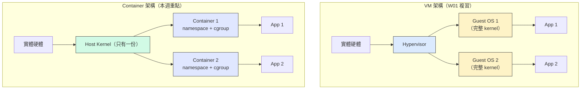
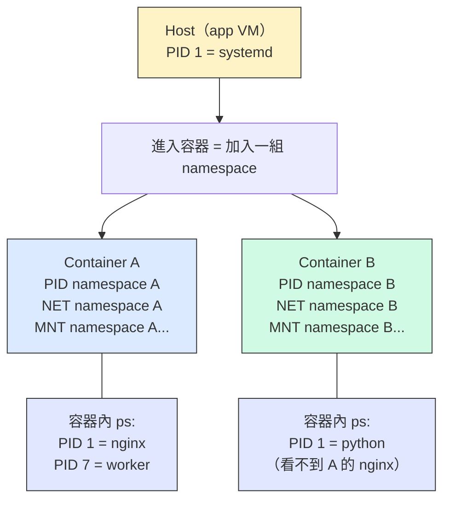
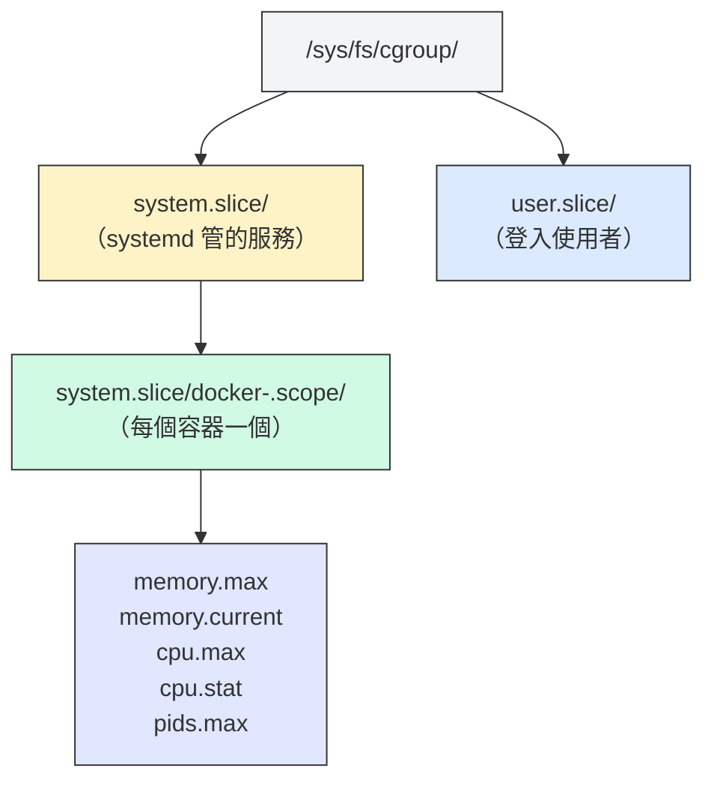
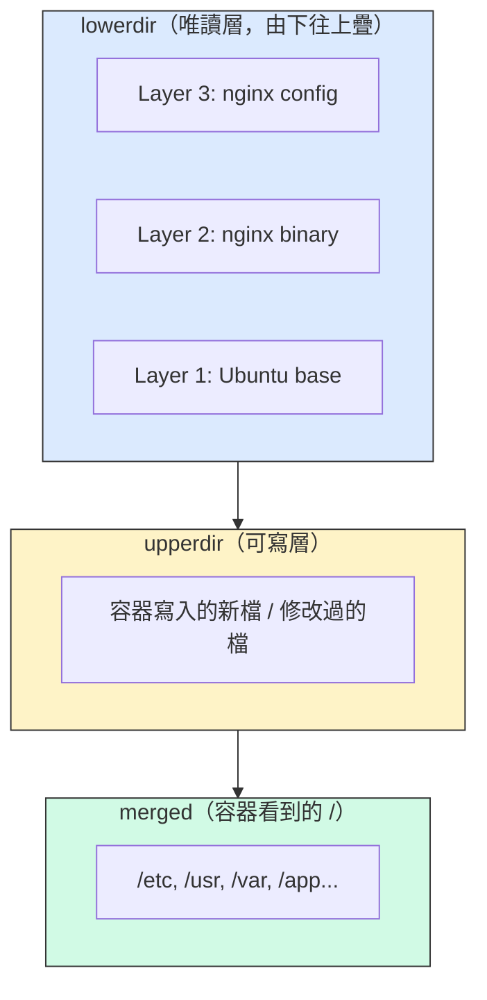

# W05｜把容器拆開來看：Namespace、Cgroups、Union FS 與 OCI

## 學習目標

1. 講得出容器為什麼不是「輕量 VM」，而是 Linux kernel 幾個機制湊出來的把戲。
2. 親手在 `/proc/<pid>/ns/` 看到 namespace，分得出 PID/NET/MNT/UTS/IPC/USER 各自隔離什麼。
3. 用 `--memory`、`--cpus` 打開 cgroup 限制，再從 `/sys/fs/cgroup/` 讀得出這些值寫去哪。
4. 看懂 Docker image 的分層結構與 Copy-on-Write，用 `docker diff` 抓到可寫層的變化。
5. 講得出 OCI（Runtime Spec + Image Spec）為什麼重要，以及它跟 runc / containerd / dockerd 的關係。
6. 親手把容器的記憶體限爆，從 `dmesg` 找到 OOM Kill 的證據。

## 先備知識

- 已完成 W01 Docker 四層驗證，能正常 `docker run`。
- 已完成 W03 三節點架構（bastion / app / db），本週所有操作都在 **app VM** 上跑。
- 已完成 W04，熟悉 `/var/lib/docker/`、`/run/docker.sock`、`systemctl` 與 Linux 權限模型；W04 尾聲那句「namespace 的效果 W05 會深入講」就是這週要兌現的。

## 問題情境

W01 到 W04 你一路用 `docker run` 起了一堆容器，nginx 跑得順、alpine 進得去。但你從沒真的打開蓋子看過：

- 容器裡 `ps aux` 只看到一兩個 process，host 上的 1000 多個 process 到哪去了？
- `docker run --memory=256m` 到底把那個 256m 寫去了哪個檔案？kernel 怎麼知道要擋下來？
- 你拉了 `ubuntu:24.04`、`nginx`、`python:3.12`，磁碟卻沒爆掉——它們明明都帶一份 Ubuntu，共享是怎麼發生的？
- 為什麼 Docker、Podman、containerd 的映像可以互吃？誰訂了規則？

不搞懂這些，你只是會「用 Docker」而已，跟「懂容器」還差一層 kernel。這週就把蓋子掀開，讓容器在你眼前變成三個你已經認識的 Linux 機制的組合拳。

> 容器不是魔法，是 kernel 三招組合技——把你看到的東西限住（namespace）、把你能用的東西限住（cgroups）、把檔案層層疊起來（union fs）。

---

## 核心概念

### 一、容器不是輕量 VM

#### 一張圖看差別

W01 我們做過 VM vs Container 的七維度對照，重點其實就一句話：**VM 虛擬化硬體，容器虛擬化 process 的視角**。



講白了：

- VM 裡的 Ubuntu 有自己的 kernel，要自己開機、自己跑 init，啟動要幾十秒。
- 容器裡的 Ubuntu **沒有自己的 kernel**——它就是 host kernel 上的一個 process，被塞進幾個 namespace、綁上 cgroup 而已。所以啟動只要幾十毫秒，image 也只要幾十 MB。

想成這樣：VM 是幫你蓋一整棟公寓，容器是把同一間房間用屏風隔成幾個工位。

| 面向 | VM | Container |
|---|---|---|
| 隔離邊界 | 獨立的 guest kernel | 共用 host kernel，靠 namespace 隔離視角 |
| 啟動時間 | 秒到分鐘 | 毫秒 |
| 資源佔用 | 每個 VM 一份 OS | 只多出 process 本身 |
| 攻擊面 | Hypervisor | host kernel（同一份）|
| 能跨 kernel 嗎？ | 可以，Linux 跑 Windows VM 沒問題 | 不行，Linux 容器需要 Linux kernel |

最後一列是重點：**容器共用 host kernel**。host 的 kernel 爆漏洞，容器就一起中標——這是容器「隔離」的先天限制，也是為什麼有 gVisor、Kata Containers 這類強隔離方案存在。

### 二、Namespace：你看得到什麼

#### 六種 namespace

Linux kernel 至少提供六種 namespace（較新的 kernel 還多了 cgroup namespace，共七種），每一種把某一類「系統資源的視角」切成獨立的隔間。Docker 啟動容器時，預設把下面這六種一次全開（cgroup namespace 要看 kernel 與 runtime 版本）：

| Namespace | 隔離什麼 | 人話 | 觀察方式 |
|---|---|---|---|
| **PID** | Process ID 空間 | 容器裡 `ps` 只看到自己的 process，host 上看得到容器的全部 | `ps aux`（容器內 vs host） |
| **NET** | 網路裝置、IP、路由、port | 容器有自己的 `lo`、`eth0`、iptables | `ip addr`、`ip route` |
| **MNT** | Mount point | 容器有自己的 `/`，看不到 host 的檔案系統 | `mount`、`cat /proc/mounts` |
| **UTS** | Hostname、domain name | 容器能改自己的 hostname 不影響 host | `hostname` |
| **IPC** | System V IPC、POSIX message queue | 容器之間不共享共享記憶體、semaphore | `ipcs` |
| **USER** | UID / GID 對映 | 容器內的 root 可以不是 host 的 root | `id`、`/proc/<pid>/uid_map` |



#### 怎麼親眼看到？

kernel 把每個 process 所在的 namespace 暴露在 `/proc/<pid>/ns/`：

```
/proc/<pid>/ns/
├── pid   -> 'pid:[4026532...]'
├── net   -> 'net:[4026532...]'
├── mnt   -> 'mnt:[4026532...]'
├── uts   -> 'uts:[4026532...]'
├── ipc   -> 'ipc:[4026532...]'
└── user  -> 'user:[4026531837]'
```

每個檔案是一個 symlink，後面那串數字（inode）就是這個 namespace 的「身分證號」。**兩個 process 的某個 namespace inode 一樣 → 它們共用那個 namespace；不一樣 → 它們被隔開了**。

想像成健身房的手環：同一個號碼才能進同一個更衣室，不同號碼就分開。

> **想一想**：一個容器裡的 bash 跑 `exec sh`，新 shell 的 PID namespace inode 會跟原本的一樣還是不一樣？為什麼？

### 三、Cgroups：你能用多少

namespace 管「看得到什麼」，cgroups 管「能用多少」。你在 `docker run --memory=256m --cpus=0.5` 下的那兩個值，最後就是寫進 cgroup 控制檔案裡。

#### cgroup v2 的階層

Ubuntu 22.04 以後預設用 **cgroup v2**（unified hierarchy），所有控制器掛在同一棵樹下，路徑是 `/sys/fs/cgroup/`。Docker 會在底下替每個容器建一個子目錄：



#### Docker flag 對到 cgroup 檔案

| Docker flag | cgroup v2 檔案 | 寫入格式 | 解讀 |
|---|---|---|---|
| `--memory=256m` | `memory.max` | `268435456`（bytes） | 硬上限，超過就 OOM kill |
| `--memory-reservation=128m` | `memory.low` | `134217728` | 軟下限，系統緊張時才被回收 |
| `--cpus=0.5` | `cpu.max` | `50000 100000` | 每 100 ms 最多用 50 ms CPU |
| `--cpu-shares=512` | `cpu.weight` | 轉換後的權重 | 相對比例，不是絕對上限 |
| `--pids-limit=100` | `pids.max` | `100` | 容器內最多能開幾個 process |

講白了：你下 flag → dockerd 透過 containerd → runc 在啟動容器前把這幾個值寫進 cgroup 檔案 → kernel 執行限制。你在 Part C 會親手 `cat` 出來看。

> **想一想**：如果你沒下 `--memory`，一個容器把 app VM 的 4 GB 記憶體吃光，會發生什麼事？其他容器會一起死嗎？

### 四、Union FS：怎麼堆起來的

#### 問題：為什麼兩個容器共用一份 Ubuntu？

你拉 `ubuntu:24.04`、再拉 `nginx`（也是基於 Ubuntu），磁碟卻沒多出兩份 Ubuntu。Union File System 就是這個把戲。

Docker 預設的 storage driver 是 **overlay2**，它把 image 拆成一堆唯讀層（lowerdir），容器啟動時再疊一個可寫層（upperdir），最後 mount 成一個統一視圖（merged）。



#### Copy-on-Write（CoW）

容器對某個唯讀層裡的檔案做修改時，overlay2 會先**把那個檔案複製到 upperdir**，再在 upper 改。原本的 lower 不動，所以其他容器看到的還是原版。

想成 Google Docs 的「建議模式」：底稿不動，你的修改疊在上面；別人還在看底稿。

這就回答了核心問題：

- 兩個容器都基於 `ubuntu:24.04` → 它們共享同一組 lowerdir，磁碟只一份。
- 只有各自的 upperdir 是分開的——你寫什麼進去，只有你自己看得到。
- `docker diff <container>` 就是在列 upperdir 相對於 merged 的差異（A=新增、C=修改、D=刪除）。

你在 Part D 會親手 `docker diff`、`docker history`、然後到 `/var/lib/docker/overlay2/` 看實體檔案。

### 五、OCI：讓 Docker、containerd、runc 能講同一種話

#### 為什麼需要標準？

2015 年以前 Docker 就是容器的全部。後來 CoreOS 的 rkt、Red Hat 的 podman、Google 的 gVisor 冒出來，大家各做各的，映像格式不通、runtime 介面不一致。於是 Docker、CoreOS、Google、Red Hat 聯手成立 **Open Container Initiative（OCI）**，訂了兩份規範：

- **OCI Image Spec**：映像長什麼樣——manifest.json、config.json、一堆 layer tarball。
- **OCI Runtime Spec**：runtime 怎麼拿這個 image 生出一個容器——config.json 裡寫要開哪些 namespace、cgroup 怎麼設、rootfs 在哪。

#### 從 `docker run` 到 process 啟動的呼叫鏈

```mermaid
flowchart LR
    CLI["docker CLI"]
    DOCKERD["dockerd\n（高層邏輯、API）"]
    CTD["containerd\n（映像管理、生命週期）"]
    SHIM["containerd-shim\n（每容器一支）"]
    RUNC["runc\n（OCI Runtime 實作）"]
    PROC["容器 process\n（unshare + cgroup）"]

    CLI -->|"HTTP over unix socket"| DOCKERD
    DOCKERD -->|"gRPC"| CTD
    CTD --> SHIM
    SHIM -->|"spawn"| RUNC
    RUNC -->|"clone + namespace + cgroup + exec"| PROC

    style CLI fill:#f3f4f6,stroke:#333
    style DOCKERD fill:#fef3c7,stroke:#333
    style CTD fill:#dbeafe,stroke:#333
    style SHIM fill:#e0e7ff,stroke:#333
    style RUNC fill:#d1fae5,stroke:#333
    style PROC fill:#fee2e2,stroke:#333
```



- `runc` 是 OCI Runtime Spec 的參考實作，真正呼叫 `clone()`、建 namespace、寫 cgroup 的就是它。
- `containerd` 負責管理映像、快照、容器生命週期，是 OCI Runtime 的上層。
- `dockerd` 包一層使用者友善的 API（build、網路、volume），底下其實是 containerd + runc。
- 因為都符合 OCI 規範，Podman / CRI-O（K8s 用的）可以直接吃 Docker build 出來的映像——這就是標準的威力。

> 講白了：你每次 `docker run`，中間要穿過四到五層軟體，最後那一下真正把 process 塞進 namespace 的動作是 runc 幹的。

---

## 操作參考

> 以下所有操作在 **app VM** 上執行。先從 bastion 用 `ssh app`（或你在 W03 設好的 alias）進去。

### Part A｜確認環境

#### 步驟 1：確認 Docker 正常

```bash
docker --version
docker info | head -30
```

- 觀察：`docker info` 輸出裡要特別抓這幾行下來，後面 Part D、Part E 會用到。

#### 步驟 2：記下 Storage Driver 與 Cgroup Driver

```bash
docker info 2>/dev/null | grep -E "Storage Driver|Cgroup Driver|Cgroup Version|Runtime"
```

- 預期輸出類似：

```
 Storage Driver: overlay2
 Cgroup Driver: systemd
 Cgroup Version: 2
 Default Runtime: runc
```

- 重點：
  - `Storage Driver: overlay2` → Part D 會用到。
  - `Cgroup Version: 2` → Part C 讀 `memory.max` 的路徑會不一樣（v1 跟 v2 差很多）。Ubuntu 22.04+ 預設是 v2。
  - `Default Runtime: runc` → 就是上面提到的 OCI runtime。

#### 步驟 3：確認 cgroup v2 掛載點

```bash
mount | grep cgroup2
ls /sys/fs/cgroup/ | head -10
```

- 預期看到：`cgroup2 on /sys/fs/cgroup type cgroup2 ...`。
- `/sys/fs/cgroup/` 下應該有 `cpu.max`、`memory.max` 這類統一的控制檔案（v1 會是 `cpu/`、`memory/` 多個子目錄）。

#### 步驟 4：建立本週工作目錄

```bash
mkdir -p ~/virt-container-labs/w05
cd ~/virt-container-labs/w05
```

> **Checkpoint A**｜環境確認完成：`docker info` 的 Storage Driver、Cgroup Version、Runtime 都已記錄，cgroup v2 掛載點已確認。

---

### Part B｜Namespace 親自看

這一 Part 的目標：證明「容器裡的 PID 1 跟 host 的 PID 1 不一樣」，而且能用 inode 數字佐證。

#### 步驟 5：啟動一個長命百歲的容器

```bash
docker run -d --name ns-demo alpine sleep 3600
docker ps | grep ns-demo
```

#### 步驟 6：取得容器在 host 上的 PID

```bash
CPID=$(docker inspect -f '{{.State.Pid}}' ns-demo)
echo "容器的 sleep 在 host 上的 PID = $CPID"
```

- 這個 `$CPID` 是 host 視角的 PID。等下會對照容器內的視角。

#### 步驟 7：從 host 看容器 process 的 namespace

```bash
sudo ls -la /proc/$CPID/ns/
```

- 預期輸出類似：

```
lrwxrwxrwx 1 root root 0 ... cgroup -> 'cgroup:[4026531835]'
lrwxrwxrwx 1 root root 0 ... ipc    -> 'ipc:[4026532281]'
lrwxrwxrwx 1 root root 0 ... mnt    -> 'mnt:[4026532279]'
lrwxrwxrwx 1 root root 0 ... net    -> 'net:[4026532284]'
lrwxrwxrwx 1 root root 0 ... pid    -> 'pid:[4026532282]'
lrwxrwxrwx 1 root root 0 ... user   -> 'user:[4026531837]'
lrwxrwxrwx 1 root root 0 ... uts    -> 'uts:[4026532280]'
```

- 記下這些 inode。

#### 步驟 8：對比 host 自己的 namespace（PID 1）

```bash
sudo ls -la /proc/1/ns/
```

- 逐一對照：`user` 的 inode 可能跟容器一樣（預設 Docker 不開 user namespace），但 `pid`、`net`、`mnt`、`uts`、`ipc` 一定不一樣——這就是「隔離」的鐵證。

#### 步驟 9：用一張表記錄差異

在 `~/virt-container-labs/w05/namespace-table.md` 裡建一張表：

| Namespace | Host PID 1 inode | 容器 sleep inode | 一樣嗎？ |
|---|---|---|---|
| pid | | | |
| net | | | |
| mnt | | | |
| uts | | | |
| ipc | | | |
| user | | | |

#### 步驟 10：進容器看 PID namespace 的效果

```bash
docker exec -it ns-demo sh
```

進去後跑：

```sh
ps aux
echo "---"
ps aux | wc -l
```

- 預期：只看到兩三個 process，`sleep` 是 **PID 1**。對照你在 host 上同時跑 `ps aux | wc -l` 應該有上百個。
- 容器內的 `sleep` 是 PID 1 → 它在容器的 PID namespace 裡是「init」；但在 host 看它是 `$CPID`（一個大數字）。同一支 process，兩個視角。

```sh
exit
```

#### 步驟 11：用 nsenter 從 host 跳進容器的 namespace

```bash
sudo nsenter -t $CPID -p -u -n -m -i sh
```

進去後跑：

```sh
hostname
ps
ip addr
exit
```

- `nsenter -t <pid> -p -u -n -m -i` 的意思是「把自己塞進這個 PID 的 PID / UTS / NET / MNT / IPC namespace」，跟 `docker exec` 效果很像，但它是直接呼叫 kernel 介面，跳過 docker CLI。

#### 步驟 12：UTS namespace 的隔離效果

```bash
hostname                                 # host 的 hostname
docker exec ns-demo hostname             # 容器的 hostname（是 container id 前 12 碼）
docker exec ns-demo hostname newname || true   # 無權改（alpine 預設非 root 不給改）
```

- 容器內的 hostname 不同 → UTS namespace 生效。改 host 的 hostname 不會影響容器，反之亦然。

#### 步驟 13：NET namespace 的隔離效果

```bash
ip addr show | grep -E "^[0-9]+:" | head
docker exec ns-demo ip addr show
```

- host 會看到 `eth0`、`docker0`、一堆 `veth...`。容器只看到 `lo` 跟 `eth0@if...`（其實是 veth pair 的另一端）。這就是 NET namespace——兩個獨立的網路協定堆疊。

> **Checkpoint B**｜Namespace 看得到：`namespace-table.md` 六列填完，至少有四種 namespace 的 inode 跟 host 不一樣；能用一句話解釋為什麼容器內 `ps` 只看到兩三個 process。

---

### Part C｜Cgroups 親自寫

這一 Part 的目標：用 `--memory`、`--cpus` 啟動容器，然後**在 host 和容器兩邊**把限制值讀出來互相對照，最後故意撞上限看 OOM。

#### 步驟 14：啟動一個有限制的容器

```bash
docker rm -f cg-demo 2>/dev/null
docker run -d --name cg-demo --memory=256m --cpus=0.5 alpine sleep 3600
```

#### 步驟 15：從容器內讀 cgroup 檔案

```bash
docker exec cg-demo sh -c 'cat /sys/fs/cgroup/memory.max; cat /sys/fs/cgroup/cpu.max'
```

- 預期輸出：

```
268435456
50000 100000
```

- 解讀：
  - `268435456` bytes = 256 MiB → 你下的 `--memory=256m`。
  - `50000 100000` → 每 100 ms 最多給 50 ms CPU 時間 = 0.5 核 → 你下的 `--cpus=0.5`。

#### 步驟 16：從 host 端找到對應的 cgroup 目錄

```bash
CID=$(docker inspect -f '{{.Id}}' cg-demo)
echo "Container ID: $CID"

# cgroup v2 + systemd cgroup driver 的路徑
CGPATH=/sys/fs/cgroup/system.slice/docker-${CID}.scope
sudo ls $CGPATH | head -20
```

- 預期看到 `memory.max`、`memory.current`、`cpu.max`、`cpu.stat`、`pids.max` 等檔案。
- 如果找不到這個路徑，跑 `cat /proc/$(docker inspect -f '{{.State.Pid}}' cg-demo)/cgroup` 找真正的相對路徑。

#### 步驟 17：host 端讀出來，跟容器內的對照

```bash
sudo cat $CGPATH/memory.max
sudo cat $CGPATH/cpu.max
sudo cat $CGPATH/memory.current
```

- `memory.max` 跟步驟 15 容器內讀到的值**完全一樣**——這就是證據：你下的 flag 最後就是寫在這個檔案裡，容器內外看到的是同一份。
- `memory.current` 是目前這個容器實際吃了多少 bytes，會隨時變動。

#### 步驟 18：觀察 CPU 限制是真的（選做）

```bash
docker exec cg-demo sh -c 'time dd if=/dev/zero of=/dev/null bs=1M count=10000' &
# 同時在 host 上另開一個 shell 跑 `top`，看 cg-demo 的 CPU% 卡在 50% 附近
```

- 0.5 核的限制表現是：CPU% 會卡在 50% 上下，不會吃到 100%。

> **Checkpoint C1**｜cgroup 限制可見：容器內 `cat memory.max` 讀到 `268435456`；host 端同名檔案數值一致；能指著檔案說「這就是 `--memory=256m` 寫進來的地方」。

#### 步驟 19：觸發 OOM Kill（故障注入）

先記下 host 目前的 `dmesg`：

```bash
sudo dmesg -T | tail -5 > ~/virt-container-labs/w05/oom-before.txt
```

刻意用一個小限制跑會爆的命令：

```bash
docker rm -f oom-demo 2>/dev/null
docker run --name oom-demo --memory=32m alpine \
    sh -c 'apk add --no-cache stress-ng >/dev/null 2>&1; stress-ng --vm 1 --vm-bytes 200M --timeout 20s'
echo "docker exit code: $?"
```

- 預期：`stress-ng` 嘗試配置 200 MB 記憶體，超過 32 MB 限制後被 kill，`docker run` exit code 非 0（通常是 137 = 128 + 9 = SIGKILL）。
- 重點：要觸發 memory cgroup OOM，**壓力必須打在 RAM 上**（anonymous pages）。`dd if=/dev/zero of=/tmp/fill` 這種寫檔方式預設寫到容器的可寫層（磁碟），不會吃 RAM，OOM 根本不會發生；若 exit code 不是 137，多半代表壓力模型沒命中。

#### 步驟 20：抓 OOM 證據

```bash
docker inspect oom-demo --format '{{.State.OOMKilled}} {{.State.ExitCode}}'
sudo dmesg -T | tail -20
sudo dmesg -T | grep -i "out of memory\|oom" | tail -10
```

- 預期：
  - `docker inspect` 印出 `true 137` → Docker 確認是 OOM Kill。
  - `dmesg` 裡能看到類似 `Memory cgroup out of memory: Killed process ... dd`。

把故障中的 dmesg 存起來：

```bash
{
  echo "=== 故障前 ==="
  cat ~/virt-container-labs/w05/oom-before.txt
  echo
  echo "=== 故障中（memory=32m + dd 200m）==="
  sudo dmesg -T | grep -i "out of memory\|oom" | tail -10
  echo
  echo "=== 容器狀態 ==="
  docker inspect oom-demo --format 'OOMKilled={{.State.OOMKilled}} ExitCode={{.State.ExitCode}}'
} > ~/virt-container-labs/w05/oom-evidence.txt
cat ~/virt-container-labs/w05/oom-evidence.txt
```

#### 步驟 21：回復——把限制放寬再跑一次

```bash
docker rm -f oom-demo
docker run --name oom-ok --memory=256m alpine \
    sh -c 'dd if=/dev/zero of=/tmp/fill bs=1M count=200 && echo DONE'
docker logs oom-ok | tail
docker rm -f oom-ok
```

- 預期：這次 `dd` 跑完印 `DONE`，exit code 0。
- 把「故障前 / 故障中 / 回復後」三段貼進 `oom-evidence.txt` 才算完整。

> **Checkpoint C2**｜OOM 三階段證據齊全：`oom-evidence.txt` 有故障前 dmesg、故障中的 `Memory cgroup out of memory`、回復後成功的 `DONE`；能講出 exit code 137 的意義。

---

### Part D｜映像分層

這一 Part 的目標：看穿 image 其實是一疊 tarball + 一份 metadata，而且兩個同源 image 真的共享底層 layer。

#### 步驟 22：拉兩個同源 image

```bash
docker pull nginx:1.27-alpine
docker pull nginx:1.26-alpine
docker images | grep nginx
```

#### 步驟 23：`docker image inspect` 看 layer

```bash
docker image inspect nginx:1.27-alpine --format '{{json .RootFS.Layers}}' | tr ',' '\n'
docker image inspect nginx:1.26-alpine --format '{{json .RootFS.Layers}}' | tr ',' '\n'
```

- 觀察：兩個 image 的 layer list 前面幾個 sha256 應該一樣（共享的 alpine base + 共同基礎層），只有最上面幾層不同。這就是 Union FS 能共享的原因——layer 用內容雜湊定址，內容一樣就是同一層。

#### 步驟 24：`docker history` 看每層怎麼建出來的

```bash
docker history nginx:1.27-alpine
```

- 每一列就是一個 layer，左邊是 `CREATED BY`（對應的 Dockerfile 指令），右邊是那一層的大小。W06 會親手寫 Dockerfile 的時候再回來看這張表。

#### 步驟 25：啟動容器、寫檔、觀察可寫層

```bash
docker run -d --name fs-demo nginx:1.27-alpine
docker exec fs-demo sh -c 'echo hello > /tmp/hello.txt; rm /etc/nginx/conf.d/default.conf; echo custom > /etc/nginx/conf.d/custom.conf'
docker diff fs-demo
```

- 預期輸出類似：

```
C /etc
C /etc/nginx
C /etc/nginx/conf.d
A /etc/nginx/conf.d/custom.conf
D /etc/nginx/conf.d/default.conf
C /tmp
A /tmp/hello.txt
```

- 解讀：
  - `A` = Added（新增）
  - `C` = Changed（目錄被改過）
  - `D` = Deleted（刪除）
  - 這些都是 upperdir 相對於 merged 的差異——**唯讀層沒動**，所有變更只影響這個容器的可寫層。

#### 步驟 26：看一眼實體的 overlay2 目錄

```bash
sudo ls /var/lib/docker/overlay2/ | head -5
sudo du -sh /var/lib/docker/overlay2/ 
MERGED=$(docker inspect fs-demo --format '{{.GraphDriver.Data.MergedDir}}')
UPPER=$(docker inspect fs-demo --format '{{.GraphDriver.Data.UpperDir}}')
LOWER=$(docker inspect fs-demo --format '{{.GraphDriver.Data.LowerDir}}' | tr ':' '\n' | head -5)
echo "merged = $MERGED"
echo "upper  = $UPPER"
echo "lower  = $LOWER"
sudo ls $UPPER
```

- `upper` 目錄裡應該能直接看到你剛剛在容器裡寫的 `tmp/hello.txt`、`etc/nginx/conf.d/custom.conf`——這就是可寫層的實體位置。
- `lower` 是一長串冒號分隔的唯讀目錄，每個對應一個 image layer。

#### 步驟 27：驗證 layer 共享（不是每個容器吃兩份）

```bash
docker run -d --name fs-demo2 nginx:1.26-alpine
sudo du -sh /var/lib/docker/overlay2/
```

- 觀察：拉第二個同源 image + 再開一個容器，`/var/lib/docker/overlay2/` 的增加量遠小於 image 本身的大小——因為大部分 layer 是共享的。

#### 步驟 28：清理

```bash
docker rm -f fs-demo fs-demo2 ns-demo cg-demo
```

> **Checkpoint D**｜分層結構看得懂：`docker image inspect` 的 layer 列表已記錄；`docker diff` 的 A/C/D 意義能解釋；能指出容器可寫層的實體路徑在 `/var/lib/docker/overlay2/<id>/diff/`。

---

### Part E｜把 OCI 的呼叫鏈摸一遍

這一 Part 目標：從 process tree 親眼看到 `dockerd → containerd → containerd-shim → 容器 process` 這條呼叫鏈。

#### 步驟 29：看 daemon 有誰在跑

```bash
ps -ef | grep -E "dockerd|containerd" | grep -v grep
```

- 預期看到至少兩支：`dockerd`（PID 較小）跟 `containerd`。它們是兩個獨立的 daemon，systemd 都管著。

#### 步驟 30：啟一個容器、看 shim

```bash
docker run -d --name oci-demo alpine sleep 3600
ps -ef | grep -E "containerd-shim|sleep" | grep -v grep
```

- 預期看到一支 `containerd-shim-runc-v2`（每個容器一支），然後底下掛著你剛啟的 `sleep 3600`。
- shim 的工作是：在 runc 跑完 `clone()` 之後「接住」容器 process，持續持有它的 stdio、收集 exit code，讓 containerd 本身可以重啟而不會把容器一起帶走。

#### 步驟 31：看 runc 的 OCI bundle

```bash
CID=$(docker inspect -f '{{.Id}}' oci-demo)
sudo ls /run/containerd/io.containerd.runtime.v2.task/moby/$CID/ 2>/dev/null || \
sudo find /run/containerd -name config.json -path "*$CID*" 2>/dev/null
```

- 這個目錄是 runc 眼中的「OCI bundle」：裡面有一份 `config.json`（OCI Runtime Spec 的實體），加上指向 rootfs 的連結。

#### 步驟 32：讀一下 `config.json`（可選但很值得）

```bash
BUNDLE=$(sudo find /run/containerd -name config.json -path "*$CID*" 2>/dev/null | head -1)
sudo cat $BUNDLE | python3 -m json.tool 2>/dev/null | head -80
```

- 重點欄位：
  - `"process"` → 裡面寫 `args: ["sleep", "3600"]`、`cwd`、`env`。
  - `"linux.namespaces"` → 列出要開哪些 namespace（`pid`、`network`、`mount`、`uts`、`ipc`）。
  - `"linux.resources"` → cgroup 限制（`memory`、`cpu`、`pids`）。
  - `"root.path"` → 指向容器的 rootfs。
- 這就是 OCI Runtime Spec 的真面目——**一份 JSON 描述一個容器**，任何符合 OCI 的 runtime（runc、crun、kata-runtime）看到這份 JSON 都能跑出一樣的容器。

#### 步驟 33：清理

```bash
docker rm -f oci-demo
```

> **Checkpoint E**｜OCI 呼叫鏈摸過：能說出 dockerd / containerd / containerd-shim / runc 各自的角色；看過 `config.json` 裡的 namespaces 跟 resources 欄位。

---

## Checkpoint 總覽

> **Checkpoint A** — 環境確認：`docker info` 的 Storage Driver（overlay2）、Cgroup Version（2）、Runtime（runc）已記錄。

> **Checkpoint B** — Namespace 看得到：`namespace-table.md` 六列完成，容器跟 host 至少四種 namespace inode 不同；能解釋容器內 `ps` 只看到自己 process 的原因。

> **Checkpoint C1** — cgroup 限制可見：容器內外讀到一致的 `memory.max=268435456`、`cpu.max=50000 100000`；能指出 `--memory=256m` 寫去哪個檔案。

> **Checkpoint C2** — OOM 三階段證據：`oom-evidence.txt` 有故障前 / 故障中（`Memory cgroup out of memory`）/ 回復後三段。

> **Checkpoint D** — 分層結構：`docker image inspect` layer 列表記錄完；`docker diff` 的 A/C/D 能解釋；能指出可寫層實體路徑。

> **Checkpoint E** — OCI 呼叫鏈：process tree 裡看得到 containerd-shim；讀過 OCI `config.json` 的 namespaces / resources 欄位。

---

## 交付清單

必交：`w05/README.md`、`w05/namespace-table.md`、`w05/oom-evidence.txt`

`README.md` 必須包含：

- Docker 環境資訊（Storage Driver / Cgroup Version / Runtime）
- 六種 namespace 的用途整理（用你自己的話寫，不要照抄）
- `namespace-table.md` 的內容（或連結）
- cgroup 實驗結果：`--memory=256m --cpus=0.5` 對應的 `memory.max`、`cpu.max` 值，以及 host 端對照
- OOM 故障注入的前 / 中 / 後三階段摘錄
- Image 分層觀察：`docker image inspect nginx` 的 layer 數、兩個同源 image 共享 layer 的證據
- `docker diff` 的 A/C/D 範例與解讀
- OCI 呼叫鏈說明：dockerd / containerd / containerd-shim / runc 各自負責什麼
- 至少 1 則排錯紀錄（症狀 → 定位 → 修正 → 驗證）
- 可重跑最小命令鏈：

```bash
docker info | grep -E "Storage Driver|Cgroup|Runtime"
docker run -d --name chk --memory=256m alpine sleep 60
docker exec chk cat /sys/fs/cgroup/memory.max
docker rm -f chk
```

---

## README 繳交模板

複製到 `~/virt-container-labs/w05/README.md`，補齊各欄位：

```markdown
# W05｜把容器拆開來看：Namespace / Cgroups / Union FS / OCI

## Docker 環境

- Storage Driver：（貼上）
- Cgroup Version：（貼上）
- Cgroup Driver：（貼上）
- Default Runtime：（貼上）

## Namespace 觀察

### 六種 namespace 用途（用自己的話）
- PID：
- NET：
- MNT：
- UTS：
- IPC：
- USER：

### Host vs 容器 inode 對照
（貼上或連結 `namespace-table.md`）

### 容器內 `ps aux` 輸出
（只看到幾支 process？為什麼？）

## Cgroups 實驗

### 容器內讀到的限制
- memory.max：
- cpu.max：

### Host 端對照（用 `docker inspect -f '{{.HostConfig.CgroupParent}}'` 動態取得路徑）
- memory.max：
- cpu.max：
- memory.current（執行時某一刻）：

### OOM 故障三階段
| 項目 | 故障前 | 故障中（memory=32m + dd 200m）| 回復後（memory=256m）|
|---|---|---|---|
| 容器 exit code | - | （填入）| （填入）|
| OOMKilled | - | （填入）| （填入）|
| dmesg 關鍵字 | 無 OOM | （填入）| 無 OOM |

## Image 分層

### `docker image inspect nginx:1.27-alpine` layer 數量
（填入）

### 兩個同源 image 共享 layer 的證據
（前幾個 sha256 是否相同？）

### `docker diff` 輸出範例與解讀
（貼上 A/C/D 實例並說明）

## OCI 呼叫鏈

（用自己的話說明 dockerd → containerd → containerd-shim → runc 各自負責什麼，以及 OCI Runtime Spec `config.json` 裡哪些欄位對應到 namespace / cgroup 設定）

## 排錯紀錄
- 症狀：
- 診斷：
- 修正：
- 驗證：

## 想一想（回答 3 題）
1. 容器裡的 PID 1 跟 host PID 1 是同一支 process 嗎？`kill -9 1`（在容器內）會發生什麼？
2. 兩個容器都基於 `ubuntu:24.04`，磁碟空間是吃兩份還是共用？怎麼驗證？
3. 如果 host 的 kernel 爆漏洞，容器還能稱為「隔離」嗎？這個限制跟 VM 差在哪？
```

---

## 常見錯誤與診斷

- 錯誤：`cat /sys/fs/cgroup/memory/memory.limit_in_bytes: No such file or directory`。
  診斷：這是 cgroup v1 的路徑。Ubuntu 22.04+ 預設用 **cgroup v2**，檔案叫 `memory.max`，放在 `/sys/fs/cgroup/` 下而不是子目錄。用 `mount | grep cgroup2` 確認版本。

- 錯誤：`docker inspect` 的 `.State.Pid` 是 `0`。
  診斷：容器已經停止或被 kill 了。先 `docker ps -a` 確認狀態，停掉的容器沒有 host PID 可以看。

- 錯誤：`nsenter: reassociate to namespace 'ns/pid' failed: Operation not permitted`。
  診斷：`nsenter` 需要 root 權限（因為進別人的 namespace 等於跨隔離邊界）。前面加 `sudo`。

- 錯誤：故障注入 `docker run --memory=32m ... dd count=200` 沒有 OOM，`dd` 跑完了。
  診斷：`dd of=/tmp/fill` 寫到容器的可寫層（磁碟），不是 memory。要改成 `dd of=/dev/null` 或 `tr /dev/urandom | head -c 200M | md5sum` 之類**真的吃 RAM** 的命令；或用 `stress-ng --vm 1 --vm-bytes 200M` 更直接。

- 錯誤：`docker run` 回 `OCI runtime create failed: ... cgroup`。
  診斷：cgroup driver 不一致（Docker 用 cgroupfs，但 host 用 systemd，或反過來）。用 `docker info | grep -i "Cgroup Driver\|Cgroup Version"` 確認 Docker 側設定，再比對 `/etc/docker/daemon.json` 是否寫了 `"exec-opts": ["native.cgroupdriver=systemd"]`；必要時加上這行讓 Docker 對齊 systemd。

- 錯誤：`docker diff` 輸出一堆 `C /proc`、`C /sys`。
  診斷：這些是偽檔案系統的掛載點，overlay2 會把它們標成 changed。忽略這類系統路徑，只看 `/etc`、`/var`、`/tmp`、`/app` 這些實際資料目錄。

- 錯誤：在容器內改了 hostname，`exit` 再 `docker exec` 進去又變回來了。
  診斷：UTS namespace 是容器級的，不是連線級的。你改的是當前 shell 看到的值，但 namespace 本身沒動；有些情境下要用 `docker run --hostname=xxx` 才會真的生效。

- 錯誤：`ls /var/lib/docker/overlay2/` 看到一堆看起來像 layer 的目錄，手動 `rm -rf` 清掉後 Docker 啟動失敗。
  診斷：overlay2 目錄由 Docker 內部索引（`image/overlay2/`）對應管理，手動刪會造成不一致。清理映像用 `docker image prune -a`、`docker system prune`，絕不手動動 `/var/lib/docker/`。

---

## 想一想

1. 容器裡的 PID 1 跟 host PID 1 是同一支 process 嗎？如果你在容器內跑 `kill -9 1` 會發生什麼？為什麼 Docker 會建議用 `--init` 啟動？
2. 兩個容器都基於 `ubuntu:24.04`，磁碟空間是吃兩份還是共用？你要怎麼用 `du -sh` 搭配 `docker image inspect` 證明給自己看？
3. 如果 host 的 Linux kernel 爆一個 privilege escalation 漏洞（例如 Dirty COW 類），容器還能稱為「隔離」嗎？這個限制跟 VM 的隔離差在哪？為什麼 Kata Containers / Firecracker 要存在？

---

做到這裡，你已經把「容器」這個概念從一個 Docker CLI 的動詞，拆成了三個你能親手量測的 Linux kernel 機制：namespace 管視角、cgroup 管配額、overlay2 管檔案層。再加上 OCI 這套讓 Docker / Podman / K8s 都能共通的規範，容器從今天起對你來說不是黑盒子，而是**可以用 `ls /proc`、`cat /sys/fs/cgroup`、`docker diff` 逐行驗證的三招組合技**。

下週 W06 會把鏡頭拉回到「怎麼把自己的應用打包成 image」——有了這週對 layer 與 overlay2 的理解，你看 Dockerfile 的 `RUN`、`COPY`、快取行為才會真的通。

## 延伸閱讀

- `[R1]` `namespaces(7)` man page：Linux namespace 的總覽與六 / 七種類型定義。（[來源連結](https://man7.org/linux/man-pages/man7/namespaces.7.html)）
- `[R2]` `pid_namespaces(7)` man page：PID namespace 的巢狀結構、PID 1 特殊語意、signal 行為。（[來源連結](https://man7.org/linux/man-pages/man7/pid_namespaces.7.html)）
- `[R3]` `cgroups(7)` man page：cgroup v1 vs v2、控制器列表、階層規則。（[來源連結](https://man7.org/linux/man-pages/man7/cgroups.7.html)）
- `[R4]` Linux kernel documentation：Control Group v2。（[來源連結](https://docs.kernel.org/admin-guide/cgroup-v2.html)）
- `[R5]` Docker documentation：Use the overlay2 storage driver。（[來源連結](https://docs.docker.com/engine/storage/drivers/overlayfs-driver/)）
- `[R6]` Docker documentation：Runtime options with Memory, CPUs, and GPUs（`--memory` / `--cpus` 對應的 cgroup 行為）。（[來源連結](https://docs.docker.com/engine/containers/resource_constraints/)）
- `[R7]` Open Container Initiative：Runtime Specification。（[來源連結](https://github.com/opencontainers/runtime-spec)）
- `[R8]` Open Container Initiative：Image Format Specification。（[來源連結](https://github.com/opencontainers/image-spec)）
- `[R9]` `runc` GitHub repository：OCI Runtime Spec 的參考實作。（[來源連結](https://github.com/opencontainers/runc)）
- `[R10]` `nsenter(1)` man page：進入既有 namespace 的工具。（[來源連結](https://man7.org/linux/man-pages/man1/nsenter.1.html)）
- `[R11]` Linux kernel documentation：Overlay Filesystem。（[來源連結](https://docs.kernel.org/filesystems/overlayfs.html)）
- `[R12]` containerd documentation：Architecture 與跟 Docker / K8s 的關係。（[來源連結](https://containerd.io/docs/)）
