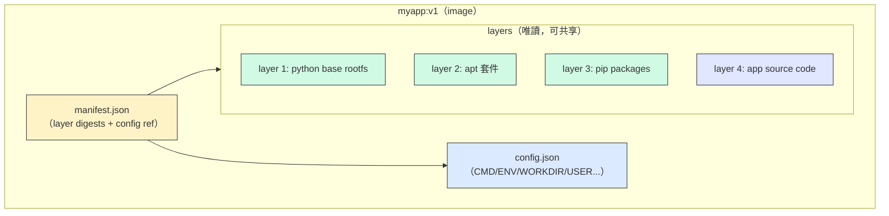
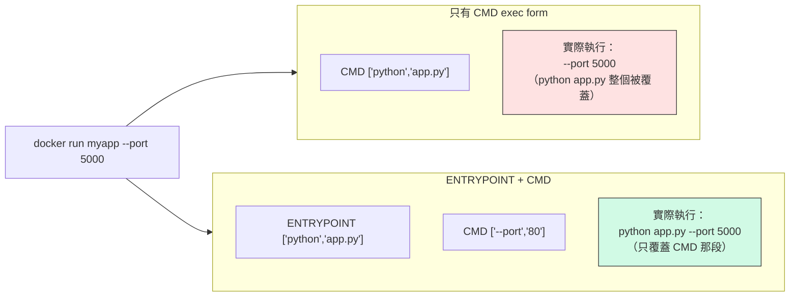
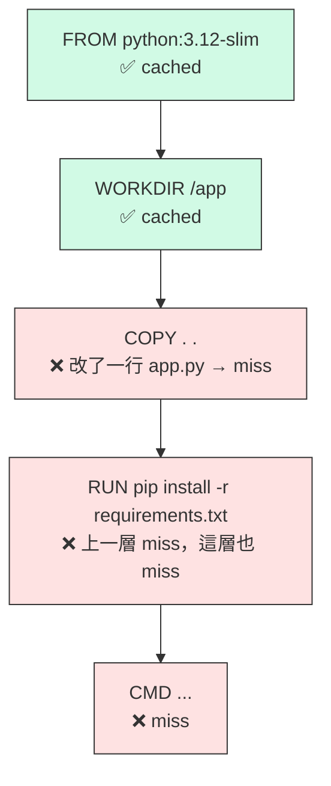
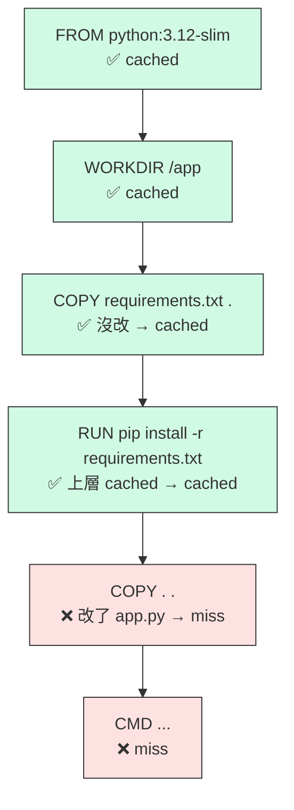
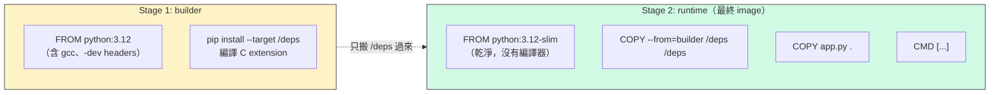

# W06｜Docker Image 與 Dockerfile：把映像拆開來，再組回去

## 學習目標

1. 講得出一個 Docker image 是由什麼組成的（layers + config + manifest），看得懂 `docker image inspect` 在講什麼。
2. 寫得出一份能跑的 Dockerfile，說得出每條指令為什麼放在那個位置。
3. 分得清 `CMD` 跟 `ENTRYPOINT`、`COPY` 跟 `ADD`、shell form 跟 exec form，各自什麼時候用。
4. 利用 layer 快取原理重排 Dockerfile，把 rebuild 時間從幾十秒砍到幾秒。
5. 親手做一次 multi-stage build，比較單階段與多階段的映像大小，講得出差了那麼多的原因。
6. 搞懂 `.dockerignore` 在幹嘛，碰到奇怪的 build context 不會一頭霧水。

## 先備知識

- 已完成 W01 的 Docker 四層驗證，手上的 app VM（W03 建立）仍可使用 Docker。
- 理解 W04 的 `$PATH`、權限與 `/usr/bin/`——寫 `USER` 指令時你才知道發生什麼事。
- 理解 W05 的 overlay2 與 Copy-on-Write——這週的「layer」就是 W05 講的那些 layer，只是現在換你來造。

## 問題情境

你在 app VM 上寫了一個 Flask hello app，第一次 `docker build` 花 80 秒。改了一行 `app.py`，再 build 一次——又是 80 秒。明明只動了一行 Python，為什麼 pip install 要從頭跑？

更怪的是：你照某篇部落格寫了 `CMD python app.py`，結果 `docker run myapp --port 5000` 的 `--port 5000` 完全被吃掉。換成 `ENTRYPOINT ["python", "app.py"]` 就正常了。到底差在哪？

然後你同事把 image push 上 registry，一個印 hello 的 app 居然 1.2 GB。

Dockerfile 寫錯一個順序、選錯一種寫法，代價就是每次 rebuild 多等一分鐘、最終 image 大十倍、參數莫名被吃掉。這週結束你要能一眼看出：**這份 Dockerfile 哪裡會害你慢、害你大、害你壞。**

---

## 核心概念

### 一、映像是什麼做的

W05 你已經用 `docker image inspect` 看過 `RootFS.Layers`——那一串 sha256 hash 就是 image 的骨頭。一個 Docker image 講白了就是三樣東西：

- **一堆唯讀 layers**：每個 layer 是一包 tarball（檔案系統的差異），對應到 W05 的 overlay2 lower dirs。
- **一份 config JSON**：裡面寫啟動命令、工作目錄、環境變數、暴露埠、user、entrypoint/cmd 等 metadata。
- **一份 manifest**：把 layers 跟 config 綁在一起，記錄每個 layer 的 digest 與大小。



容器跑起來的時候，daemon 把這些唯讀 layers 疊起來當 lower，再加一層可寫的 upper——就是 W05 看過的 overlay2 merged view。

**想成這樣**：image 是一張食譜（config）加一盒料（layers）。兩個容器同樣用 `python:3.12-slim`，盒子裡的料是同一份，不會複製兩份到硬碟。這就是為什麼 Docker 下載多個 image 時會說「Already exists」——共享 layer。

### 二、Dockerfile 指令全覽

Dockerfile 是一份照順序執行的 build 腳本，每條指令會產生一層 layer（或修改 metadata）。以下是最常用的幾條：

| 指令 | 一句話 | 常見坑 |
|---|---|---|
| `FROM` | 選擇 base image，所有事情從這一層之上疊 | 選 `:latest` 會讓 build 不可重現；選 `alpine` 要留意 musl libc |
| `RUN` | 在 build 時執行命令（安裝套件、編譯），結果固化成一層 | 多個 `RUN` = 多層；`apt update` 和 `apt install` 必須同一層 |
| `COPY` | 把 build context 裡的檔案複製進 image | 路徑是相對 build context 根目錄，不是 Dockerfile 位置 |
| `ADD` | 類似 `COPY` 但多了自動解壓 tar、抓遠端 URL | 官方建議：能用 `COPY` 就別用 `ADD` |
| `WORKDIR` | 設定後續指令的工作目錄（等於 `cd`） | 不存在會自動建立；別用 `RUN cd /app` 代替 |
| `ENV` | 設環境變數，build 時與 runtime 都生效 | 不要塞密碼（`docker history` 看得到） |
| `ARG` | build 時期變數，只在 build 存在 | runtime 看不到；可以被 `--build-arg` 覆蓋 |
| `EXPOSE` | 宣告容器會聽哪個埠（文件化用途） | **不會**真的發布埠，要 `docker run -p` 才會 |
| `USER` | 切換執行身份 | 預設是 root，生產環境務必切成非 root |
| `CMD` | 容器啟動時的預設命令 | 可被 `docker run` 後面的參數覆蓋 |
| `ENTRYPOINT` | 容器啟動時固定執行的主程式 | 跟 `CMD` 搭配時行為不同，下節詳解 |

> **講白了**：`FROM/RUN/COPY/ADD` 會造出新 layer、佔硬碟空間；`WORKDIR/ENV/ARG/EXPOSE/USER/CMD/ENTRYPOINT` 只改 metadata、不產生新的檔案層（但仍會佔一個 metadata-only 的層）。

### 三、CMD vs ENTRYPOINT：最容易搞混的一對

這是 Dockerfile 最多人踩雷的地方。兩者都能指定「容器啟動時跑什麼」，但行為差很多。重點記兩件事：

1. 寫法分 **shell form**（字串）跟 **exec form**（JSON 陣列）。
2. `CMD` 的參數**會**被 `docker run` 後面接的 args 覆蓋，`ENTRYPOINT` 的主命令**不會**。

#### 三種寫法行為對照

以 `docker run myapp arg1 arg2` 為例：

| Dockerfile 寫法 | 容器實際執行 | 特性 |
|---|---|---|
| `CMD python app.py`（shell form） | `/bin/sh -c "python app.py"` | 多一層 shell；`arg1 arg2` 會完全覆蓋整條命令 |
| `CMD ["python", "app.py"]`（exec form） | `python app.py`（PID 1 就是 python） | 無 shell；`arg1 arg2` 會整條覆蓋成 `arg1 arg2` |
| `ENTRYPOINT ["python", "app.py"]`（exec form） | `python app.py arg1 arg2` | 固定跑 python app.py，後面附加參數 |
| `ENTRYPOINT ["python", "app.py"]` + `CMD ["--port", "80"]` | `python app.py --port 80`；若 run 時接 `--port 5000` 則變 `python app.py --port 5000` | 最常見的組合：ENTRYPOINT 當主程式、CMD 當預設參數 |



**選擇原則**：

- 容器是一個固定跑的程式（像 nginx、python app）→ 用 `ENTRYPOINT` exec form，把預設參數放 `CMD`。
- 容器要當成通用工具箱（像 `ubuntu`、`alpine`）→ 只用 `CMD`，讓使用者自由覆蓋。
- **幾乎都該用 exec form**（JSON 陣列）：PID 1 是你的程式而不是 sh，容器收得到 SIGTERM，能正確 graceful shutdown。

> **想一想**：為什麼用 shell form 時 `docker stop` 有時候會卡 10 秒才強制殺？（提示：PID 1 是 sh，不是你的 app）

### 四、Layer 快取機制

Dockerfile 每條指令會算一個 **cache key**，規則大致是：

```
cache_key = hash(
    上一層的 cache_key
  + 這條指令的完整字串（含 ARG/ENV 展開後的結果）
  + COPY/ADD 的檔案內容（build context 中被複製檔案的 hash）
  + 目標平台（linux/amd64、linux/arm64…）
  + FROM 所指向的 base image digest
)
```

換句話說：**不只看指令文字**，連 `--build-arg`、`ENV` 的值、目標架構、甚至 base image 被重 push 後的 digest 改變都會讓 cache key 變，導致這層 miss。

只要 cache key 一樣，Docker 就直接從快取重用這層，不重新執行。但有一條殘酷的規則：**一旦某一層 miss，它之後所有層都 miss**，因為後面每層的 cache key 都依賴前一層。



上圖是常見的反面教材——改一行程式就要重跑 pip install。正確寫法是把「變動頻率低」的步驟往前放：



同樣改一行 `app.py`，這版只有最後兩層重算，pip install 直接 hit cache，省下幾十秒。

**排序黃金法則**：**愈不常變的愈往上放**。順序是 `FROM` → 系統套件 → 語言依賴 → 應用程式碼 → CMD。

### 五、Multi-stage build

單階段 Dockerfile 常見問題：為了 build 你裝了 gcc、make、-dev headers，跑起來根本用不到，卻通通進了最終 image。結果就是 app 500 MB 起跳。

Multi-stage build 讓你在同一份 Dockerfile 寫多個 `FROM`，每個 `FROM` 是一個獨立的 stage。最後你只 `COPY --from=<stage>` 把需要的產物搬到乾淨的 runtime stage，build tools 全部留在 builder 階段，不會進最終 image。



最終 image 只包含 runtime stage 的 layers，builder stage 的 layers **不會**進最終 image（但仍然在本機 build cache 裡，下次 build 可重用）。

**想一想**：那些「消失」的 builder layers 真的消失了嗎？`docker images -a` 看看——它們還在本機快取，只是沒有 tag。這就是 multi-stage 省空間但不省快取的原理。

---

## 操作參考

以下所有操作在 **app VM** 上執行（W03/W04 建立的那台）。確認你已經能不加 sudo 執行 `docker ps`。

### Part A：把現成映像拆開來看

#### 步驟 1：拉一個 base image

- 命令：

```bash
docker pull python:3.12-slim
docker images python
```

- 觀察：記錄 SIZE 欄位的值（之後要跟你自己 build 的 image 對照）。

#### 步驟 2：看 image 的 layer 歷史

- 命令：

```bash
docker history python:3.12-slim
```

- 預期輸出：一串 layer，每層有 `CREATED BY`（哪條指令造的）、`SIZE`。大多數層是 base OS、pip、Python runtime。

#### 步驟 3：用 inspect 看 config

- 命令：

```bash
docker image inspect python:3.12-slim | head -80
```

- 重點觀察：`Config.Env`、`Config.Cmd`、`Config.Entrypoint`、`Config.WorkingDir`、`RootFS.Layers`（一串 sha256）。
- 把 `RootFS.Layers` 的數量記下來——這就是 W05 講的 overlay2 lower dirs 的數量。

#### 步驟 4：觀察兩個同源 image 共享 layer

- 命令：

```bash
docker pull python:3.12
docker images python
docker history python:3.12 | tail -5
docker history python:3.12-slim | tail -5
```

- 觀察：兩者底層幾個 layer 的 hash 可能相同（共享），這是 Docker 的空間最佳化。

> **Checkpoint A** — 能說出 image 由 layers + config + manifest 組成；能從 `docker history` 找到哪一層最大；能從 `docker image inspect` 讀出 `Cmd`、`Env`、`WorkingDir`。

---

### Part B：寫你的第一份 Dockerfile

#### 步驟 5：建立專案資料夾

- 命令：

```bash
mkdir -p ~/virt-container-labs/w06/app
cd ~/virt-container-labs/w06
```

#### 步驟 6：寫 Flask hello app

- 建立 `app/app.py`：

```python
from flask import Flask
import os, socket

app = Flask(__name__)

@app.route("/")
def hello():
    return f"Hello from {socket.gethostname()} | version={os.environ.get('APP_VERSION','dev')}\n"

if __name__ == "__main__":
    app.run(host="0.0.0.0", port=80)
```

- 建立 `app/requirements.txt`：

```
flask==3.0.3
```

#### 步驟 7：寫第一版 Dockerfile（故意寫爛的那種）

- 建立 `Dockerfile.v1`：

```dockerfile
FROM python:3.12-slim
WORKDIR /app
COPY app/ .
RUN pip install --no-cache-dir -r requirements.txt
EXPOSE 80
CMD ["python", "app.py"]
```

- 注意：這版把 `COPY app/ .` 放在 `pip install` 之前——動任何程式碼都會害 pip install 失效。這是故意的，後面會對照。

#### 步驟 8：build 並計時

- 命令：

```bash
time docker build -f Dockerfile.v1 -t myapp:v1 .
```

- 預期輸出：build 過程依序跑每條指令，最後印 `Successfully tagged myapp:v1`。把 `real` 時間記下來（例如 45 秒）。

#### 步驟 9：跑起來驗證

- 命令：

```bash
docker run -d --name myapp-v1 -p 8080:80 -e APP_VERSION=v1 myapp:v1
curl http://localhost:8080/
docker logs myapp-v1
docker stop myapp-v1 && docker rm myapp-v1
```

- 預期輸出：curl 看到 `Hello from <container-id> | version=v1`。

> **Checkpoint B** — Dockerfile.v1 build 成功，curl 能打到容器；你記下了第一次 build 的耗時。

---

### Part C：玩壞快取，再修回來

#### 步驟 10：重 build 不改任何東西

- 命令：

```bash
time docker build -f Dockerfile.v1 -t myapp:v1 .
```

- 預期輸出：每一層都 `CACHED`，幾秒內結束。這是 best case。

#### 步驟 11：改一行 app.py 再 build

- 命令：

```bash
sed -i 's/Hello from/Hi from/' app/app.py
time docker build -f Dockerfile.v1 -t myapp:v1 .
```

- 預期觀察：從 `COPY app/ .` 開始 cache miss，`RUN pip install` 整個重跑。時間幾乎回到第一次 build 的長度。
- 這就是**錯誤排序的代價**：改一行程式，pip install 從頭來一次。

#### 步驟 12：寫第二版 Dockerfile（排序修正版）

- 建立 `Dockerfile.v2`：

```dockerfile
FROM python:3.12-slim
WORKDIR /app

# 先複製相依清單，單獨裝套件（這層只在 requirements 變動時才 rebuild）
COPY app/requirements.txt .
RUN pip install --no-cache-dir -r requirements.txt

# 再複製應用程式碼（這層才是常常變動的）
COPY app/ .

EXPOSE 80
CMD ["python", "app.py"]
```

#### 步驟 13：build v2 並清除 v1 cache 來比較

- 命令：

```bash
time docker build -f Dockerfile.v2 -t myapp:v2 .
# 再改一行 app.py
sed -i 's/Hi from/Hey from/' app/app.py
time docker build -f Dockerfile.v2 -t myapp:v2 .
```

- 預期觀察：第二次 build 時，`COPY requirements.txt` 跟 `RUN pip install` 都 CACHED，只有最後 `COPY app/ .` 跟 CMD 的 metadata 重算。時間從幾十秒變幾秒。

#### 步驟 14：記錄對照數據

- 把以下三個數字填進待交的 README：
  1. v1 首次 build 時間
  2. v1 改程式後 rebuild 時間
  3. v2 改程式後 rebuild 時間

> **Checkpoint C** — 能用數據證明「把 `COPY requirements.txt` 獨立出來」有效；講得出為什麼 v1 miss 之後所有層都 miss。

---

### Part D：CMD vs ENTRYPOINT 三種寫法實驗

#### 步驟 15：寫一個會印 argv 的小程式

- 建立 `app/show_args.py`：

```python
import sys, os
print("argv =", sys.argv)
print("PID  =", os.getpid())
```

#### 步驟 16：三種 Dockerfile 寫法

- 建立 `Dockerfile.cmd-shell`：

```dockerfile
FROM python:3.12-slim
WORKDIR /app
COPY app/show_args.py .
CMD python show_args.py default1 default2
```

- 建立 `Dockerfile.cmd-exec`：

```dockerfile
FROM python:3.12-slim
WORKDIR /app
COPY app/show_args.py .
CMD ["python", "show_args.py", "default1", "default2"]
```

- 建立 `Dockerfile.entrypoint`：

```dockerfile
FROM python:3.12-slim
WORKDIR /app
COPY app/show_args.py .
ENTRYPOINT ["python", "show_args.py"]
CMD ["default1", "default2"]
```

#### 步驟 17：build 三個版本

- 命令：

```bash
docker build -f Dockerfile.cmd-shell -t argtest:shell .
docker build -f Dockerfile.cmd-exec  -t argtest:exec  .
docker build -f Dockerfile.entrypoint -t argtest:entry .
```

#### 步驟 18：不帶參數執行

- 命令：

```bash
docker run --rm argtest:shell
docker run --rm argtest:exec
docker run --rm argtest:entry
```

- 預期觀察：三者都會印 `default1 default2`。但 shell form 的 `PID` 是 python 被 sh fork 出來的，exec form 跟 entrypoint 版本的 PID 1 就是 python。

#### 步驟 19：帶額外參數執行

- 命令：

```bash
docker run --rm argtest:shell extra1 extra2
docker run --rm argtest:exec  extra1 extra2
docker run --rm argtest:entry extra1 extra2
```

- 預期觀察：
  - `argtest:shell` → 直接錯誤或完全忽略 extra1/extra2（因為 shell form 的 CMD 被整串覆蓋成 `extra1 extra2`，執行 `/bin/sh -c extra1 extra2`）。
  - `argtest:exec` → 執行 `extra1 extra2`，會報錯 `exec: "extra1": executable file not found`——整條被覆蓋。
  - `argtest:entry` → 執行 `python show_args.py extra1 extra2`，完美附加。

#### 步驟 20：記錄三種行為

- 把三次輸出貼進 README 的對照表，用自己的話解釋為什麼 `ENTRYPOINT` + `CMD` 的組合最穩。

> **Checkpoint D** — 能講出三種寫法的差異；知道為什麼 production 幾乎都用 exec form ENTRYPOINT + CMD 組合。

---

### Part E：Multi-stage build 把映像瘦身

#### 步驟 21：看看 v2 現在多大

- 命令：

```bash
docker images myapp
```

- 記下 v2 的 SIZE。

#### 步驟 22：寫 multi-stage Dockerfile

- 建立 `Dockerfile.multi`：

```dockerfile
# ---------- builder stage ----------
FROM python:3.12 AS builder
WORKDIR /build
COPY app/requirements.txt .
# 把相依安裝到獨立 prefix，之後整包搬走
# 用 --prefix 而不是 --target：--prefix 會同時產生 bin/ 與 lib/pythonX.Y/site-packages/，
# console script（例如 flask、gunicorn）才不會漏掉。
RUN pip install --no-cache-dir --prefix=/install -r requirements.txt

# ---------- runtime stage ----------
FROM python:3.12-slim AS runtime
WORKDIR /app

# 把 /install 底下的 bin 與 site-packages 一起搬到 runtime 的對應位置
COPY --from=builder /install/bin /usr/local/bin
COPY --from=builder /install/lib/python3.12/site-packages /usr/local/lib/python3.12/site-packages
COPY app/ .

# 切成非 root
RUN useradd -m -u 1000 appuser && chown -R appuser:appuser /app
USER appuser

EXPOSE 80
ENTRYPOINT ["python"]
CMD ["app.py"]
```

- 注意：
  - builder stage 用 `python:3.12`（完整版，含編譯工具），runtime 用 `python:3.12-slim`。
  - runtime 完全沒有 `pip install`，也沒有編譯器。
  - 順便加了 `USER appuser` 符合 W12 安全要求的伏筆。

#### 步驟 23：build 並比大小

- 命令：

```bash
docker build -f Dockerfile.multi -t myapp:multi .
docker images myapp
```

- 預期觀察：`myapp:multi` 通常比 `myapp:v2` 略小（Python 套件本身占最大宗，這個範例差距不大；若 app 需要編譯 C extension 差距會非常明顯）。
- 把 v1/v2/multi 三個 SIZE 記下來填進 README。

#### 步驟 24：看 layer 結構差異

- 命令：

```bash
docker history myapp:v2
docker history myapp:multi
```

- 觀察：`myapp:multi` 看不到 builder stage 裡的 layers，只有 runtime stage 的。

#### 步驟 25：驗證 multi-stage 可執行且能覆蓋參數

- 命令：

```bash
docker run -d --name myapp-multi -p 8081:80 -e APP_VERSION=multi myapp:multi app.py
curl http://localhost:8081/
docker exec myapp-multi whoami
docker stop myapp-multi && docker rm myapp-multi
```

- 預期輸出：curl 正常；`whoami` 回 `appuser`（不是 root）。

#### 步驟 26：確認 builder 層還在本機

- 命令：

```bash
docker images -a | head -20
```

- 觀察：會看到一些 `<none>` tag 的 image——這些就是 builder stage 的中間產物。最終 image 沒帶它們，但本機 cache 還留著，下次 build 可重用。

> **Checkpoint E** — 能說出單階段 vs 多階段的 size 差；能解釋 builder 層去哪了；知道 `USER` 改非 root 的意義。

---

### Part F：.dockerignore 故障注入

#### 步驟 27：記錄故障前基線

- 命令：

```bash
echo "=== 故障前：build context 大小 ==="
du -sh .
ls -la
```

- 暫時還沒有 `.dockerignore`，也還沒有大垃圾。

#### 步驟 28：故障注入——製造 build context 垃圾

- 命令：

```bash
# 模擬 .git、node_modules、log 等常見垃圾
mkdir -p .git/objects
dd if=/dev/urandom of=.git/objects/big.pack bs=1M count=100 2>/dev/null
mkdir -p logs
dd if=/dev/urandom of=logs/huge.log bs=1M count=50 2>/dev/null

du -sh .
```

- 預期輸出：專案突然胖了 150 MB。

#### 步驟 29：觀測故障——build 時間與 context 大小

- 命令：

```bash
echo "=== 故障中：沒有 .dockerignore ==="
time docker build -f Dockerfile.multi -t myapp:dirty .
```

- 預期觀察：build 輸出的第一行 `transferring context` 會顯示 150+ MB，而且傳 context 就吃掉明顯的時間。更糟的是 `COPY app/ .` 的 cache 因為 context 變動有可能被波及（視 BuildKit 版本而定）。

#### 步驟 30：回復——加上 .dockerignore

- 建立 `.dockerignore`：

```
.git
.gitignore
logs
*.log
__pycache__
*.pyc
.venv
.env
Dockerfile*
!Dockerfile
README.md
```

#### 步驟 31：回復後驗證

- 命令：

```bash
echo "=== 回復後：有 .dockerignore ==="
time docker build -f Dockerfile.multi -t myapp:clean .
```

- 預期觀察：`transferring context` 的大小掉回幾十 KB，build 時間也明顯縮短。

#### 步驟 32：清理故障注入產物

- 命令：

```bash
rm -rf .git logs
```

#### 步驟 33：三階段對照

把以下填進 README：

| 項目 | 故障前（無 .git、無 .dockerignore） | 故障中（有 150MB .git，無 .dockerignore） | 回復後（有 .dockerignore） |
|---|---|---|---|
| `du -sh .` | （填入） | （填入） | （填入） |
| build context 傳輸大小 | （填入） | （填入） | （填入） |
| build 時間 | （填入） | （填入） | （填入） |

> **Checkpoint F** — 三階段證據完整；能說出為什麼 `.dockerignore` 對 build 速度與 image 安全都重要（避免 `.git`、`.env` 意外被 COPY 進 image）。

---

## Checkpoint 總覽

> **Checkpoint A** — 能說出 image 由 layers + config + manifest 組成；能從 `docker history`、`docker image inspect` 讀出關鍵欄位。

> **Checkpoint B** — Dockerfile.v1 build 成功並用 curl 驗證；記下首次 build 時間。

> **Checkpoint C** — 有 v1/v2 的 rebuild 時間對照；能解釋「某層 miss 則其後全 miss」規則。

> **Checkpoint D** — CMD shell form / CMD exec form / ENTRYPOINT+CMD 三種行為都實測過，有 argv 輸出對照。

> **Checkpoint E** — 單階段 vs multi-stage 的 SIZE 對照完成；`USER appuser` 已設定並驗證。

> **Checkpoint F** — `.dockerignore` 故障注入三階段證據完整。

---

## 交付清單

必交目錄：`~/virt-container-labs/w06/`

必要檔案：

- `Dockerfile`（最終版本，內容等於 `Dockerfile.multi`）
- `Dockerfile.v1`、`Dockerfile.v2`、`Dockerfile.cmd-shell`、`Dockerfile.cmd-exec`、`Dockerfile.entrypoint`、`Dockerfile.multi`（保留所有實驗版本）
- `app/app.py`、`app/show_args.py`、`app/requirements.txt`
- `.dockerignore`
- `README.md`

`README.md` 必須包含：

- Image 組成說明（layers / config / manifest 各自是什麼）
- `docker image inspect python:3.12-slim` 的 `Cmd`、`Env`、`WorkingDir` 紀錄
- Dockerfile.v1 的首次 build 時間
- v1 改程式後 rebuild 時間 vs v2 改程式後 rebuild 時間對照
- 三種 CMD/ENTRYPOINT 寫法的 `docker run` 輸出對照表（含帶參數與不帶參數兩組）
- 單階段 vs multi-stage 的 SIZE 對照表
- `.dockerignore` 故障前/中/後三階段對照（context 大小、build 時間）
- 至少 1 則排錯紀錄（症狀 → 定位 → 修正 → 驗證）
- 可重跑最小命令鏈：

```bash
cd ~/virt-container-labs/w06
docker build -f Dockerfile.multi -t myapp:multi .
docker run -d --name myapp-final -p 8080:80 -e APP_VERSION=final myapp:multi app.py
curl http://localhost:8080/
docker stop myapp-final && docker rm myapp-final
```

---

## README 繳交模板

複製到 `~/virt-container-labs/w06/README.md`，補齊各欄位：

```markdown
# W06｜Docker Image 與 Dockerfile

## 映像組成
- Layers 是什麼：（用自己的話寫）
- Config 是什麼：（用自己的話寫）
- Manifest 是什麼：（用自己的話寫）

## python:3.12-slim inspect 摘錄
- Config.Cmd：（填入）
- Config.Env：（填入）
- Config.WorkingDir：（填入）
- RootFS.Layers 數量：（填入）

## Layer 快取實驗
| 情境 | build 時間 |
|---|---|
| v1 首次 build | （填入） |
| v1 改 app.py 後 rebuild | （填入） |
| v2 首次 build | （填入） |
| v2 改 app.py 後 rebuild | （填入） |

觀察（用自己的話寫）：為什麼 v2 的 rebuild 這麼快？

## CMD vs ENTRYPOINT 實驗
| 寫法 | `docker run ` 輸出 | `docker run  extra1 extra2` 輸出 |
|---|---|---|
| CMD shell form | （填入） | （填入） |
| CMD exec form | （填入） | （填入） |
| ENTRYPOINT + CMD | （填入） | （填入） |

結論（用自己的話寫）：

## Multi-stage 大小對照
| Image | SIZE |
|---|---|
| python:3.12（builder base） | （填入） |
| python:3.12-slim（runtime base） | （填入） |
| myapp:v2（單階段） | （填入） |
| myapp:multi（多階段） | （填入） |

解釋（用自己的話寫）：builder stage 的 layer 去哪了？

## .dockerignore 故障注入
| 項目 | 故障前 | 故障中 | 回復後 |
|---|---|---|---|
| du -sh . | （填入） | （填入） | （填入） |
| build context 傳輸大小 | （填入） | （填入） | （填入） |
| build 時間 | （填入） | （填入） | （填入） |

## 排錯紀錄
- 症狀：
- 診斷：
- 修正：
- 驗證：

## 設計決策
（說明本週至少 1 個技術選擇與取捨，例如：為什麼 runtime 選 `python:3.12-slim` 而不是 `alpine`？）
```

---

## 常見錯誤與診斷

- 錯誤：`COPY failed: file not found in build context or excluded by .dockerignore: stat app/requirements.txt: file does not exist`。
  診斷：`COPY` 的來源路徑是相對 **build context 根目錄**（也就是 `docker build` 最後那個 `.`），不是相對 Dockerfile 位置。檢查 `ls` 確認檔案存在，並確認沒有被 `.dockerignore` 排除。

- 錯誤：改了 `app.py` 一行，build 時 `RUN pip install` 依然從頭跑、什麼都沒 cache。
  診斷：`COPY . .` 放在 `RUN pip install` 之前，導致 COPY 層 miss 後面全 miss。改成「先 COPY requirements → RUN pip install → 再 COPY 其他」（見 Part C 的 v2 範例）。

- 錯誤：`docker run -p 8080:80` 後 `curl http://localhost:8080` 連線被拒。
  診斷：優先檢查 app 是否 listen 在 `0.0.0.0` 而不是 `127.0.0.1`（容器內的 localhost 外面連不到）。接著確認 `EXPOSE 80` 和 `-p 8080:80` 對應的是容器內真的在 listen 的埠。最後檢查 host 是否已經有別的程序佔了 8080（`ss -tlnp | grep 8080`）。

- 錯誤：`docker run myapp --port 5000` 的 `--port 5000` 完全沒作用。
  診斷：Dockerfile 用了 `CMD ["python", "app.py"]`（沒有 ENTRYPOINT）——`docker run` 後面的參數會**整條覆蓋** CMD，而不是附加在後。想要附加參數請改用 `ENTRYPOINT ["python", "app.py"]` + `CMD []`（或把預設參數放 CMD）。

- 錯誤：multi-stage build 跑 `COPY --from=builder /build/dist /app` 回 `"/build/dist": not found`。
  診斷：`--from=<stage>` 的路徑是 **builder stage 內的絕對路徑**，不是你本機的路徑。確認 builder stage 裡確實有 `/build/dist`（加一行 `RUN ls /build` 臨時 debug），也注意 stage 名稱拼字（`FROM python:3.12 AS builder` 的 `builder`）。

- 錯誤：build 到一半 `docker build` 傳 context 就花了一分鐘，還沒開始執行 Dockerfile。
  診斷：build context 太大——可能有 `.git`、`node_modules`、`.venv`、大 log。加 `.dockerignore` 排除這些（見 Part F）；或把 Dockerfile 與 app 放在一個乾淨的子目錄，再從那個子目錄執行 `docker build`。

- 錯誤：`docker images` 後 `myapp:multi` 比想像中大，裡面還有 gcc。
  診斷：runtime stage 的 `FROM` 選錯了（可能誤選了完整版 `python:3.12`）。多階段的關鍵是**最終 stage 要選乾淨的 base**，並且**只 COPY 產物過來**，不要在 runtime stage 再 `apt install build-essential`。

- 錯誤：切成 `USER appuser` 後容器一起來就 crash，log 顯示 `Permission denied: '/app/app.py'`。
  診斷：`COPY` 進來的檔案預設是 root 擁有。在切 `USER` 之前要先 `chown -R appuser:appuser /app`（或 `COPY --chown=appuser:appuser ...`）。順序：先 COPY、再 chown、再 USER。

---

## 想一想

1. 為什麼把 `COPY requirements.txt` 跟 `COPY . .` 分兩步寫，會比一次 `COPY . .` 聰明？用「cache key 計算規則」解釋，不只是「把變動的放後面」這種口訣。

2. Multi-stage build 最終 image 裡「消失」的那些 builder layers 真的消失了嗎？用 `docker images -a` 查一下——它們去哪了？本機磁碟有省到空間嗎？push 到 registry 呢？

3. 如果 base image 選 `python:3.12-alpine` 而不是 `python:3.12-slim`，你預期會遇到什麼坑？關鍵字：musl libc vs glibc、預編譯的 Python wheel、需要 `apk add gcc musl-dev` 才能 `pip install` 某些套件。對一個 hello world app 來說值得嗎？對一個用 numpy/pandas 的 app 呢？

---

## 延伸閱讀

- `[R1]` Dockerfile reference（官方指令總覽，含 BuildKit 新語法）：<https://docs.docker.com/reference/dockerfile/>
- `[R2]` Best practices for writing Dockerfiles（layer 快取原則、multi-stage 範例）：<https://docs.docker.com/build/building/best-practices/>
- `[R3]` Multi-stage builds 官方教學：<https://docs.docker.com/build/building/multi-stage/>
- `[R4]` Docker build cache 詳解（cache key 計算、cache mount、BuildKit 快取）：<https://docs.docker.com/build/cache/>
- `[R5]` CMD vs ENTRYPOINT 官方說明（含 shell form / exec form 行為表）：<https://docs.docker.com/reference/dockerfile/#cmd> 與 <https://docs.docker.com/reference/dockerfile/#entrypoint>
- `[R6]` `.dockerignore` 文件與最佳實踐：<https://docs.docker.com/build/concepts/context/#dockerignore-files>
- `[R7]` OCI Image Format Specification（manifest + config + layers 的規範定義）：<https://github.com/opencontainers/image-spec>
- `[R8]` Docker BuildKit 概觀（現代 build 引擎，快取與 parallel stage）：<https://docs.docker.com/build/buildkit/>
- `[R9]` Alpine Linux 與 musl libc 在 Python 上的坑（社群討論）：<https://pythonspeed.com/articles/alpine-docker-python/>
- `[R10]` Docker Official Image `python` README（`slim` vs `alpine` vs 完整版的差別）：<https://hub.docker.com/_/python>

---

做完這週，你應該能一眼看穿一份 Dockerfile 的好壞：看順序就知道它 rebuild 會不會爆炸、看 `FROM` 就知道最終 image 會多肥、看 `CMD`/`ENTRYPOINT` 就知道 `docker run` 接參數會發生什麼事。Dockerfile 不是咒語，它是有規則的——規則搞懂了，你寫出來的 image 自然又小、又快、又穩。
