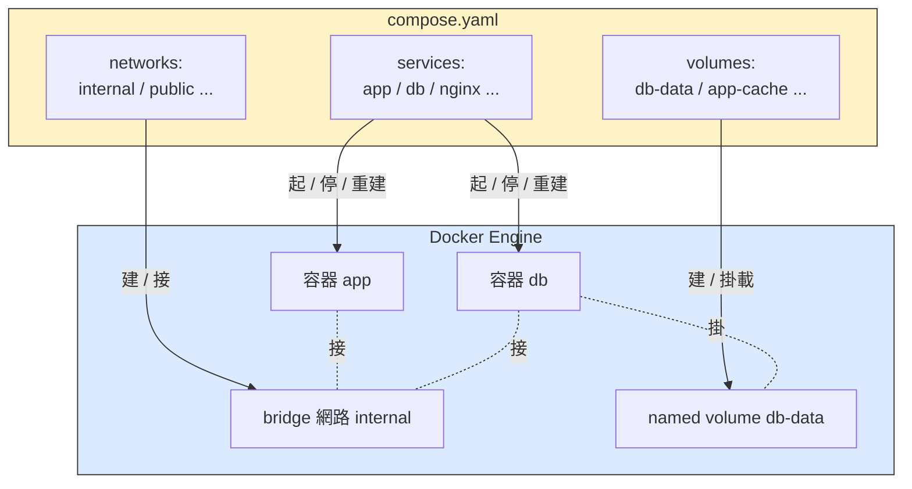
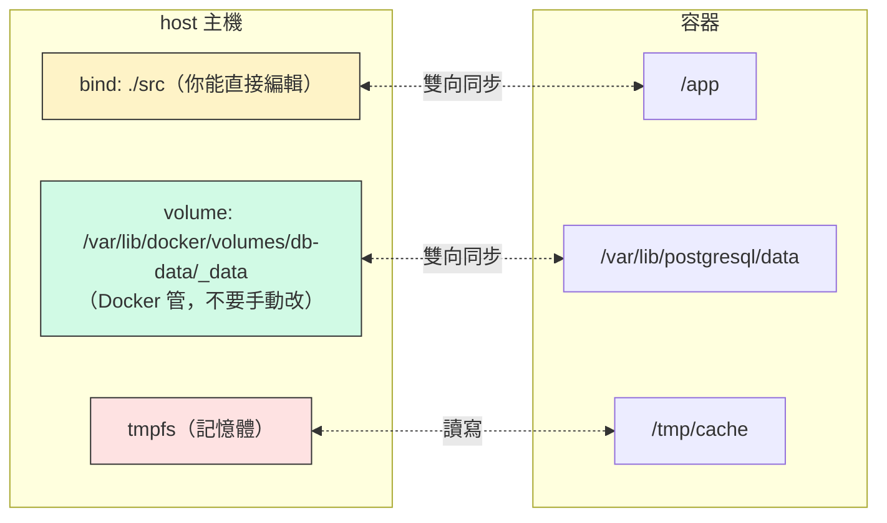
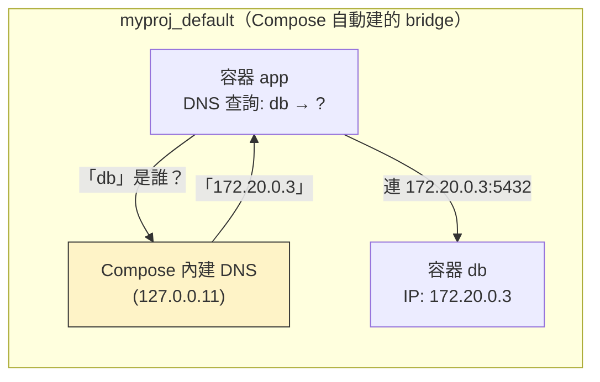

# W07｜Docker Compose 與資料持久化：從一堆指令到一份 YAML

## 學習目標

1. 講得出為什麼期中那種「兩個 `docker run` 加一條 `docker network create`」做法到第三個服務就會失控，看得懂宣告式（compose.yaml）跟命令式（docker run）的差別。
2. 寫得出一份能跑 app + db 兩個 service 的 `compose.yaml`，講得出 `services`、`networks`、`volumes` 三大區塊各自負責什麼。
3. 分得清 named volume、bind mount、tmpfs 三種掛載的用途、生命週期、適合的情境，挑得出在 dev / prod / 暫存 三個情境該選哪個。
4. 用 `depends_on` 搭配 `healthcheck` 控制服務啟動順序，看得懂為什麼「app 比 db 早起來」會炸。
5. 親手做一次「容器砍掉重練」實驗，用三種掛載各跑一遍，用資料還在不在的事實證明 named volume 為什麼是預設選擇。
6. 看得懂 `docker compose config / ps / logs / down -v` 這幾條最常用的指令在做什麼，被學弟妹問起時能一句話回答。

## 先備知識

- 已完成期中實作，手上有可用的 `app` VM（W03 建立、Docker 已裝好），能用 bastion → app 的 SSH 跳轉。
- 理解 W04 的 `journalctl`、systemd 服務概念——這週的 healthcheck 跟它們是同一套思路（檢查健康、重啟、依賴）。
- 理解 W05 的 overlay2 與 W06 的 Dockerfile——這週要動的「volume」就是 W05 那張 overlay 圖裡 **upper dir 之外** 的另一條資料路徑。
- **跨平台註記**：Mac 同學請在 UTM 的 Ubuntu ARM64 VM 上做；Windows 同學在 VMware 上的 Ubuntu VM 做。Compose 指令、`compose.yaml` 內容兩平台完全相同，差別只在 image 是否需要 `arm64` tag（後面會註記）。

## 問題情境

回到期中那個場景。你在 app VM 上要部署一個小 app，依序敲了：

```bash
docker network create lab-net
docker volume create db-data
docker run -d --name db --network lab-net -v db-data:/var/lib/postgresql/data \
  -e POSTGRES_PASSWORD=secret postgres:16
docker run -d --name app --network lab-net -p 8080:80 \
  -e DB_HOST=db -e DB_PASSWORD=secret myapp:v1
```

兩個禮拜後，學弟要重現你的部署。你打開筆記，發現：

- 漏抄了 `docker network create`，學弟跑 `docker run --network lab-net` 報 network not found。
- 密碼 `secret` 散落在兩條指令、兩個 `-e` 裡，學弟改一個忘了另一個，app 起來連不上 db。
- 你忘了 `-v db-data:/var/lib/postgresql/data`，學弟把 `--name db` 容器 `docker rm` 砍掉重起，整個學期的測試資料一起消失。

這不是你的問題，是 `docker run` 這把工具天生不適合「一組互相依賴的容器」。它是**命令式**的——你說一條，它做一條，順序錯了沒人提醒。

這週要把這套「散落的指令」收進**一份 `compose.yaml`**。Compose 是宣告式的：你描述「我要的最終狀態」，它負責確保網路、volume、容器都按照這份描述存在。同時，我們會把**資料的生命週期**這件事講清楚——容器砍掉重來之後，資料在哪、會不會跟著死。

---

## 核心概念

### 一、Compose 解決的事：從命令式到宣告式

| 比較 | `docker run` 一條一條敲 | `docker compose up` 跑一份 yaml |
|---|---|---|
| 風格 | 命令式：你給步驟 | 宣告式：你給最終狀態 |
| 順序 | 你自己排，錯了不會提醒 | Compose 依 `depends_on` 排 |
| 網路 | `docker network create` 手動建 | 自動建 default network，service name 即 DNS |
| 環境變數 | 散落在各條 `-e` | 集中在 `services.<name>.environment` 或 `.env` |
| 重現性 | 靠筆記重抄 | `git clone` + `docker compose up -d` |
| 多容器停掉 | `docker stop a b c d`、`docker rm ...` | `docker compose down` |
| 一起更新 image | 手動 pull、stop、rm、run | `docker compose pull && docker compose up -d` |

**講白了**：Compose 不是新技術，它就是把你那一堆 `docker run` 翻譯成 YAML，但多做了三件事——**自動管網路、自動排順序、自動清現場**。

### 二、`compose.yaml` 的三大區塊

一份基本 `compose.yaml` 長這樣：

```yaml
services:    # 我要哪些容器（最重要的區塊）
  app:
    image: myapp:v1
    ...
  db:
    image: postgres:16
    ...

networks:    # 我要哪些網路（不寫的話 Compose 會自動建一個 default）
  internal:
    driver: bridge

volumes:     # 我要哪些 named volume（資料要活過容器重啟的）
  db-data:
```



三件事可以記成口訣：**「services 是要跑的東西、networks 是怎麼通、volumes 是怎麼存」**。

### 三、三種掛載：把資料放對地方

容器是會死的。預設情況下，容器砍掉，它寫進 overlay2 upper layer 的東西也跟著死。如果你的 db 把資料寫在容器內部目錄，容器一被 `docker rm`，學期的測試資料一起燒成灰。

Docker 有三種「把容器內路徑跟外部儲存綁起來」的辦法：

| 類型 | 寫法（compose） | 資料實際在哪 | 容器砍掉資料還在嗎 | 適合情境 |
|---|---|---|---|---|
| **bind mount** | `./src:/app` | host 上你指定的目錄 | 在（host 還在就在） | 開發時即時改 code、想用編輯器看資料 |
| **named volume** | `db-data:/var/lib/postgresql/data` | Docker 管的 `/var/lib/docker/volumes/` 下 | 在（除非 `docker volume rm`） | **生產環境的資料庫資料**、需要可攜性 |
| **tmpfs** | `tmpfs: /tmp/cache` | 記憶體（host 不落地） | **不在**（容器停就消失） | 敏感暫存（密鑰）、超快 cache |



**選擇原則**：

- **資料庫的 data 目錄**永遠用 named volume——你不應該知道也不需要知道 postgres 怎麼擺檔案，交給 Docker 管。
- **開發中的 source code**用 bind mount——這樣你在 host 編輯器存檔，容器內立刻看到，不用重 build。
- **某個密鑰只在跑的時候有效**用 tmpfs——容器一停資料連 host 上都不殘留。

> **想一想**：為什麼 named volume 不建議你「直接去 `/var/lib/docker/volumes/` 用 vim 改」？提示：postgres 在跑的時候，那個目錄是 mmap 進它的記憶體的。

### 四、Compose 內建網路與服務發現

跑 `docker compose up` 時，Compose 自動幫你做這兩件事：

1. 建一個專屬這份 yaml 的 bridge 網路（命名規則：`<專案目錄名>_default`）。
2. 把所有 service 接到這個網路上，並讓 **service name 直接就是 DNS 名稱**。

也就是說，`app` service 裡寫 `DB_HOST=db`，容器啟動後解析 `db` 會直接拿到 `db` service 的容器 IP。不用再 `docker network create`、不用 `--link`、不用知道 IP。



> **想一想**：如果你把 `services.db` 改名成 `services.postgres`，但 `app` 的 `DB_HOST` 還寫 `db`，會發生什麼？你看 log 會看到什麼錯誤訊息？

### 五、依賴與健康檢查：別讓 app 比 db 早起來

`depends_on` 控制**啟動順序**。但要注意一個陷阱：**單純的 `depends_on` 只保證「db 容器啟動了」，不保證「db 真的可以接受連線」**。Postgres 容器啟動到能 accept connection 之間有 1–5 秒的初始化窗口，這段時間 app 連過去會吃 connection refused。

正確寫法是**搭配 `healthcheck` + `condition: service_healthy`**：

```yaml
services:
  db:
    image: postgres:16
    healthcheck:
      test: ["CMD-SHELL", "pg_isready -U postgres"]
      interval: 2s
      timeout: 3s
      retries: 10
  app:
    image: myapp:v1
    depends_on:
      db:
        condition: service_healthy   # 等 db 真的健康才起 app
```

`condition` 有三種：

| condition | 等到什麼程度才起依賴方 |
|---|---|
| `service_started` | 容器啟動（不保證內部服務就緒）— 預設值 |
| `service_healthy` | 容器的 healthcheck 回 healthy |
| `service_completed_successfully` | 容器跑完且 exit 0（適合一次性 init job） |

> **想一想**：為什麼不能用「app 啟動失敗就重啟，重啟到 db 好為止」這種土法煉鋼？提示：crash loop、log 噪音、k8s 也會重蹈這條路（spoiler：k8s 還是用 readiness probe）。

---

## 操作參考

以下所有操作在 **app VM** 上執行（期中那台）。請先確認：

```bash
docker --version             # 應該 >= 20.10
docker compose version       # 應該 >= v2.x（注意：是 docker compose，不是 docker-compose）
```

> **若 `docker compose version` 找不到**：你裝的是舊的 docker-ce 沒帶 compose plugin。執行 `sudo apt-get install docker-compose-plugin` 即可。

### Part A：把期中的兩條 `docker run` 改寫成 compose.yaml

#### 步驟 1：建立專案目錄

- 命令：

```bash
mkdir -p ~/virt-container-labs/w07/app
cd ~/virt-container-labs/w07
```

#### 步驟 2：寫一個會連 Postgres 的 Flask app

- 建立 `app/app.py`：

```python
from flask import Flask
import os, socket, psycopg2

app = Flask(__name__)

def db_conn():
    return psycopg2.connect(
        host=os.environ["DB_HOST"],
        user=os.environ["DB_USER"],
        password=os.environ["DB_PASSWORD"],
        dbname=os.environ["DB_NAME"],
    )

@app.route("/")
def hello():
    with db_conn() as conn, conn.cursor() as cur:
        cur.execute("SELECT NOW()")
        now = cur.fetchone()[0]
    return f"Hello from {socket.gethostname()} | db time = {now}\n"

@app.route("/healthz")
def healthz():
    try:
        with db_conn() as conn, conn.cursor() as cur:
            cur.execute("SELECT 1")
        return "ok", 200
    except Exception as e:
        return f"db unreachable: {e}", 503

if __name__ == "__main__":
    app.run(host="0.0.0.0", port=80)
```

- 建立 `app/requirements.txt`：

```
flask==3.0.3
psycopg2-binary==2.9.9
```

- 建立 `app/Dockerfile`（沿用 W06 的排序原則）：

```dockerfile
FROM python:3.12-slim
WORKDIR /app
COPY requirements.txt .
RUN pip install --no-cache-dir -r requirements.txt
COPY . .
EXPOSE 80
CMD ["python", "app.py"]
```

#### 步驟 3：寫第一份 `compose.yaml`

- 在 `~/virt-container-labs/w07/` 下建立 `compose.yaml`：

```yaml
services:
  db:
    image: postgres:16
    environment:
      POSTGRES_PASSWORD: ${DB_PASSWORD}
      POSTGRES_DB: ${DB_NAME}
    volumes:
      - db-data:/var/lib/postgresql/data
    restart: unless-stopped

  app:
    build: ./app
    ports:
      - "8080:80"
    environment:
      DB_HOST: db
      DB_USER: postgres
      DB_PASSWORD: ${DB_PASSWORD}
      DB_NAME: ${DB_NAME}
    depends_on:
      - db        # 第一版：先用最簡單的 depends_on，下面會看到它的問題
    restart: unless-stopped

volumes:
  db-data:
```

- 建立 `.env`（把密碼從 yaml 抽出來）：

```
DB_PASSWORD=changeme123
DB_NAME=labdb
```

- 建立 `.gitignore`（提醒：`.env` 不要進 git）：

```
.env
```

#### 步驟 4：用 `docker compose config` 預覽 Compose 看到的最終樣貌

- 命令：

```bash
docker compose config
```

- 預期觀察：印出展開 `.env`、合併預設值之後的 yaml。`${DB_PASSWORD}` 應該已被替換成 `changeme123`。
- 為什麼有這條：複雜的 yaml + override + env 展開，肉眼看不準，`config` 是 Compose 的「我看到的是這樣」確認步驟。

#### 步驟 5：起來

- 命令：

```bash
docker compose up -d
docker compose ps
```

- 預期輸出：兩個 service `app` 跟 `db` 都 running。`app` 那行應該顯示 `0.0.0.0:8080->80/tcp`。

#### 步驟 6：用 curl 驗證

- 命令：

```bash
curl http://localhost:8080/
curl http://localhost:8080/healthz
```

- 預期輸出：第一條印 `Hello from <container-id> | db time = 2025-...`；第二條印 `ok`。
- 若印 `db unreachable: ...`：跳到「Part D：依賴與健康檢查」會解釋為什麼，跟怎麼修。

> **Checkpoint A** — 一份 `compose.yaml` + 一份 `.env` 取代了三條 `docker run`、一條 `network create`、一條 `volume create`，curl 能打到 app 並回應 db time。

---

### Part B：認識 Compose 自動建立的網路

#### 步驟 7：列出 Compose 建的網路與 volume

- 命令：

```bash
docker network ls | grep w07
docker volume ls | grep w07
```

- 預期觀察：看到 `w07_default`（Compose 自動建的 bridge）跟 `w07_db-data`（你宣告的 named volume）。命名規則是 `<專案目錄名>_<資源名>`。

#### 步驟 8：看 service name DNS 解析

- 命令：

```bash
docker compose exec app sh -c "getent hosts db"
docker compose exec app sh -c "python -c 'import socket; print(socket.gethostbyname(\"db\"))'"
```

- 預期輸出：`getent hosts db` 印出 db 的容器 IP（172.x.x.x）；Python 那行也印同一個 IP。
- 註：`python:3.12-slim` 沒有預裝 `ping`、`curl`、`wget`（slim 版的設計就是只留 Python 跟最小依賴）。要驗 DNS 通不通，用 `getent` 或 `python -c 'socket.gethostbyname(...)'` 比較穩。

#### 步驟 9：把 service 改名後觀察 DNS 失敗

- 把 `compose.yaml` 裡的 `db:` 暫時改成 `database:`，但**不改 app 那邊的 `DB_HOST: db`**。
- 命令：

```bash
docker compose up -d
sleep 3
curl http://localhost:8080/healthz
docker compose logs app --tail=10
```

- 預期觀察：`/healthz` 回 503，log 出現 `could not translate host name "db"` 之類的錯誤。
- 改回來：把 `database:` 改回 `db:`，`docker compose up -d` 一次。

> **Checkpoint B** — 看得懂 Compose 自動建的 network 命名規則，能解釋 service name 為什麼可以當 DNS 用。

---

### Part C：三種掛載對照——bind / named volume / tmpfs

這節要證明：**named volume 才是資料庫的正確選擇**。

#### 步驟 10：寫一筆測試資料進 db

- 命令：

```bash
docker compose exec db psql -U postgres -d labdb -c \
  "CREATE TABLE IF NOT EXISTS notes (id serial, msg text); \
   INSERT INTO notes(msg) VALUES ('期中前寫的資料');"
docker compose exec db psql -U postgres -d labdb -c "SELECT * FROM notes;"
```

- 預期輸出：看到 `1 | 期中前寫的資料`。

#### 步驟 11：模擬「容器砍掉重練」（保留 volume）

- 命令：

```bash
docker compose down       # 不帶 -v，volume 不會被砍
docker volume ls | grep w07_db-data
docker compose up -d
sleep 5
docker compose exec db psql -U postgres -d labdb -c "SELECT * FROM notes;"
```

- 預期觀察：資料 **還在**。容器是新的、IP 是新的，但 named volume 存活。

#### 步驟 12：模擬「連 volume 一起砍」（看會失去什麼）

- 命令：

```bash
docker compose down -v    # -v 連 named volume 一起砍
docker volume ls | grep w07_db-data    # 應該不見了
docker compose up -d
sleep 8
docker compose exec db psql -U postgres -d labdb -c "SELECT * FROM notes;" || true
```

- 預期觀察：要嘛 `relation "notes" does not exist`，要嘛 db 重新跑了一次 init script、`labdb` 是空的。
- 這就是 **`down` vs `down -v` 的差別**：前者只砍容器，後者連 named volume 也砍。

#### 步驟 13：把資料補回來（為下一個實驗準備）

- 命令：

```bash
docker compose exec db psql -U postgres -d labdb -c \
  "CREATE TABLE notes (id serial, msg text); \
   INSERT INTO notes(msg) VALUES ('準備測 bind mount');"
```

#### 步驟 14：bind mount 試做（拿 app 的 source code 做示範，不要拿 db）

- 警告：**不要把 db 的 data 目錄改成 bind mount**——postgres 會抱怨權限、locale、SELinux。bind mount 適合 source code，不適合 db data。
- 修改 `compose.yaml`，給 `app` 加上：

```yaml
  app:
    build: ./app
    volumes:
      - ./app:/app          # bind mount：host 的 ./app 直通容器 /app
    ports:
      - "8080:80"
    ...
```

- 命令：

```bash
docker compose up -d app
# 改一行 app.py
sed -i 's/Hello from/Hi from/' app/app.py
# 容器內看
docker compose exec app cat /app/app.py | grep "Hi from"
```

- 預期觀察：容器內的 `/app/app.py` 立刻看到改動——bind mount 是雙向同步。
- 注意：Flask 預設不會自動 reload，所以要 `docker compose restart app` 才會看到網頁改變。但「檔案進到容器」這件事是即時的，這就是 bind mount 對開發的意義。

#### 步驟 15：tmpfs 試做

- 修改 `compose.yaml`，給 `app` 再加一個 tmpfs（這裡用 `volumes:` 長語法，因為 Compose 官方 spec 只在 `volumes:` 長語法明文支援 `tmpfs.size`；`tmpfs:` 短語法雖然 docker run 也吃 `size=`，但官方 Compose 範例只示範 `mode=,uid=,gid=`）：

```yaml
  app:
    ...
    volumes:
      - ./app:/app
      - type: tmpfs
        target: /tmp/cache
        tmpfs:
          size: 67108864   # 64 MiB
```

- 命令：

```bash
docker compose up -d app
docker compose exec app sh -c "echo 'secret' > /tmp/cache/x && cat /tmp/cache/x"
docker compose exec app sh -c "df -h /tmp/cache"
docker compose restart app
docker compose exec app sh -c "ls /tmp/cache"
```

- 預期觀察：寫入成功、`df` 顯示 type 是 `tmpfs`、restart 之後 `/tmp/cache` 是空的。
- 這就是 tmpfs：超快、容器停就消失、host 完全不留痕跡。

> **Checkpoint C** — 三種掛載各跑一次。能用「容器砍了還在不在」「host 上看不看得到」「重啟後資料如何」三個維度填出對照表。

---

### Part D：依賴與健康檢查——讓 app 等 db 真的就緒

回想 Part A 步驟 6，第一次 `curl /healthz` 有沒有 503？這節要還原並修好。

#### 步驟 16：故意製造「app 比 db 早起來」的情況

- 把 `compose.yaml` 裡的 `db` service 加一個假的延遲（模擬 db init 慢）：

```yaml
  db:
    image: postgres:16
    environment:
      POSTGRES_PASSWORD: ${DB_PASSWORD}
      POSTGRES_DB: ${DB_NAME}
    volumes:
      - db-data:/var/lib/postgresql/data
    command: >
      sh -c "sleep 8 && exec docker-entrypoint.sh postgres"
    restart: unless-stopped
```

- 確保 `app.depends_on` 還是只寫 `- db`（沒有 condition）。

#### 步驟 17：完整重啟並立刻打 healthz

- 命令：

```bash
docker compose down
docker compose up -d
for i in 1 2 3 4 5 6 7 8 9 10; do
  printf "t=%ds " $i
  curl -s -o /dev/null -w "%{http_code}\n" http://localhost:8080/healthz
  sleep 1
done
```

- 預期觀察：前幾秒 503，後面才 200。這是因為 app 已經跑起來了，但 db 還在 sleep + init，連線被拒。
- 看 log：

```bash
docker compose logs app | grep -i "could not\|refused" | head
```

#### 步驟 18：加 healthcheck + condition: service_healthy

- 修改 `compose.yaml`：

```yaml
  db:
    image: postgres:16
    environment:
      POSTGRES_PASSWORD: ${DB_PASSWORD}
      POSTGRES_DB: ${DB_NAME}
    volumes:
      - db-data:/var/lib/postgresql/data
    command: >
      sh -c "sleep 8 && exec docker-entrypoint.sh postgres"
    healthcheck:
      test: ["CMD-SHELL", "pg_isready -U postgres -d $${POSTGRES_DB}"]
      interval: 2s
      timeout: 3s
      retries: 15
      start_period: 5s
    restart: unless-stopped

  app:
    build: ./app
    ports: ["8080:80"]
    environment:
      DB_HOST: db
      DB_USER: postgres
      DB_PASSWORD: ${DB_PASSWORD}
      DB_NAME: ${DB_NAME}
    depends_on:
      db:
        condition: service_healthy
    restart: unless-stopped
```

- 注意 `$${POSTGRES_DB}`：兩個 dollar sign 是要告訴 Compose「不要展開這個變數，原樣交給 healthcheck 在容器內展開」。

#### 步驟 19：再次完整重啟並觀察

- 命令：

```bash
docker compose down
docker compose up -d
docker compose ps
for i in 1 2 3 4 5 6 7 8 9 10 11 12; do
  printf "t=%ds " $i
  curl -s -o /dev/null -w "%{http_code}\n" http://localhost:8080/healthz
  sleep 1
done
```

- 預期觀察：app 容器要等到 db `(healthy)` 才會開始啟動，所以你打 curl 的前幾秒會是 connection refused（沒有 app listening），但**一旦 app 起來就直接 200，不會再有 503**。
- 對照表：

| 寫法 | curl 結果序列 | 為什麼 |
|---|---|---|
| 步驟 17（只 depends_on）| 503 503 503 ... 200 | app 太早起，連 db 失敗 |
| 步驟 19（service_healthy）| refused refused 200 200 ... | app 等 db healthy 才起，起來就能用 |

#### 步驟 20：把人為的 sleep 8 拿掉

- 修改 `compose.yaml`，把 `db.command` 那行刪掉（或改成 `command: postgres`）。
- 命令：`docker compose down -v && docker compose up -d`。

> **Checkpoint D** — 能用 curl 序列證明「`depends_on` + `condition: service_healthy`」修好了什麼問題；能解釋 `start_period` 這個欄位為什麼存在（讓 db 在初始化期間 health check 失敗不算錯誤）。

---

### Part E：跨平台註記與常用指令速查

#### 步驟 21：Mac (UTM, ARM64) 同學特別檢查

- 命令：

```bash
uname -m
docker info | grep -i architecture
docker compose pull
```

- 預期觀察：`uname -m` 印 `aarch64`；`docker info` 印 `Architecture: aarch64`。`docker compose pull` 會自動拉對應架構的 image，**postgres:16、python:3.12-slim 都有 ARM64 版**，不需特別指定 `platform`。
- 若不放心，可在 `compose.yaml` service 下加：`platform: linux/arm64`（強制）或 `platform: linux/amd64`（在 ARM 上模擬 x86，會慢）。

#### 步驟 22：常用指令速查（建議收藏）

```bash
# 起停
docker compose up -d              # 起所有 service（背景）
docker compose up -d app          # 只起 app（會自動拉 depends_on）
docker compose down               # 停 + 砍容器與網路（保留 volume）
docker compose down -v            # 停 + 砍容器、網路、named volume

# 觀察
docker compose ps                 # 狀態總覽
docker compose logs -f app        # 看 app 的 log（-f follow）
docker compose logs --tail=20     # 所有 service 最新 20 行
docker compose top                # 容器內的程序樹（像 ps）

# 進去除錯
docker compose exec app sh        # 進 app 容器
docker compose exec db psql -U postgres -d labdb

# 套用變更
docker compose config             # 預覽 Compose 看到的 yaml
docker compose up -d              # 自動偵測 yaml 變動，只重建變動的 service
docker compose build --no-cache app  # 強制重 build（忽略 cache）
docker compose pull               # 拉最新版的 image（不會重啟）
```

> **Checkpoint E** — 速查表抄到 README，能說出 `down` vs `down -v` 的差別，能說出 `restart` vs `up -d` 在「程式碼變了之後重新生效」上的不同（`restart` 不會重 build；`up -d` 會自動偵測並 rebuild）。

---

## Checkpoint 總覽

> **Checkpoint A** — 用一份 `compose.yaml` + `.env` 跑起 app + db 兩個 service；curl 能打到 app 並讀到 db 時間。

> **Checkpoint B** — 看得懂 `docker network ls / volume ls` 中 Compose 自動建的資源命名規則；能用「故意改 service name」的實驗解釋 service name 為什麼是 DNS。

> **Checkpoint C** — 三種掛載（named volume / bind / tmpfs）各做過一輪「容器砍了又重起」的觀察，並用對照表記下結果。

> **Checkpoint D** — 重現「app 比 db 早起 503」並用 healthcheck 修好；能用 curl 時間序列當證據。

> **Checkpoint E** — 速查表完成；說得出 `down` 與 `down -v` 的差別。

---

## 交付清單

必交目錄：`~/virt-container-labs/w07/`

必要檔案：

- `compose.yaml`（最終版本）
- `.env.example`（**不要**交 `.env`，交一份去掉密碼的範例）
- `app/Dockerfile`、`app/app.py`、`app/requirements.txt`
- `.gitignore`
- `README.md`

`README.md` 必須包含：

- 用一張圖（mermaid 或 ASCII）畫出本週 Compose 起來的拓樸：app、db、default network、db-data volume。
- 一段「我為什麼用 Compose 而不是三條 docker run」的回顧（自己的話）。
- Part C 的三種掛載對照表（容器砍掉資料還在嗎、host 看得到嗎、重啟後資料狀態）。
- Part D 的 curl 時間序列對照（沒 healthcheck vs 有 healthcheck）。
- 至少 1 則排錯紀錄（症狀 → 診斷 → 修正 → 驗證）。
- 可重跑最小命令鏈：

```bash
cd ~/virt-container-labs/w07
cp .env.example .env  # 同學自己改密碼
docker compose up -d
sleep 10
curl http://localhost:8080/healthz
```

---

## README 繳交模板

```markdown
# W07｜Docker Compose 與資料持久化

## 拓樸圖
（mermaid 或 ASCII，標出 app、db、default network、db-data volume）

## 從 docker run 到 compose.yaml
（自己的話：你最有感的一個改善是什麼？）

## 三種掛載對照
| 掛載類型 | 路徑（host） | 容器砍重起資料還在嗎 | 重啟容器資料狀態 | 適合情境 |
|---|---|---|---|---|
| named volume |  |  |  |  |
| bind mount |  |  |  |  |
| tmpfs |  |  |  |  |

## healthcheck 前後對照
| 寫法 | curl /healthz t=1s | t=3s | t=5s | t=10s |
|---|---|---|---|---|
| 只 depends_on |  |  |  |  |
| service_healthy |  |  |  |  |

觀察（自己的話）：

## 排錯紀錄
- 症狀：
- 診斷：
- 修正：
- 驗證：

## 設計決策
（為什麼 db 用 named volume 而不是 bind mount？為什麼不能在生產用 tmpfs 存資料庫？）
```

---

## 常見錯誤與診斷

- 錯誤：`docker compose up` 印 `service "app" depends on undefined service "db": invalid compose project`。
  診斷：`depends_on` 寫的 service 名稱不存在於 `services:` 區塊。檢查拼字、縮排（YAML 對縮排敏感）。

- 錯誤：`/healthz` 一直 503，log 顯示 `could not translate host name "db"`。
  診斷：兩種可能。第一種：`services.db` 的 key 名跟 app 環境變數 `DB_HOST` 對不上。第二種：兩個 service 不在同一個 network——通常是你手動寫了 `networks:` 卻沒讓 `app` 跟 `db` 都加入。最快的解法：刪掉自訂 `networks:`，讓 Compose 用 default network。

- 錯誤：`docker compose up` 卡在 `Pulling db ... no matching manifest for linux/arm64`。
  診斷：image 沒有 ARM64 build。改用支援 multi-arch 的 image（postgres、python、nginx 官方版都有），或在 service 加 `platform: linux/amd64`（會慢、有時不穩）。

- 錯誤：`docker compose down` 之後 `docker compose up -d`，db 裡的資料消失。
  診斷：你不小心打了 `docker compose down -v`，或 yaml 裡的 volume 名稱被改過導致建了新 volume。`docker volume ls` 確認 `<專案>_db-data` 還在；改名的 volume 不會自動接舊資料。

- 錯誤：bind mount 後容器裡的檔案 owner 是 `1000:1000` 但你 host 是 root，permission denied。
  診斷：bind mount 的權限是直接帶 host 的 uid/gid 進容器。解法：在 host 上 `sudo chown -R 1000:1000 ./app`，或在 Dockerfile 內用 `USER 1000`，或用 `COPY --chown` + named volume。

- 錯誤：改 yaml 之後跑 `docker compose restart` 沒效果。
  診斷：`restart` 只是把容器停了再開，**不會重讀 yaml**。要讓 yaml 變動生效，用 `docker compose up -d`（會自動 diff 並重建變動的 service）。Dockerfile 改了則要 `docker compose up -d --build`。

- 錯誤：`environment` 區塊寫 `POSTGRES_PASSWORD: $DB_PASSWORD`，容器裡這個變數是空字串。
  診斷：`.env` 檔的位置不對（必須在 `compose.yaml` 同層）；或變數名拼錯；或寫成單引號 `'$DB_PASSWORD'` 變成字面字串。先用 `docker compose config` 確認展開結果。

- 錯誤：healthcheck 一直 unhealthy，但 `psql` 進去明明可以連。
  診斷：常見三個原因：(1) `pg_isready` 沒指對 `-U` 或 `-d`；(2) container 內沒有 `pg_isready`（用了極簡 base image）；(3) `start_period` 太短，db 還在初始化就被宣告 unhealthy。把 `start_period` 拉到 30s、retries 設 15 試試。

---

## 想一想

1. Compose 為什麼要替每個專案建一個獨立的 default network，而不是讓所有專案共用 `bridge`？想想你同時跑兩個 Compose 專案，兩邊都有一個叫 `db` 的 service 會發生什麼。

2. 為什麼 named volume 的路徑（`/var/lib/docker/volumes/...`）官方文件叫你「**不要直接動**」？跟 W05 學過的 overlay2 upper dir 比一比，差在哪？

3. 你的同事說：「我們 dev 環境用 bind mount 把整個 source 掛進容器很方便，prod 也用同一份 compose.yaml 就好啦。」這個建議至少有兩個壞處，是哪兩個？提示：security 跟 portability。

4. 如果 `app` 跟 `db` 之間的連線需要加密（比方說 TLS），這件事該寫在 Compose 哪裡？還是該丟給 app 自己處理？這沒有標準答案，講你的判斷。

---

## 延伸閱讀

- `[R1]` Compose 官方規格（v2 spec，最權威的 yaml 欄位定義）：<https://docs.docker.com/compose/compose-file/>
- `[R2]` Compose Networking 詳解（default network、aliases、external network）：<https://docs.docker.com/compose/how-tos/networking/>
- `[R3]` Volumes 與 bind mounts 對照（含資料生命週期討論）：<https://docs.docker.com/engine/storage/volumes/>
- `[R4]` Healthcheck 與 startup ordering（含 `condition` 三種值）：<https://docs.docker.com/compose/how-tos/startup-order/>
- `[R5]` Compose `.env` 與 environment 變數展開規則：<https://docs.docker.com/compose/how-tos/environment-variables/>
- `[R6]` Postgres 官方 Docker image README（環境變數、init scripts）：<https://hub.docker.com/_/postgres>
- `[R7]` Docker Engine `tmpfs` mount 文件：<https://docs.docker.com/engine/storage/tmpfs/>
- `[R8]` 「為什麼 docker-compose down 不該在 prod 用」社群討論彙整：<https://docs.docker.com/compose/intro/features-uses/>
- `[R9]` Compose 跨平台（Mac/Win/Linux）注意事項：<https://docs.docker.com/desktop/troubleshoot-and-support/troubleshoot/topics/>
- `[R10]` 一份「從 `docker run` 到 Compose」的遷移範例（社群教學）：<https://docs.docker.com/compose/gettingstarted/>

---

## 下週預告

W08 要把單一 service 的「能跑」升級成「跑得穩」：寫 healthcheck 的最佳實踐、用 logging driver 把 log 引導到 host、用 cgroup（`mem_limit` / `cpus`）防止某個容器吃光資源、再把 W06 的 `USER appuser` 跟 `--cap-drop` 整理成正式的最小權限模式。等於是把這週的 compose.yaml 從「能跑」拉到「能撐住一個學期」。

做完這週你會發現：當你對學弟說「來，clone 這個 repo、`docker compose up -d`、curl localhost:8080」這三句話就交代完一個學期的部署，那才是 Compose 想給你的那種輕。
