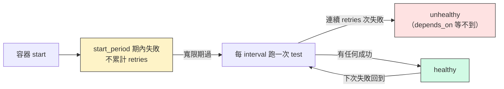
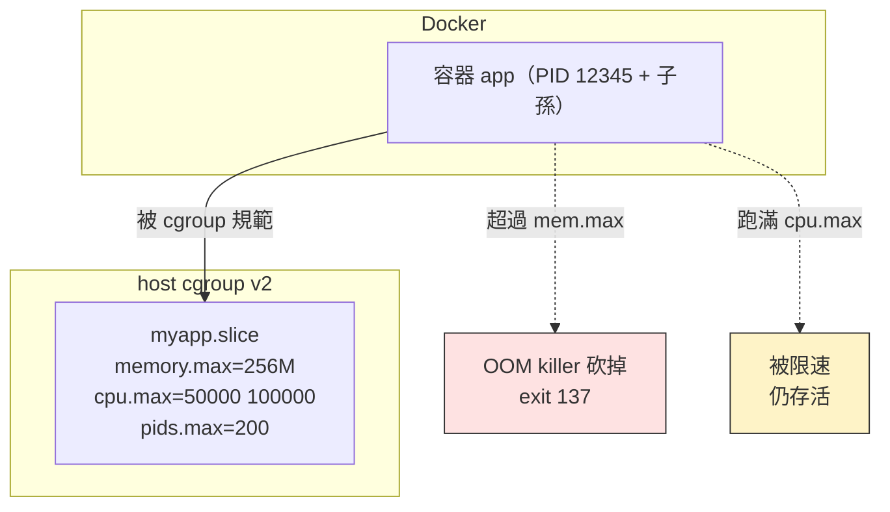

# W08｜容器生產實踐：讓容器活得健康、不吵鬧、不越權

## 學習目標

1. 講得出 Dockerfile `HEALTHCHECK` 和 Compose `healthcheck` 兩處設定的差別與適用情境，寫得出一個會「真的反映服務健康」的 health probe（不是 `curl -f / || exit 1` 這種偷懶版）。
2. 看得懂 `docker logs` 預設的 json-file driver 把 log 寫到哪、為什麼 30 GB 硬碟兩天內可能被 log 吃光，並能設好 `max-size` + `max-file` 把它馴服。
3. 用 `mem_limit` 與 `cpus` 給容器套上 cgroup 限制，親手做一次「吃光記憶體被 OOM 殺掉」與「吃光 CPU 被限速」的實驗，把 W05 學的 cgroup 知識真的用出來。
4. 用 `USER`、`read_only`、`cap_drop`、`security_opt: no-new-privileges` 把容器的權限階梯一階一階收緊，講得出每一階各自擋了什麼樣的攻擊。
5. 把 W07 的 `compose.yaml` 升級成「能上 production」的版本：每個 service 都有 healthcheck、log rotation、資源上限、最小權限，並且 `docker compose up -d` 還是能跑。
6. 看得懂 `docker stats`、`docker inspect`、`docker events` 三個觀察工具各自看的是什麼，知道遇到「容器突然死掉、不知道原因」要先打開哪個。

## 先備知識

- 已完成 W07，手上有 `~/virt-container-labs/w07/` 那份 app + db 的 `compose.yaml`，本週會直接複製過來改造。
- 理解 W04 的 `journalctl`、systemd——這週的 logging driver 思路其實很像（誰收 log、收到哪、會不會輪轉）。
- 理解 W05 的 cgroup v2——這週你會親手把 cgroup 限制套到容器上，去 `/sys/fs/cgroup/...` 把那組數字驗證一次。
- 理解 W06 的 `USER appuser`——這週把這條從「孤伶伶一條」擴成「一整套最小權限」。

## 問題情境

W07 你跑起了 app + db，週五交差，回家睡覺。週日中午同學傳訊息：

> 你的伺服器整台卡爆，連 ssh 都登不進去。

你打開 console，發現幾件事：

- `df -h /var/lib/docker` 顯示 96% used——某個容器 log 沒 rotation，吐了 27 GB 進 `*-json.log`。
- `docker stats` 顯示其中一個 service 吃了 4 GB 記憶體、CPU 一直 100%——一個無限迴圈 + 記憶體洩漏的 app，沒有 cgroup 限制就會把 host 拖死。
- `docker exec app id` 顯示 `uid=0(root)`——容器是用 root 跑的，掛上去的 bind mount 上你的 host 檔案，攻擊者要動就動。
- `docker exec app capsh --print` 一看，預設給了 14 個 capability——CAP_NET_RAW、CAP_AUDIT_WRITE 之類的，這個 web app 用不到，卻全部開著。

W07 的 yaml「能跑」。但「能跑」跟「能在線上撐住」之間，差的就是這週要補的四件事：**健康檢查、日誌管理、資源限制、最小權限**。

---

## 核心概念

### 一、Healthcheck 的兩個層次

容器「在跑」不等於「能用」。一個 process 還活著、port 還開著，但裡面已經陷入無窮迴圈、db 連線池滿了、記憶體爆了——這時候你要的不是 `process running`，是 `service healthy`。

Docker 提供兩個地方寫 healthcheck：

| 寫在哪 | 語法 | 何時生效 | 適用 |
|---|---|---|---|
| Dockerfile | `HEALTHCHECK CMD ...` | 每個用這個 image 起來的容器都會帶 | image 作者要保證的「最低限度健康」 |
| compose.yaml | `services.app.healthcheck:` | 只對這份 yaml 起的容器生效，**會覆蓋 Dockerfile 那條** | 部署環境特定的健康判準 |

**寫 healthcheck 的三個常見錯誤**：

1. **拿 `curl -f / || exit 1` 當萬用解**：根目錄回 200 不代表你的 db 連線正常。應該打一條會碰到 db、會碰到 cache 的 `/healthz`。
2. **忘了 `start_period`**：app 啟動到能 serve 之間有空窗，這段期間 health 失敗不該算 retries。`start_period: 20s` 給它一個寬限期。
3. **把 timeout 設太短**：`timeout: 1s` 在偶爾 GC pause 的服務會被誤判 unhealthy。一般 timeout >= 平均回應時間 × 5。



> **想一想**：「healthcheck unhealthy」會不會讓 Docker 自動重啟容器？預設不會。重啟交給 `restart: unless-stopped` + 你自己的監控決定。Compose 跟 Docker 不是 Kubernetes——unhealthy 只是個標籤，**不等於**自動重啟。

### 二、Logging driver 與 log 失控

預設情況下，`docker logs <container>` 看的是 **json-file driver** 寫到 host 的這個檔案：

```
/var/lib/docker/containers/<container-id>/<container-id>-json.log
```

它會**無限增長**。一個吵的 app 一秒 1 MB，一週就是 600 GB。預設沒有 rotation，硬碟會無聲無息被吃光。

修法是改 logging driver 設定。可以全機改（`/etc/docker/daemon.json`）或單服務改（`compose.yaml` 裡的 `logging:`）：

```yaml
services:
  app:
    image: myapp:v1
    logging:
      driver: json-file
      options:
        max-size: "10m"     # 單一檔案最大 10 MB
        max-file: "3"       # 最多保留 3 份（總共 30 MB）
```

| Driver | 何時用 | 注意 |
|---|---|---|
| `json-file`（預設） | 開發、單機 | 一定要加 `max-size` + `max-file` |
| `local` | 跟 json-file 類似但更省空間 | Docker 較新版本內建 |
| `journald` | 想丟給 systemd journal 統一管 | 串接 W04 的 `journalctl` |
| `syslog` / `fluentd` / `gelf` | 集中式 log 系統 | 通常 production 才會碰 |

> **想一想**：你已經設了 `max-size: 10m`，但有個容器一秒寫 5 MB log，rotation 速度跟得上嗎？如果跟不上，最壞會發生什麼？提示：被 rotate 走的 log 直接消失，你來查事故的時候已經沒得看。

### 三、資源限制：把 cgroup 用起來

W05 你看過 `/sys/fs/cgroup/` 裡的 `cpu.max`、`memory.max`。Compose 可以一行寫好：

```yaml
services:
  app:
    image: myapp:v1
    mem_limit: 256m        # 記憶體上限
    cpus: "0.5"            # 最多用 0.5 顆 CPU
    pids_limit: 200        # 最多 200 個 process（防 fork bomb）
```

| 設定 | 對應 cgroup 控制 | 超過會怎樣 |
|---|---|---|
| `mem_limit` | `memory.max` | 行程被 **OOM killer** 殺掉，容器 exit code 137 |
| `cpus` | `cpu.max`（quota / period） | **被限速**，不會被殺，但跑得很慢 |
| `pids_limit` | `pids.max` | 後續 `fork()` / `clone()` 失敗，但已經存在的 process 不影響 |
| `memswap_limit` | `memory.swap.max` | 控制 swap 的使用上限（一般設 = mem_limit 等於關閉 swap） |

**設限策略**：先用 `docker stats` 觀察容器跑兩三天的真實用量，取**平均的 1.5 倍**當上限。設太緊容器會頻繁 OOM，設太鬆等於沒設。



### 四、最小權限的四階階梯

容器跑進來，預設可能比你想的危險。下表四階逐步收緊：

| 階梯 | 設定 | 阻擋什麼 |
|---|---|---|
| 1. 非 root | `user: "1000:1000"` 或 Dockerfile 的 `USER appuser` | 攻擊者進到容器內也不是 root，動不了 `/etc/`、裝不了套件 |
| 2. 唯讀 rootfs | `read_only: true` + 必要 `tmpfs:` | 攻擊者寫不進 `/usr/bin/`、塞不進 web shell |
| 3. 砍掉 capabilities | `cap_drop: [ALL]` + `cap_add: [NET_BIND_SERVICE]`（需要才加） | 即使是 root，也不能 `iptables`、`mount`、`chmod +s` |
| 4. 禁止 setuid 升權 | `security_opt: ["no-new-privileges:true"]` | 容器內不能透過 setuid binary 升回 root（堵住一票 CVE） |

把這四階都套上的 `compose.yaml` service 看起來會像：

```yaml
services:
  app:
    image: myapp:v1
    user: "1000:1000"
    read_only: true
    tmpfs:
      - /tmp:size=64M
    cap_drop: [ALL]
    cap_add: [NET_BIND_SERVICE]   # 只給「綁 80 port」這一個 cap
    security_opt:
      - no-new-privileges:true
```

> **想一想**：為什麼 `read_only: true` 之後還要加一條 `tmpfs: /tmp`？提示：很多 app（包含 Python `tempfile`、shell 寫 `/tmp/`）需要可寫的暫存區，唯讀 rootfs 會直接報 errno 30。

---

## 操作參考

以下操作在 **app VM** 上做（W07 那台）。先把 W07 的成果搬過來：

```bash
mkdir -p ~/virt-container-labs/w08
cp -r ~/virt-container-labs/w07/. ~/virt-container-labs/w08/
cd ~/virt-container-labs/w08
docker compose down -v 2>/dev/null || true
```

### Part A：Healthcheck 的進階寫法

#### 步驟 1：把 healthcheck 改成「真的查 db」

- 編輯 `compose.yaml`，把 `app` 的 healthcheck 加上：

```yaml
  app:
    build: ./app
    ports: ["8080:80"]
    environment:
      DB_HOST: db
      DB_USER: postgres
      DB_PASSWORD: ${DB_PASSWORD}
      DB_NAME: ${DB_NAME}
    depends_on:
      db:
        condition: service_healthy
    healthcheck:
      test: ["CMD", "python", "-c", "import urllib.request; urllib.request.urlopen('http://127.0.0.1:80/healthz').read()"]
      interval: 5s
      timeout: 3s
      retries: 5
      start_period: 10s
    restart: unless-stopped
```

- 注意：用 `python -c` 而不是 `curl`，因為 `python:3.12-slim` 沒裝 curl。**healthcheck 的 test 一定要是容器內存在的命令**。

#### 步驟 2：起來並觀察 health 狀態

- 命令：

```bash
docker compose up -d
sleep 12
docker compose ps
docker inspect --format='{{.State.Health.Status}}' $(docker compose ps -q app)
docker inspect --format='{{json .State.Health}}' $(docker compose ps -q app) | python3 -m json.tool | head -30
```

- 預期觀察：`docker compose ps` 應該標示 `healthy`；`State.Health.Log` 看得到最近幾次 health probe 的結果。

#### 步驟 3：故意讓 healthcheck 失敗（拔掉 db）

- 命令：

```bash
docker compose stop db
sleep 30
docker compose ps
docker inspect --format='{{.State.Health.Status}}' $(docker compose ps -q app)
docker compose logs app --tail=5
```

- 預期觀察：app 容器仍在 running，但 `Health.Status` 變成 `unhealthy`；log 有 `db unreachable`。
- **重點**：unhealthy 不會自動重啟容器，這是設計使然。要重啟得搭配外部監控（W11 的 k8s readiness probe 才會自動處理這件事）。

#### 步驟 4：恢復

- 命令：`docker compose start db && sleep 15 && docker compose ps`。

> **Checkpoint A** — healthcheck 真的會碰到 db；停 db 後 30 秒內 app 被標 unhealthy；記錄了 `start_period`、`interval`、`retries` 各自的影響。

---

### Part B：Log 失控與 rotation 修正

#### 步驟 5：寫一個會狂吐 log 的 service

- 建立 `noisy/Dockerfile`（在 `~/virt-container-labs/w08/` 下）：

```bash
mkdir -p noisy
cat > noisy/Dockerfile <<'EOF'
FROM alpine:3.20
# 用 yes 把固定字串無限吐到 stdout，模擬一個吵到失控的服務
# （busybox 的 yes 沒有節流，吐速跟 CPU 差不多，剛好用來測 log rotation）
CMD ["sh", "-c", "yes 'noisy log line lorem ipsum dolor sit amet consectetur adipiscing elit'"]
EOF
```

- 在 `compose.yaml` 加一個 service（先**不**加 logging 設定，故意讓它放飛）：

```yaml
  noisy:
    build: ./noisy
    restart: unless-stopped
```

#### 步驟 6：起來，看它吐多大

- 命令：

```bash
docker compose up -d noisy
sleep 30
NOISY_ID=$(docker compose ps -q noisy)
LOG_PATH=$(docker inspect --format='{{.LogPath}}' $NOISY_ID)
echo "log file: $LOG_PATH"
sudo ls -lh "$LOG_PATH"
```

- 預期觀察：log 檔已經有幾十 MB，**而且還會繼續長**。

#### 步驟 7：故障證據——估算「這個 service 一天會佔多大」

- 命令：

```bash
sudo wc -c "$LOG_PATH" | awk '{print "size after 30s = "$1" bytes; estimated 24h = "$1*60*60*24/30/1024/1024/1024" GB"}'
```

- 預期觀察：印出「24 小時內預估會吃掉 X GB」。把這個數字記到 README——這就是為什麼必須做 rotation。

#### 步驟 8：修正——加上 logging driver 設定

- 修改 `compose.yaml` 的 `noisy` service：

```yaml
  noisy:
    build: ./noisy
    restart: unless-stopped
    logging:
      driver: json-file
      options:
        max-size: "2m"
        max-file: "3"
```

- 同時把 `app` 跟 `db` 也加上（generosity 一點，10m × 5）：

```yaml
  app:
    ...（前略）
    logging:
      driver: json-file
      options:
        max-size: "10m"
        max-file: "5"

  db:
    ...（前略）
    logging:
      driver: json-file
      options:
        max-size: "10m"
        max-file: "5"
```

#### 步驟 9：套用設定觀察

- 命令：

```bash
docker compose up -d
sleep 30
NOISY_ID=$(docker compose ps -q noisy)
LOG_DIR=$(dirname $(docker inspect --format='{{.LogPath}}' $NOISY_ID))
sudo ls -lh "$LOG_DIR" | grep json
sudo du -sh "$LOG_DIR"
```

- 預期觀察：`*-json.log`、`*-json.log.1`、`*-json.log.2` 各 ~2 MB，總和 ≤ 6 MB，而且**會穩定維持**——超過會把最舊那份 rotate 掉。

#### 步驟 10：把 `noisy` 拿掉（它的歷史任務完成了）

- 從 `compose.yaml` 刪掉 `noisy` service，刪 `noisy/` 目錄：
- 命令：`docker compose up -d --remove-orphans && rm -rf noisy/`

> **Checkpoint B** — 估算過「不設 rotation 一天會吃多少」，套上 max-size + max-file 後 log 大小會穩定；能解釋為什麼這件事不該等到出事才做。

---

### Part C：資源限制——OOM 與 CPU throttle 實驗

#### 步驟 11：建立一個會吃資源的測試 service

- 建立 `stress/Dockerfile`：

```bash
mkdir -p stress
cat > stress/Dockerfile <<'EOF'
FROM ubuntu:24.04
RUN apt-get update && apt-get install -y --no-install-recommends stress-ng && rm -rf /var/lib/apt/lists/*
CMD ["sleep", "infinity"]
EOF
```

- 在 `compose.yaml` 加：

```yaml
  stress:
    build: ./stress
    mem_limit: 128m
    cpus: "0.5"
    pids_limit: 200
```

- 命令：

```bash
docker compose build stress
docker compose up -d stress
```

#### 步驟 12：實驗 1——吃光記憶體會發生什麼

- **重要設計選擇**：要看到「容器整個被 OOM 殺掉、`ExitCode=137`」，吃記憶體的程序必須是**容器的主程序（PID 1）**。`stress-ng` 採用 parent-supervisor 架構，子 worker 被 OOM 殺掉後 parent 會重 fork 新 worker，容器整體不會死——所以這裡改用 Python 單程序當 PID 1：

```bash
docker run --rm --name oomtest --memory 128m python:3.12-slim python -c "
import time
print('allocating 256MB...', flush=True)
x = bytearray(256 * 1024 * 1024)
print('done', flush=True)
time.sleep(5)
"
echo "exit code = $?"
```

- 預期觀察：印出 `allocating 256MB...` 之後就被殺，**`echo` 印出 `exit code = 137`**。`bytearray(256 * 1024 * 1024)` 強制把 256 MB 同時撐住（不能像 stress-ng `--vm` 那樣循環重用 page），超過 `--memory 128m` 的限制就被 OOM killer 用 SIGKILL 砍掉。
- 為什麼是 137？Linux 的慣例是「process 被 signal 殺掉時，exit code = 128 + signal number」。SIGKILL 是 signal 9，所以 128 + 9 = **137**。同理，被 SIGTERM (15) 殺掉的 exit code 是 143、被 Ctrl+C (SIGINT, 2) 殺掉的是 130。
- **延伸**：你也可以把這條 Python 命令塞進 `stress` service 的 `command:`（取代 `sleep infinity`），這樣 `docker compose up` 起來就會看到容器自己 OOM 死、ExitCode=137。stress-ng 適合測 CPU（下面步驟 13 會看到），不適合測容器層級的 OOM。

#### 步驟 13：把容器重起，做實驗 2——吃光 CPU 會被限速

- 命令：

```bash
docker compose up -d stress
docker stats --no-stream $(docker compose ps -q stress)
# 開一個 CPU 燃燒器（4 個 worker，但容器只有 0.5 個 CPU 配額）
docker compose exec -d stress stress-ng --cpu 4 --timeout 30s
sleep 5
docker stats --no-stream $(docker compose ps -q stress)
```

- 預期觀察：`stress-ng` 開 4 個 worker，但 `docker stats` 顯示 CPU% 維持在 ~50%（被 cgroup `cpu.max` 限制）。
- 對照沒有 `cpus: "0.5"` 的情況：你的 host 整顆 CPU 會被打到 100%；有了限制後，host 還能順順地。

#### 步驟 14：去 cgroup 檔案系統驗證（連回 W05）

- 命令：

```bash
PID=$(docker inspect --format='{{.State.Pid}}' $(docker compose ps -q stress))
CGPATH=$(cat /proc/$PID/cgroup | head -1 | cut -d: -f3)
echo "cgroup path: $CGPATH"
cat /sys/fs/cgroup$CGPATH/memory.max
cat /sys/fs/cgroup$CGPATH/cpu.max
cat /sys/fs/cgroup$CGPATH/pids.max
```

- 預期觀察：印出 `134217728`（=128 MiB）、`50000 100000`（每 100ms 給 50ms = 50%）、`200`。
- 跟 `compose.yaml` 寫的數字對得上——**Compose 沒有什麼神秘的，它就是把這幾個值寫進 cgroup**。

> **Checkpoint C** — 親手做出 OOM kill 與 CPU throttle 兩個觀察，並從 `/sys/fs/cgroup` 看到對應的設定值。

---

### Part D：權限階梯——把 app 收緊四階

回到 `app` service，逐階加上去。

#### 步驟 15：階梯 1——非 root（user）

- 改 `app/Dockerfile`，最後加：

```dockerfile
RUN useradd -m -u 1000 appuser && chown -R appuser:appuser /app
USER appuser
```

- 在 `compose.yaml` 的 `app` service 加（雙保險，明示非 root）：

```yaml
    user: "1000:1000"
```

#### 步驟 16：rebuild + 驗證

- 命令：

```bash
docker compose up -d --build app
docker compose exec app id
docker compose exec app whoami
curl http://localhost:8080/healthz
```

- 預期觀察：`uid=1000(appuser)`，但 healthz 仍然 200。

#### 步驟 17：階梯 2——唯讀 rootfs + tmpfs

- 在 `compose.yaml` 的 `app` 加：

```yaml
    read_only: true
    tmpfs:
      - /tmp:size=32M
```

#### 步驟 18：先看會不會炸（很可能會）

- 命令：

```bash
docker compose up -d app
sleep 5
docker compose ps
docker compose logs app --tail=15
```

- 預期觀察：可能正常、也可能 crash（取決於 Flask、psycopg2 是否會寫進 site-packages 之外的 cache 目錄）。
- 若 crash，常見的是 Python 某個套件想寫 `/.cache/...`。修法：再加一個 tmpfs `- /home/appuser/.cache:size=16M`；或讓 app 的 `HOME` 指向 `/tmp`。

#### 步驟 19：階梯 3——cap_drop + 必要時 cap_add

- 在 `compose.yaml` 的 `app` 加：

```yaml
    cap_drop: [ALL]
    # cap_add: [NET_BIND_SERVICE]   # 我們已經 -p 8080:80 由 host 綁，容器內聽 80 不需要 root，但 80 < 1024 會報 perm denied
```

- 注意：容器內 listen 80 (`< 1024`) 在非 root 下需要 `CAP_NET_BIND_SERVICE`。最乾淨的解法是**改成監聽 `8080`、Compose 也改 `-p 8080:8080`**。三個地方一起改，缺一不可：
  1. **`app/app.py`** 最後一行：`app.run(host="0.0.0.0", port=8080)`
  2. **`app/Dockerfile`** 的 `EXPOSE 80` 改成 `EXPOSE 8080`
  3. **`compose.yaml`** 的 `app` service：
     - `ports: ["8080:8080"]`
     - `healthcheck.test` 中的 URL 從 `http://127.0.0.1:80/healthz` 改成 `http://127.0.0.1:8080/healthz`（這條漏改，容器一起來就會立刻 unhealthy）

#### 步驟 20：階梯 4——no-new-privileges

- 在 `compose.yaml` 的 `app` 加：

```yaml
    security_opt:
      - no-new-privileges:true
```

#### 步驟 21：套用、驗證、看 capabilities

- 命令：

```bash
docker compose up -d --build app
sleep 5
curl http://localhost:8080/healthz
docker compose exec app sh -c "id; cat /proc/self/status | grep -E 'CapEff|NoNewPrivs'"
```

- 預期觀察：`uid=1000`、`NoNewPrivs: 1`、`CapEff: 0000000000000000`。
- 對照預設 root 容器的 `CapEff` 是 `00000000a80425fb`（Docker 預設留 14 個 capability：CHOWN, DAC_OVERRIDE, FOWNER, FSETID, KILL, SETGID, SETUID, SETPCAP, NET_BIND_SERVICE, NET_RAW, SYS_CHROOT, MKNOD, AUDIT_WRITE, SETFCAP）。
- **關鍵理解**：CapEff 的變化其實**主要由 `user` 觸發**——一旦切成非 root（uid != 0），CapEff 就自動歸零，因為「effective capabilities」是 root 才有的特權。`cap_drop: [ALL]` 在這個情境下是**defense-in-depth**：萬一容器內有某個 setuid binary 把行程升回 root，cap_drop 確保升回 root 時也是「沒有任何 capability 的 root」。

#### 步驟 22：紀錄四階對照表

把以下表格填入 README：

| 階梯 | 設定 | `id` | `CapEff` | `NoNewPrivs` | curl /healthz |
|---|---|---|---|---|---|
| 0（baseline）| 啥都沒設 | uid=0(root) | `00000000a80425fb` | 0 | 200 |
| 1（非 root）| user 1000 | uid=1000 | `0000000000000000` ← **切非 root 後就是 0** | 0 | 200 |
| 2（唯讀 rootfs）| + read_only | uid=1000 | `0000000000000000` | 0 | （200 或 crash？修正後填） |
| 3（cap_drop）| + cap_drop ALL | uid=1000 | `0000000000000000` ← 還是 0，但**多一層 defense-in-depth** | 0 | 200 |
| 4（no-new-priv）| + security_opt | uid=1000 | `0000000000000000` | 1 | 200 |

**注意一個常見誤解**：很多教學會把 cap_drop 講成「砍掉容器的能力」。實際上 CapEff 從階梯 0 到階梯 1 就已經歸零了——**只要容器是非 root 跑**。階梯 3 的 cap_drop ALL 真正擋的是「容器裡的程序透過 setuid binary 短暫升回 root 的瞬間」——那一瞬間沒有 cap_drop 的話，CapEff 會回到 baseline 那 14 個。所以四階是**互補**的，不是線性遞進。

> **Checkpoint D** — 四階都套上、curl /healthz 仍然 200；能說出每階各自擋了什麼。

---

### Part E：把 W07 的 yaml 升級成「production-ready」版

#### 步驟 23：總整理 compose.yaml

把整份 `compose.yaml` 整理成這樣（包含 W07 的所有功能 + W08 的所有強化）：

```yaml
services:
  db:
    image: postgres:16
    environment:
      POSTGRES_PASSWORD: ${DB_PASSWORD}
      POSTGRES_DB: ${DB_NAME}
    volumes:
      - db-data:/var/lib/postgresql/data
    # 註：postgres 官方 image 沒有附 HEALTHCHECK，pg_isready 是社群慣用寫法
    healthcheck:
      test: ["CMD-SHELL", "pg_isready -U postgres -d $${POSTGRES_DB}"]
      interval: 5s
      timeout: 3s
      retries: 10
      start_period: 10s
    mem_limit: 512m
    cpus: "1.0"
    logging:
      driver: json-file
      options:
        max-size: "10m"
        max-file: "5"
    restart: unless-stopped

  app:
    build: ./app
    ports: ["8080:8080"]
    environment:
      DB_HOST: db
      DB_USER: postgres
      DB_PASSWORD: ${DB_PASSWORD}
      DB_NAME: ${DB_NAME}
    depends_on:
      db:
        condition: service_healthy
    healthcheck:
      test: ["CMD", "python", "-c", "import urllib.request; urllib.request.urlopen('http://127.0.0.1:8080/healthz').read()"]
      interval: 5s
      timeout: 3s
      retries: 5
      start_period: 10s
    user: "1000:1000"
    read_only: true
    tmpfs:
      - /tmp:size=32M
      - /home/appuser/.cache:size=16M
    cap_drop: [ALL]
    security_opt:
      - no-new-privileges:true
    mem_limit: 256m
    cpus: "0.5"
    pids_limit: 200
    logging:
      driver: json-file
      options:
        max-size: "10m"
        max-file: "5"
    restart: unless-stopped

volumes:
  db-data:
```

#### 步驟 24：完整重起並全項驗證

- 命令：

```bash
docker compose down
docker compose up -d --build
sleep 15
docker compose ps
curl -s http://localhost:8080/
curl -s http://localhost:8080/healthz
docker compose exec app sh -c "id; cat /proc/self/status | grep -E 'CapEff|NoNewPrivs'"
docker stats --no-stream
```

- 預期觀察：兩個 service 都 healthy；app 是非 root + 0 capabilities + NoNewPrivs=1；`docker stats` 看得到 limit。

> **Checkpoint E** — 一份「能跑、能撐、不越權」的 compose.yaml 完成；所有 Checkpoint A-D 的能力一份 yaml 全部用上。

---

## Checkpoint 總覽

> **Checkpoint A** — Healthcheck 真的查 db；故意停 db 能在 30 秒內被標 unhealthy。

> **Checkpoint B** — 估算過 log 成長速率，rotation 設定後容量穩定。

> **Checkpoint C** — 親手觸發 OOM kill 與 CPU throttle，並到 `/sys/fs/cgroup` 驗證設定值。

> **Checkpoint D** — 權限四階全套上，curl /healthz 仍 200，能對照表記錄每階差異。

> **Checkpoint E** — 整合到一份 production-ready 的 compose.yaml。

---

## 交付清單

必交目錄：`~/virt-container-labs/w08/`

必要檔案：

- `compose.yaml`（最終版本，包含本週所有強化）
- `.env.example`
- `app/`（含 Dockerfile, app.py, requirements.txt）
- `stress/Dockerfile`
- `README.md`

`README.md` 必須包含：

- Healthcheck 故障測試紀錄（停 db 之後幾秒內 unhealthy、log 中對應的訊息）
- Log 失控估算（30 秒 → 24 小時的預估）+ 套上 rotation 後的穩定大小
- OOM kill 與 CPU throttle 兩個實驗的命令、輸出、`exit code`、cgroup 檔的對應值
- 四階權限對照表（如步驟 22）
- 至少 1 則排錯紀錄（症狀 → 診斷 → 修正 → 驗證）
- 可重跑最小命令鏈：

```bash
cd ~/virt-container-labs/w08
cp .env.example .env
docker compose up -d --build
sleep 15
curl http://localhost:8080/healthz
```

---

## README 繳交模板

```markdown
# W08｜容器生產實踐

## Healthcheck 故障測試
- 停 db 後幾秒被標 unhealthy：（填）
- 對應的 log 訊息：

## Log 失控估算
- noisy 容器 30s log 大小：
- 預估 24h 大小：
- 套 rotation 後穩定上限：

## 資源限制實驗
| 實驗 | 命令 | 觀察結果 | 對應 cgroup 檔 | 值 |
|---|---|---|---|---|
| OOM | stress-ng --vm 1 --vm-bytes 200m | exit 137, OOMKilled=true | memory.max | 134217728 |
| CPU throttle | stress-ng --cpu 4 | docker stats CPU% ≈ 50% | cpu.max | 50000 100000 |

## 權限四階對照
| 階梯 | id | CapEff | NoNewPrivs | curl /healthz |
|---|---|---|---|---|
| 0 |  |  |  |  |
| 1 |  |  |  |  |
| 2 |  |  |  |  |
| 3 |  |  |  |  |
| 4 |  |  |  |  |

## 排錯紀錄
- 症狀 / 診斷 / 修正 / 驗證

## 設計決策
（你選的 mem_limit / cpus 數值理由是什麼？read_only 之後你補了哪些 tmpfs，為什麼？）
```

---

## 常見錯誤與診斷

- 錯誤：healthcheck 永遠 unhealthy，但服務明明能 curl。
  診斷：healthcheck 的 `test` 命令在容器內不存在（最常見：image 沒 curl 卻寫 `curl -f`）。改用容器內一定有的命令（python-slim 用 python urllib，alpine 用 wget，busybox 用 nc）。

- 錯誤：app 啟動很慢，每次重起都被 healthcheck 判 unhealthy 然後（如果接 k8s）一直被殺。
  診斷：`start_period` 沒設或太短。把它調到 app 啟動時間的 1.5–2 倍。

- 錯誤：`docker compose up` 後 `docker logs <c>` 看到 log，但 `docker compose logs` 看不到。
  診斷：通常是 service 名稱拼錯（`docker compose logs <service-name>`，不是容器名）。或者 logging driver 改成 `journald` / `syslog` 之後 `docker logs` 不會再有東西，要去 host 的 journal 看。

- 錯誤：設了 `mem_limit: 128m`，容器跑沒幾秒就 exit 137。
  診斷：你的 app 真的需要 > 128 MB。先 `docker stats --no-stream` 看實際用量再回去調，不是把 limit 拿掉就對了——「容器需要多少」這個資訊本身很有價值。

- 錯誤：設了 `cpus: "0.5"` 但 `docker stats` 顯示 CPU% 衝到 200%。
  診斷：`docker stats` 的 CPU% 是「相對 1 顆 CPU」的，多核機器一個容器跑兩顆核會是 200%。但 `cpus: "0.5"` 是 cgroup 的 quota，**不會被超過**。你看到的 200% 可能是 stats 取樣時間問題，或是你誤把 `cpu_shares`（相對權重）當 `cpus`（絕對配額）寫了。

- 錯誤：`read_only: true` 後 Flask 啟動失敗，log 顯示 `OSError: [Errno 30] Read-only file system`。
  診斷：app 想寫某個目錄。最常見的是 `/tmp`（tempfile 模組）、`/home/<user>/.cache`、`/var/log/<app>`。把這些目錄改成 tmpfs 或 named volume 就好。

- 錯誤：`cap_drop: [ALL]` 後 nginx 啟動失敗 `bind() to 0.0.0.0:80 failed (13: Permission denied)`。
  診斷：非 root 不能綁 < 1024 的 port。兩種解法選一個：(1) `cap_add: [NET_BIND_SERVICE]`（最小化），(2) 把 app 改聽 8080 並 `-p 80:8080`（更乾淨）。

- 錯誤：`pids_limit: 200` 後容器啟動失敗 `fork: retry: Resource temporarily unavailable`。
  診斷：你的 process 數真的超過 200 了（很多 web framework 的 worker model 會起一堆 process）。先 `ps -ef` 看實際數量再決定上限。

- 錯誤：`logging.options.max-size: "10m"` 沒生效，log 還是無限長。
  診斷：YAML 縮排錯了，`options` 沒在 `logging` 之下；或者 `max-size` 用了整數沒加引號（`10m` 是字串、`10` 是整數）。`docker compose config` 看展開後的結果，再去 `docker inspect <c>` 看 `HostConfig.LogConfig` 確認。

---

## 想一想

1. 為什麼 unhealthy 不會自動觸發容器重啟？這個設計選擇好還是不好？換 k8s 會怎麼處理（提示：W11 會講到 readiness probe vs liveness probe）。

2. 你的同事說：「`mem_limit` 設了會拖慢效能，production 不要設。」這個說法錯在哪？提示：限制不等於不分配，cgroup 限制只在「達到上限時」才介入。

3. `read_only: true` + tmpfs 之後，攻擊者進到容器內還能做什麼壞事？提示：cap_drop 後是不是真的什麼都動不了？bind mount 進來的 host 目錄呢？

4. 看一下你的 app 的 `cap_drop: [ALL]` 之後 `CapEff` 確實是 0；但如果這個容器是用 `--privileged` 起的（你不會這樣寫，但別人寫的 image 可能有），上面這四階全部會被打穿。為什麼？這對「不要從別人的 image 直接 build」這件事有什麼啟發？

---

## 延伸閱讀

- `[R1]` Docker `HEALTHCHECK` 官方文件：<https://docs.docker.com/reference/dockerfile/#healthcheck>
- `[R2]` Compose `healthcheck` + `depends_on.condition`：<https://docs.docker.com/compose/how-tos/startup-order/>
- `[R3]` Logging drivers 概觀（json-file、local、journald 對照）：<https://docs.docker.com/engine/logging/configure/>
- `[R4]` `docker logs` rotation 設定（含 daemon-level 預設）：<https://docs.docker.com/engine/logging/drivers/json-file/>
- `[R5]` Compose 資源限制（`mem_limit`、`cpus`、`pids_limit`）：<https://docs.docker.com/compose/compose-file/deploy/#resources>
- `[R6]` Linux Capabilities 速查（NET_BIND_SERVICE 等常見 cap 用途）：<https://man7.org/linux/man-pages/man7/capabilities.7.html>
- `[R7]` `no-new-privileges` 機制與 setuid 阻擋：<https://www.kernel.org/doc/html/latest/userspace-api/no_new_privs.html>
- `[R8]` Docker 安全最佳實踐（含 read_only、cap_drop 推薦組合）：<https://docs.docker.com/engine/security/>
- `[R9]` cgroup v2 介面（memory.max、cpu.max、pids.max）：<https://www.kernel.org/doc/html/latest/admin-guide/cgroup-v2.html>
- `[R10]` `docker stats` 與 `docker events` 觀察工具：<https://docs.docker.com/reference/cli/docker/container/stats/>

---

## 下週預告

W09 是「概念為主 + 一段最短的安裝實作」。我們會問一個直接的問題：到目前為止你的 `compose.yaml` 跑在 **一台** VM 上。**那台 VM 掛了怎麼辦？要更新一個版本不停機怎麼辦？要橫向擴五個副本接負載怎麼辦？** 這三題 Compose 的回答都是「沒辦法／要寫腳本」——這就是 Kubernetes 出現的理由。下週先講 k8s 的控制平面、節點層元件，再講 k3s 為什麼能在你的 2 vCPU / 4 GB Ubuntu VM 上跑出完整的物件抽象，最後動手裝 k3s 確認 `kubectl get nodes` 能跑。

做完這週，你的 compose.yaml 已經夠資格被別人在 production 用。下週開始，我們要進入「多台機器、自我修復、滾動更新」的世界。
