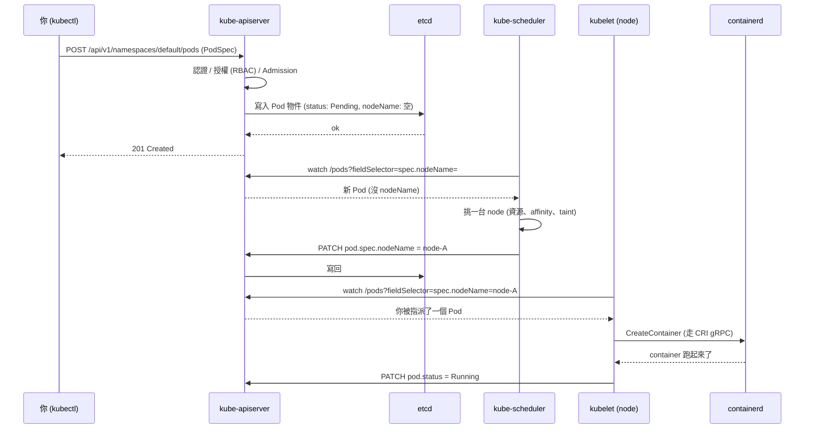
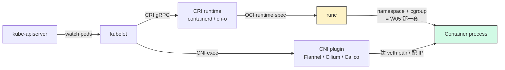
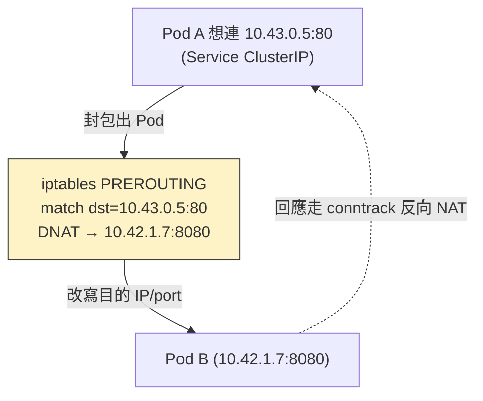

# W09｜從 Compose 到 Kubernetes：架構認知與在一台 VM 上跑 k3s

## 學習目標

1. 講得出 Compose 解決了哪些問題、又留下哪些「上線後才會痛」的問題（單機、無自我修復、無滾動更新、無水平擴展），並說明這就是 Kubernetes 出場的理由——不是「比較潮」，是「Compose 答不出來那四題」。
2. 畫得出 Kubernetes 控制平面四件套（`kube-apiserver` / `etcd` / `kube-scheduler` / `kube-controller-manager`）的分工，並用「`kubectl apply` 一個 Pod」這條請求路徑把它們串起來——誰收命令、誰存狀態、誰排機器、誰盯著要結果發生。
3. 講得出 node 元件三件套（`kubelet` / `kube-proxy` / container runtime）各自做什麼：誰把 Pod 真的跑起來、誰把 Service 那個「不存在於任何網卡上」的 IP 變成真實流量、容器到底是誰在拉 image 跑。
4. 解釋為什麼 k3s 可以把整個 Kubernetes 塞進一個 < 100 MB 的 binary 還拿到 CNCF certified——它取捨了什麼（用 SQLite 經 kine 取代 etcd、Flannel/Klipper-LB/Traefik 內建、單一 process 跑多個 component），又能跑哪些 production workload、不能跑哪些。
5. 比得出 k3s / minikube / kind 三個本地 Kubernetes 方案的差異，講得出「我這台 2 vCPU / 4 GB Ubuntu VM 為什麼選 k3s」的合理理由——不是「因為老師教的」，是因為架構上少多了一層。
6. 在 W01 那台 Ubuntu VM 上裝好 k3s server-only，能 `kubectl get nodes` 看到一台 `Ready`，並對著 `kube-system` 裡的預設 Pod，一個一個指出「這是 W09 哪一段講的角色」。

## 先備知識

- **W04**：systemd / `journalctl`——k3s 跑成 `k3s.service`，第一次出問題你要去看 `journalctl -u k3s`。
- **W05**：Linux namespace + cgroup v2——Kubernetes 的 Pod 不是「另一種容器」，底下還是同一套 namespace + cgroup。理解這層你才會懂為什麼 k3s 跟 Docker 不打架（雖然它們不該共存於 production，但同一台 VM 同時裝得起來）。
- **W07/W08**：你已經讓 Compose 「能跑、能撐、不越權」——這週你要去問的問題是：**那台 VM 一台掛掉怎麼辦？** Compose 的回答是「沒辦法」。
- **W03**：SSH / 防火牆——k3s server 預設聽 `6443/tcp`，要從別台機器存取要記得開 port。

## 問題情境

W08 你交了一份 production-ready 的 `compose.yaml`。週一上班，老闆連續問你四個問題：

1. 「我要五個副本接負載，能做嗎？」
   → Compose 有 `deploy.replicas`，但**那是給 Docker Swarm 看的**，`docker compose up` 直接忽略。你要五個副本只能 `docker run` 五次然後自己掛 nginx 在前面。

2. 「凌晨 3 點 app crash 能自己重起嗎？」
   → `restart: unless-stopped` 會重起 process，但**只看到 process 死亡那一刻**。你的 healthcheck 變 unhealthy 不會觸發重起（W08 你已經親眼看過）；資料庫 deadlock、記憶體緩慢洩漏到死，Compose 都接不住。

3. 「上版本不要停機？」
   → `docker compose up` 換 image 是**先 stop 舊的、再 start 新的**，中間有 downtime。你想做「滾動更新」（一台一台換、舊的還在 serve、新的 ready 才切流量）就要自己寫腳本——而你不會想自己寫。

4. 「我要把這台 VM 升級下線一小時，誰接管？」
   → 沒人接管。Compose 是**單機物件**，根本沒有「另一台 VM」的概念。

這四題就是 Kubernetes 出生的理由。代價是：你要學一整套抽象——Pod、Deployment、Service、ConfigMap、Ingress、Volume——這是 W10–W12 的事。今天我們先把這套抽象的「人」認清楚：誰是主腦、誰是手腳、誰負責記憶。

---

## 核心概念

### 一、Compose 與 Kubernetes：你失去什麼，得到什麼

| 議題 | Compose | Kubernetes | 換到 K8s 你付出的代價 |
|---|---|---|---|
| 單位 | service（=一群相同設定的容器，但實際只有 1 個跑） | Pod（=共享網路與儲存的容器集合，可以一群一起 schedule） | 多一層抽象「Pod」，要習慣 |
| 副本 | 沒有真副本（deploy.replicas 只 swarm 用） | Deployment 控制 N 個副本，自動補齊 | 寫法從 yaml 變多層：Deployment → ReplicaSet → Pod |
| 自我修復 | 只看 process 是否存活（restart） | liveness probe 失敗自動重起 Pod、readiness probe 失敗自動把它從 Service 摘掉 | 要寫兩種 probe，不只一種 |
| 滾動更新 | 沒有，要停機或自己寫腳本 | Deployment 自動：滾動 / 暫停 / 回滾 | yaml 多了 strategy、maxSurge、maxUnavailable |
| 跨機器 | 單機 | 多 node 自動排程 | 要學 scheduler 的 affinity/taint/tolerations（後面才碰） |
| 服務發現 | 同一個 compose project 內用 service name | Service（ClusterIP）+ DNS（CoreDNS） | 多了 Service 抽象、DNS 名字格式 `<svc>.<ns>.svc.cluster.local` |
| 對外暴露 | `ports: 8080:80` 直接綁 host port | Service: NodePort / LoadBalancer / Ingress | 多了 Ingress 與 LoadBalancer 概念 |
| 儲存 | bind / named volume / tmpfs | PVC + StorageClass + PV | 多一層「申請—分配」關係 |
| 機密 | `.env` + `${VAR}` | Secret（k8s 物件，base64 encode） | 不是加密，但比 .env 多了 RBAC 與版本 |
| 設定 | 寫在 yaml 裡 | ConfigMap（與 image 解耦） | 多一個物件 |

> **想一想**：上面這張表，每一列右邊都比左邊複雜——為什麼還要換？提示：當你從「一台 VM」變成「五台 VM、每台都可能掛、deploy 不能停機」時，左邊那欄的每一格都會變成你要寫的腳本，右邊則是別人已經寫好且千人百萬節點驗證過的程式碼。**抽象的代價**換到的是**自動化的紅利**。

### 二、Kubernetes 控制平面：四個常駐人員的分工

控制平面（control plane）就是「下決定的那群人」。在一台 production K8s cluster 上，這幾個元件通常裝在 1～3 台「control plane node」上；在 k3s 單節點，它們全部跑在同一個 process 裡。

| 元件 | 一句話職責 | 出問題會看到什麼 |
|---|---|---|
| `kube-apiserver` | 全部請求的入口；對外暴露 Kubernetes HTTP API；唯一可以動 `etcd` 的人 | `kubectl` 連不上、所有操作 timeout |
| `etcd` | 一致性 KV store，**所有 cluster state 都在這裡**：Pod、Service、Secret、Node 狀態 … | 全 cluster 失憶；恢復速度取決於最近一次 backup |
| `kube-scheduler` | 看到「沒被指派 node 的 Pod」就找一台 node 幫它指派 | 新 Pod 卡 `Pending`，event 寫 `no node available` |
| `kube-controller-manager` | 跑各種 controller：Node controller（node 掛了重新排）、Job controller、EndpointSlice、ServiceAccount … | 副本不會自動補齊、node 掛了沒人接管 |
| `cloud-controller-manager` | 雲端整合（AWS/GCP/Azure 的 LB、Volume）；單機教學環境用不到 | — |

「`kubectl apply -f pod.yaml`」這條命令會發生什麼？



關鍵理解：**沒有人主動呼叫對方**。`scheduler` 跟 `kubelet` 都是看 `apiserver` 的事件流（watch），看到自己有興趣的東西就動作。這就是「declarative API」的核心：你只寫「我要什麼」（desired state），controller 自己想辦法把現實（actual state）拉到你要的樣子，這個迴圈叫 **reconcile loop**。

> **想一想**：你 `kubectl delete pod xxx` 之後，這個 Pod 「真的被砍」的那一刻在哪一步？提示：apiserver 寫 etcd 的 `deletionTimestamp`，但容器還在跑——是 `kubelet` 看到後才呼叫 CRI 砍掉容器、再回報 apiserver 真的清掉。中間有可能因為 finalizer 卡住，這就是為什麼有時候 Pod 會 stuck 在 `Terminating`。

### 三、Node 元件：每台機器上的三個常駐工

每台「跑 workload 的機器」（worker node）上一定有三個東西。在 k3s 單節點上，server 既當 control plane 也當 worker，所以這三個東西也在這台 VM 上。

| 元件 | 一句話職責 |
|---|---|
| `kubelet` | 看 apiserver 派給「我這台 node」的 PodSpec，呼叫 container runtime 把容器跑起來，並回報健康狀態 |
| `kube-proxy` | 在 node 上維護網路規則（iptables / ipvs / nftables），把 Service 那個虛擬 IP 變成「打到後端 Pod」的真實流量 |
| container runtime | 真正跑容器的程式（containerd / cri-o），透過 **CRI** 介面被 kubelet 呼叫 |

#### kubelet 與 CRI：為什麼 K8s 不直接呼 docker



**為什麼不直接呼 `docker`？** 因為 K8s 想要「runtime 可換」——你今天用 containerd、明天想換 cri-o 也行，介面一致。CRI（Container Runtime Interface）就是這個介面。Docker 早期沒實作 CRI，K8s 用一個叫 `dockershim` 的轉接層撐著，後來 K8s 1.24（2022）正式拿掉 dockershim——這就是「Kubernetes 棄用 Docker」這個被誤傳的新聞的真相：**棄用的是 dockershim，不是 Docker image**（Docker build 的 OCI image 跟 containerd 直接 build 的 image 100% 相容）。

#### kube-proxy：把不存在的 IP 變成真實流量

Service 的 `ClusterIP` 是個 **虛擬 IP**——它**不對應任何網卡**，你 `ip addr` 找不到它。但你 `curl <ClusterIP>:80` 就是會到後端 Pod。這個魔法是 `kube-proxy` 寫的 iptables 規則做的：



| kube-proxy 模式 | 機制 | 適合 |
|---|---|---|
| `iptables`（預設） | 一條條 DNAT 規則；連線追蹤靠 conntrack | 一般用，幾百個 Service 沒問題 |
| `ipvs` | 用 kernel 的 IPVS 模組，hash table 查找 | 大叢集（thousands of Services） |
| `nftables`（新） | 取代前兩者的下一代規則引擎 | 較新版本的 K8s 開始預設 |

> **想一想**：如果你 `kubectl get svc` 看到一個 ClusterIP 是 `10.43.0.5`，但你 `ping 10.43.0.5` 不通——這算正常還是出事？提示：ICMP echo 不會被 iptables 的 DNAT 規則匹配（規則只配 TCP/UDP + port），所以 ping 不通是**正常**。Service 是「TCP/UDP 上的虛擬 IP」，不是 L3 上的 IP。

### 四、k3s：整個 Kubernetes 塞進一個 binary

k3s 是 Rancher（現在歸 SUSE）做的「精簡 Kubernetes 發行版」，CNCF certified——也就是說，跑出來的 cluster 跟 upstream Kubernetes **API 完全相容**。它做了哪些取捨？

| 元件 | upstream Kubernetes | k3s 預設 |
|---|---|---|
| 二進位數量 | `kube-apiserver`、`kube-controller-manager`、`kube-scheduler`、`kubelet`、`kube-proxy` … 各一個 | **一個 `k3s` binary，全包**（< 100 MB） |
| 跑法 | 通常 control plane 用 static pod 起，每個 component 一個 process | 全部以 goroutine 跑在同一個 process 內 |
| 預設 datastore | etcd（多節點 raft） | **kine**（API shim）→ SQLite（單節點預設） |
| 預設 CNI | 沒有預設，自己選（Flannel / Calico / Cilium …） | **Flannel + VXLAN backend** |
| 預設 ingress | 無，要自己裝 | **Traefik**（聽 80 / 443） |
| 預設 LoadBalancer | 雲端 LB 或自己裝 metallb | **Klipper-LB / servicelb**（用 hostPort 招式） |
| 預設 storage | 無，要自己裝 storage class | **local-path-provisioner**（在 host 上開資料夾） |
| 預設 DNS | 要自己裝 | **CoreDNS**（內建） |
| 預設 metrics | 要自己裝 | **metrics-server**（內建，`kubectl top` 才能用） |
| Pod CIDR | 自己選 | **`10.42.0.0/16`** |
| Service CIDR | 自己選 | **`10.43.0.0/16`**（含 cluster DNS `10.43.0.10`） |
| Container runtime | 要自己裝 | **內建 containerd + runc** |

**取捨的本質**：k3s 把「production Kubernetes 上你 90% 的時候會用的選擇」全部打包成預設，省掉「裝完一個 cluster 還要 helm install 半天」的痛。代價是換掉某個元件比較費事（要 `--disable=traefik` 重裝、或繞道）。

但有些取捨**不能進 production**：

- **SQLite datastore**：單一檔案、不能 HA（高可用）。production 要 HA 必須切到 embedded etcd 或外部 MySQL/PostgreSQL。
- **單 process 全包**：好處是省記憶體、壞處是 component 之間沒有 process 隔離——一個 panic 全死。但因為都是 Go 寫的同一個程式，實際上很少出這種事。
- **Klipper-LB 是 hack**：它本質上是「在 node 上開一個 hostPort + iptables redirect」，不是真的 LoadBalancer。`EXTERNAL-IP` 直接填 node 自己的 IP，**單節點 / 單 hostPort 不衝突的情境下會 work**；但兩個 LoadBalancer Service 都想用 80 就會有一個搶不到、卡 `<pending>`。production 跑公雲還是要用真 LB。

> **想一想**：如果今天你公司跟你說「我們要在工廠的 30 台 ARM 工控機上跑邊緣運算服務」，你會選 upstream K8s 還是 k3s？為什麼？提示：每台工控機可能只有 4 GB RAM、跑半離線、要自己 OTA 更新。

### 五、k3s vs minikube vs kind：你為什麼選 k3s

三個都能在你的筆電上跑出一個能用的 K8s。差別在「**多裝了哪幾層東西**」。

| 方案 | 你的 VM 裡實際在跑什麼 | 起停成本 | 最適合 |
|---|---|---|---|
| **k3s** | 1 個 systemd service（`k3s.service`）+ containerd + 你的 Pod | 安裝 30 秒、開機自動跑 | 單節點長期跑、邊緣、IoT、想用 systemd 管 |
| **minikube** | 你的 VM 裡再開**另一台 VM**（VirtualBox/KVM/QEMU），裡面跑 K8s。或用 docker driver：你的 VM 裡跑 Docker，Docker 裡跑 K8s | `minikube start` 拉幾分鐘、`minikube stop` 才不吃資源 | 個人桌機學習、要試 add-on 生態 |
| **kind** | 你的 VM 裡跑 Docker，Docker 裡每個 K8s「節點」是一個 container | `kind create cluster` 1～2 分鐘 | CI 流水線、想快速建多節點 cluster 測試 |

「層數」直觀比較：

```mermaid
flowchart TD
    subgraph K3S[" k3s "]
        K3S_HOST[Ubuntu VM]
        K3S_HOST --> K3S_BIN[k3s binary 直接跑]
    end

    subgraph MINI[" minikube (vm driver) "]
        MINI_HOST[Ubuntu VM]
        MINI_HOST --> MINI_VM[再開一台 VM 給 minikube]
        MINI_VM --> MINI_K[K8s 跑在這台子 VM 內]
    end

    subgraph KIND[" kind "]
        KIND_HOST[Ubuntu VM]
        KIND_HOST --> KIND_DOCKER[Docker daemon]
        KIND_DOCKER --> KIND_NODE[節點容器 = 一個 docker container]
        KIND_NODE --> KIND_K[K8s 元件 + Pod 都在這個 container 裡]
    end

    style K3S fill:#d1fae5,stroke:#333
    style MINI fill:#fef3c7,stroke:#333
    style KIND fill:#fef3c7,stroke:#333
```



**這門課選 k3s 的四個理由**：

1. 不再多一層 VM 或 Docker——你的 2 vCPU / 4 GB VM 已經很省了，再多一層會卡。
2. 跑成 systemd service，跟 W04 學的 `systemctl` / `journalctl` 工具直接通用。
3. 預裝 Traefik、CoreDNS、metrics-server、local-path-provisioner——一裝完馬上有完整 K8s 體驗，不用 helm install 一個禮拜。
4. CNCF certified，學到的 `kubectl` 操作、寫的 yaml 全部能搬到 production K8s。

> **想一想**：minikube 跟 kind 各自把 K8s 包了一層 isolation（VM / Docker container），這對你練習「砍掉重來」是好處還壞處？對你練習「真實生產的 systemd 整合」呢？

---

## 操作參考

本週只做一件實作：**在 W01 那台 Ubuntu VM 上裝 k3s，跑 `kubectl get nodes`，並認得它預裝了什麼**。所有後續週次（W10–W12）都會直接用這台 cluster，**請不要砍掉**。

### Part A：確認 VM 資源夠

#### 步驟 1：對齊 k3s 官方 minimum（2 CPU / 2 GB / SSD 建議）

- 命令：

```bash
free -h | grep Mem
nproc
df -h /
uname -r
cat /etc/os-release | head -2
```

- 預期觀察：
  - `Mem` 行 `total ≈ 4 Gi`（W01 設的 4 GB）
  - `nproc` 印 `2`
  - `/` 空間 free 至少 5 GB（k3s 加上 image cache 跑久後會吃）
  - `uname -r` 印 5.x 或 6.x（k3s 對 kernel 版本不挑，太舊（< 4.x）才會出問題）

#### 步驟 2：確認 cgroup v2 啟用（Ubuntu 22.04+ 預設就是）

- 命令：

```bash
stat -fc %T /sys/fs/cgroup/
mount | grep cgroup2
```

- 預期觀察：第一條印 `cgroup2fs`；第二條看到一行包含 `... type cgroup2 (...)`（第一欄通常是 `none` 或 `cgroup2`，視發行版而定）。
- 對照：如果印 `tmpfs`，代表是 cgroup v1，k3s 還是會跑但某些 pod 行為會差。Ubuntu 22.04 / 24.04 預設 v2，不會踩到。

> **Checkpoint A** — VM 規格符合 k3s 官方下限，cgroup v2 啟用。

---

### Part B：安裝 k3s（單節點 server-only）

#### 步驟 3：建工作目錄、留檔

- 命令：

```bash
mkdir -p ~/virt-container-labs/w09
cd ~/virt-container-labs/w09
free -h > resources-before.txt
ps -ef | wc -l > processes-before.txt
```

#### 步驟 4：執行官方安裝腳本

- 命令：

```bash
curl -sfL https://get.k3s.io | K3S_KUBECONFIG_MODE="644" sh -
```

- **每個環境變數的意義**（不要照抄不問為什麼）：
  - `K3S_KUBECONFIG_MODE="644"`：把 `/etc/rancher/k3s/k3s.yaml` 設成所有人可讀。**不設的話預設是 600（root only）**，你之後每次 `kubectl` 都要 `sudo`，很煩。
  - 沒設 `INSTALL_K3S_EXEC`：預設就是 `server`（單節點 server-only），剛好。
  - 沒設 `K3S_URL` / `K3S_TOKEN`：這兩個是給 agent 加入 server 用的，單節點不需要。

- 預期觀察：腳本會印一些 `[INFO]`，最後不會印「Done」之類的字串，但沒紅字 / 沒 exit 1 就是成功。整個過程通常 30 秒～2 分鐘（看你 VM 的網速）。

#### 步驟 5：確認 systemd service

- 命令：

```bash
sudo systemctl status k3s --no-pager | head -10
sudo systemctl is-enabled k3s
```

- 預期觀察：`Active: active (running)`、`enabled`（開機自動啟動）。

#### 步驟 6：第一次 `kubectl get nodes`

- 命令：

```bash
kubectl get nodes
kubectl get nodes -o wide
```

- 預期觀察：
  - 一行，`STATUS=Ready`，`ROLES` 是 `control-plane`，`VERSION` 是 `v1.x.y+k3s1`（k3s 1.35.x 起 ROLES 不再含 `master` 字樣，這是 upstream Kubernetes 1.24 拿掉舊 label 的延續）。
  - **如果 `STATUS=NotReady`，等 30–60 秒再試**——CNI（Flannel）剛起來時 node 會短暫 NotReady。超過 2 分鐘還是 NotReady 才是有事。

- 如果 `kubectl: command not found`：k3s 安裝時把 `kubectl` symlink 到 `/usr/local/bin/kubectl`，可能 `$PATH` 沒包含 `/usr/local/bin`。檢查 `echo $PATH`，或用 `sudo k3s kubectl get nodes` 走 k3s 內建 wrapper。

> **Checkpoint B** — `kubectl get nodes` 印一台 Ready，VERSION 帶 `+k3s1` 字樣，不需要 sudo。

---

### Part C：認識 k3s 預裝的東西（對照前面的概念）

#### 步驟 7：看 `kube-system` namespace 下有什麼

- 命令：

```bash
kubectl get ns
kubectl get pods -n kube-system
kubectl get svc -n kube-system
kubectl get pods -n kube-system -o wide
```

- 預期觀察（順序、數量、hash 後綴會略有不同）：
  - **`coredns-...`**：cluster DNS。所有 Pod 想透過 service 名稱找彼此都要靠它。
  - **`metrics-server-...`**：`kubectl top pods` / `top nodes` 才有資料（裝完約 30 秒～1 分鐘後才會回傳數字）。
  - **`local-path-provisioner-...`**：之後 W11 你建 PVC 時，它會在 host 上開資料夾掛進去。
  - **`traefik-...`**：ingress controller，預設聽 80 / 443。
  - **`svclb-traefik-...`**：Klipper-LB（servicelb）為 traefik 那個 LoadBalancer service 起的「hostPort 代理」，每 node 一個 Pod，**Pod 內每個對外 port 一個 container**——所以你會看到 `READY 2/2`（Traefik 開 80 + 443，所以兩個 container：`lb-tcp-80`、`lb-tcp-443`）。
  - **`helm-install-traefik-...` 與 `helm-install-traefik-crd-...`**：兩個一次性 Job，完成後變 `Completed`——一個裝 Traefik 本體、一個裝它需要的 CRD。`RESTARTS` 偶爾會是 1（首次拉 image 失敗就會重試），只要最後是 `Completed` 就 OK。

- 也順便看 service：

```bash
kubectl get svc -n kube-system
```

  - `kube-dns` 應該是 ClusterIP `10.43.0.10`（W09 第四段預設值）。
  - `traefik` 是 LoadBalancer 類型，`EXTERNAL-IP` **應該印出你 VM 的 IP**（不是 `<pending>`）——這就是 Klipper-LB 把 node IP 直接填上去的「假 LB」做法。如果是 `<pending>`，看「常見錯誤」那段。

#### 步驟 8：對照「W09 哪一段講的角色」

- 在 `~/virt-container-labs/w09/README.md` 填以下對照表：

| 看到的 Pod | 屬於 W09 哪一段 | 為什麼 |
|---|---|---|
| `coredns-...` | 第四段「k3s 預裝」 | 內建 cluster DNS，service 名稱解析靠它 |
| `traefik-...` | 第四段「k3s 預裝」 | ingress controller，承接 W11/W12 |
| `svclb-traefik-...` | 第四段「Klipper-LB」 | hostPort + iptables 假裝成 LoadBalancer |
| `local-path-provisioner-...` | 第四段「local-path」 | StorageClass 的具體實作 |
| `metrics-server-...` | 第四段「metrics」 | `kubectl top` 用 |

> **Checkpoint C** — 能在 README 表上對得出每個 Pod 是 W09 哪段講的角色（不是 copy 名字，是說得出它做什麼）。

---

### Part D：認識 k3s 怎麼把所有東西塞進一個 process

這是 k3s 「單 binary 多 component」設計的證據。

#### 步驟 9：在 host 看 process

- 命令：

```bash
ps -ef | grep -E "k3s|containerd|kubelet|kube-proxy|kube-apiserver|kube-controller|kube-scheduler" | grep -v grep
```

- 預期觀察：
  - **一條** `/usr/local/bin/k3s server`（主程序；apiserver / scheduler / controller-manager / kubelet / kube-proxy 全部以 goroutine 形式跑在這條 process 內）。
  - **一條** `containerd`（k3s 在 `/var/lib/rancher/k3s/...` 下起的獨立 instance，跟你 W05–W08 用的 Docker containerd 是不同 daemon、不同 socket）。
  - 數條 `containerd-shim-runc-v2`（每個 Pod 對應一個）。
  - **可能還會看到**某些 Pod 內服務 process 直接列在 host 上，例如 `metrics-server` 自己——這是因為它跑在 host PID namespace 看得到的位置（容器隔離不影響 host `ps` 列出處理程序），不是另一個 daemon。

- **沒有獨立的** `kube-apiserver` / `kube-scheduler` / `kube-controller-manager` / `kubelet` / `kube-proxy` 程序——這正是 k3s 「單 binary 多 component」的證據。對照 upstream Kubernetes，你在 control-plane node 上會看到這五支獨立 process。

#### 步驟 10：看 cgroup（連回 W05）

- 命令：

```bash
sudo systemd-cgls /system.slice/k3s.service | head -30
sudo systemctl show k3s -p MemoryCurrent -p TasksCurrent
```

- 預期觀察：
  - `systemd-cgls` 印出 k3s 主程序與 containerd-shim 的層級結構。
  - `MemoryCurrent` 通常 600 MB～1 GB（idle）；`TasksCurrent` 數十～數百。

#### 步驟 11：看 Pod CIDR / Service CIDR 對得上 k3s 預設

- 命令：

```bash
kubectl get svc -n default kubernetes -o jsonpath='{.spec.clusterIP}{"\n"}'
kubectl get pods -n kube-system -o wide | awk '{print $1, $6}' | head
ip addr show flannel.1 2>/dev/null || ip addr | grep flannel
ip route | grep -E "10.42|10.43" | head
```

- 預期觀察：
  - `kubernetes` service 的 ClusterIP 是 `10.43.0.1`（service-cidr `10.43.0.0/16` 的第一個 IP）。
  - 預設 Pod IP 落在 `10.42.x.x`（pod-cidr `10.42.0.0/16`）。
  - 多一張 `flannel.1` 介面（VXLAN tunnel 端點）。
  - 路由有一條到 `10.42.0.0/24` via `cni0`。

> **Checkpoint D** — 能用 `ps` 看到 k3s 是「一條主程序 + containerd」，能用 `kubectl` / `ip` 對應到 W09 第四段的 CIDR 預設值。

---

### Part E：留筆記、不要砍

#### 步驟 12：留檔

- 命令：

```bash
cd ~/virt-container-labs/w09
kubectl get nodes -o wide > nodes.txt
kubectl get pods -n kube-system -o wide > kube-system-pods.txt
kubectl get svc -A > all-services.txt
sudo journalctl -u k3s --no-pager | tail -50 > k3s-startup.log
free -h > resources-after.txt
```

#### 步驟 13：對照「裝 k3s 前後」資源差異

- 命令：

```bash
diff resources-before.txt resources-after.txt || true
```

- 預期觀察：`Mem` 的 `used` 多了大約 600 MB～1 GB，`available` 少對應的量。如果 used 衝到 3.5 GB+ 那就是 idle 太重，要去看是不是有 image 在 pull、或某 Pod 在 crashloop。

#### 步驟 14：**不要**執行下面這條（除非真的要砍重來）

- 萬一裝壞要重來：

```bash
# /usr/local/bin/k3s-uninstall.sh
```

- W10–W12 都會直接用這台 cluster，砍了下週要重來一次。

> **Checkpoint E** — 完整存檔（nodes.txt、kube-system-pods.txt、all-services.txt、k3s-startup.log、資源前後對照）；k3s 仍在跑、`systemctl is-enabled k3s` 為 enabled。

---

## Checkpoint 總覽

> **Checkpoint A** — VM 資源（2 vCPU / 4 GB / cgroup v2）符合 k3s 官方下限。

> **Checkpoint B** — k3s 安裝完成、`kubectl get nodes` Ready、不用 sudo 就能跑。

> **Checkpoint C** — 能對著 `kube-system` 下每個 Pod 說出它是 W09 哪一段講的角色。

> **Checkpoint D** — 能用 `ps` / `ip` 證明「k3s = 一個 binary 跑全部」與預設 CIDR `10.42 / 10.43`。

> **Checkpoint E** — 留檔完整，cluster 持續運行。

---

## 交付清單

必交目錄：`~/virt-container-labs/w09/`

必要檔案：

- `README.md`
- `resources-before.txt`、`resources-after.txt`
- `nodes.txt`
- `kube-system-pods.txt`
- `all-services.txt`
- `k3s-startup.log`

`README.md` 必須包含：

- VM 資源確認結果（CPU / RAM / cgroup v2 / kernel）
- k3s 安裝命令（含 `K3S_KUBECONFIG_MODE` 用意）
- `kubectl get nodes` 輸出
- `kube-system` Pod ↔ W09 概念對照表
- `kubernetes` service ClusterIP、抽樣 Pod IP，與 W09 預設 CIDR 對照
- 裝 k3s 前後 `free -h` 差異
- 至少 1 則排錯紀錄（症狀 → 診斷 → 修正 → 驗證）；如果一次就裝對，記錄你「為什麼確定它真的對了」（看了哪幾個訊號）

---

## README 繳交模板

```markdown
# W09｜從 Compose 到 Kubernetes：架構認知與在一台 VM 上跑 k3s

## VM 資源確認
- CPU: ___ cores
- RAM: ___ GB
- cgroup version: ___
- kernel: ___
- OS: ___

## 安裝
- 命令：`curl -sfL https://get.k3s.io | K3S_KUBECONFIG_MODE="644" sh -`
- `K3S_KUBECONFIG_MODE="644"` 的用意：__________
- systemctl status k3s 輸出（節錄）：
- `kubectl get nodes` 輸出：

## kube-system 下的 Pod 對照
| Pod | 屬於 W09 哪一段 | 它做什麼 |
|---|---|---|
| coredns-... |  |  |
| traefik-... |  |  |
| svclb-traefik-... |  |  |
| local-path-provisioner-... |  |  |
| metrics-server-... |  |  |

## CIDR 對照
- `kubernetes` service ClusterIP: ___（落在 ___ /16）
- 抽樣 Pod IP: ___（落在 ___ /16）
- flannel 介面: ___

## 資源前後對照
- 安裝前 free -h `used`：___
- 安裝後 free -h `used`：___
- 差額：___

## 排錯紀錄
- 症狀 / 診斷 / 修正 / 驗證
- 或：「為什麼我確定一次就對」——你看了哪三個訊號？

## 設計思考
（你會在什麼情境下選 k3s 而不是 minikube/kind？反過來呢？）
```

---

## 常見錯誤與診斷

- 錯誤：`curl ... | sh -` 跑到一半 exit 1，訊息含 `cgroup`。
  診斷：cgroup v1 + 某些 Ubuntu 變種。檢查 `/proc/cmdline` 是否有 `systemd.unified_cgroup_hierarchy=1`；正常 Ubuntu 22.04+ 不用設。

- 錯誤：`kubectl: command not found`。
  診斷：k3s 把 `kubectl` 放在 `/usr/local/bin/kubectl`，而你的 `$PATH` 沒包含這個目錄（少數 minimal shell 設定會這樣）。先用 `sudo k3s kubectl get nodes` 確認 cluster 是好的，再改 `~/.bashrc` 補 `$PATH`。

- 錯誤：`kubectl get nodes` 印 `error: error loading config file ... permission denied`。
  診斷：`/etc/rancher/k3s/k3s.yaml` 是 `0600` 權限。你裝的時候沒設 `K3S_KUBECONFIG_MODE=644`。修法：`sudo chmod 644 /etc/rancher/k3s/k3s.yaml`，或重裝。

- 錯誤：node 一直 `NotReady`，超過 2 分鐘。
  診斷：先看 `journalctl -u k3s --no-pager | tail -50`。常見原因：
  - 防火牆擋了 `flannel` 的 VXLAN port（UDP 8472）——`sudo ufw status` 確認；單節點通常不會踩。
  - kernel 沒載 `vxlan` 模組——判定方式是 **看 `flannel.1` 介面有沒有起來**（`ip addr show flannel.1`），看不到才需要 `sudo modprobe vxlan`。`lsmod | grep vxlan` 為空不一定代表沒載，有些 kernel 把 vxlan 編譯進核心而不是模組，這時 lsmod 看不到但功能正常。

- 錯誤：`traefik` service 的 `EXTERNAL-IP` 一直 `<pending>`。
  診斷：Klipper-LB 起不來，通常是 host 的 80 / 443 已經被佔（你的 W08 還在跑 nginx？）。`sudo ss -tlnp | grep -E ':80|:443'` 確認，砍掉佔用者。

- 錯誤：`docker ps` 看不到 k3s 跑的 Pod 對應的 container。
  診斷：**正常**。k3s 用內建 containerd（不是你 W05–W08 安裝的 Docker containerd），是不同 instance。要看 k3s 的容器：
  - `sudo crictl ps`（k3s 安裝時已把 `crictl` symlink 進 `/usr/local/bin/`，可直接用）
  - `sudo k3s ctr -n k8s.io containers list`（透過 ctr 看 k8s.io namespace 的容器）

- 訊息：安裝 log 印 `[INFO]  Host iptables-save/iptables-restore tools not found`。
  診斷：**正常**。Ubuntu 24.04 預設沒裝 `iptables-persistent` 之類套件，所以 host 沒有 `iptables-save` 命令；k3s 會用自己內建的 iptables binary，不需要 host 那一套。網路功能不受影響。

- 錯誤：磁碟瞬間少了好幾 GB。
  診斷：k3s 把所有 image cache 在 `/var/lib/rancher/k3s/`。`sudo du -sh /var/lib/rancher/k3s/agent/containerd` 看看，跟 docker 的 `/var/lib/docker` 是分開的。

- 錯誤：第二天開機後 `kubectl get nodes` 連不上 `localhost:6443`。
  診斷：`sudo systemctl status k3s` 看是不是 service 沒起來。如果 `is-enabled` 為 enabled 但 `is-active` 為 inactive，看 journal 找原因（最常見：磁碟滿了、SQLite 資料庫鎖住）。

- 錯誤：想砍 traefik，但 `kubectl delete pod traefik-xxx` 砍完它又起來。
  診斷：traefik 是 helm-controller 部署的，砍 Pod 沒用，會被重建。要徹底拿掉：`/usr/local/bin/k3s-uninstall.sh` 後重裝時加 `INSTALL_K3S_EXEC="server --disable=traefik"`。

---

## 想一想

1. `etcd` 是 K8s 「最容易痛」的單點。k3s 用 SQLite 取代它在生產上會痛在哪？提示：HA、橫向擴張、備份還原速度。

2. 你看到一個 Pod 一直 `Pending`，要去查哪個元件的 log？提示：先看 `kubectl describe pod xxx` 的 events，再看 scheduler vs kubelet 的 log——「沒被指派到 node」與「指派了但跑不起來」是兩件事。

3. Service 的 ClusterIP 對應的不是任何網卡，為什麼還能用？對照前面 kube-proxy 那段，把「為什麼 `ping` 不通但 `curl` 通」用一段話寫出來。

4. k3s 把 `kubelet` / `kube-proxy` / `apiserver` 都塞進一個 process。這對「一個 component 出 bug 全 cluster 死」這個風險是放大還是縮小？跟 docker compose 的 logging driver 把所有 service 共用 host 那一套有什麼類比？

5. minikube 用 docker driver 在你的 Ubuntu VM 裡跑「Docker 裡跑 K8s」，等於 VM → Docker → containerd（K8s 的）→ Pod。這比 k3s 多了哪兩層？多這兩層分別會在「啟動時間」、「ssh 進去 debug」、「資源消耗」上各自帶來什麼後果？

6. 假設你被 ops 抓去看一個生產 K8s cluster，第一個指令通常是 `kubectl get nodes`。為什麼這條最早問的「廢話」其實是有價值的訊息？對照 Compose 你都從哪一條命令開始查？

---

## 延伸閱讀

- `[R1]` Kubernetes Components（控制平面 / 節點元件官方總表）：<https://kubernetes.io/docs/concepts/overview/components/>
- `[R2]` Cluster Architecture（控制平面 vs node 圖示）：<https://kubernetes.io/docs/concepts/architecture/>
- `[R3]` Virtual IPs and Service Proxies（kube-proxy 三模式：iptables / ipvs / nftables）：<https://kubernetes.io/docs/reference/networking/virtual-ips/>
- `[R4]` Kubernetes Local Learning Environments（kind / minikube 官方推薦）：<https://kubernetes.io/docs/tasks/tools/>
- `[R5]` K3s Architecture：<https://docs.k3s.io/architecture>
- `[R6]` K3s Installation Requirements（min CPU/RAM、port、cgroup）：<https://docs.k3s.io/installation/requirements>
- `[R7]` K3s Quick Start（一行安裝、kubeconfig 路徑）：<https://docs.k3s.io/quick-start>
- `[R8]` K3s Networking Options（Flannel 預設、cluster-cidr / service-cidr）：<https://docs.k3s.io/networking/basic-network-options>
- `[R9]` K3s GitHub README（< 100 MB binary、bundled component 清單）：<https://github.com/k3s-io/k3s>
- `[R10]` Kine（SQLite shim 取代 etcd 的原理）：<https://github.com/k3s-io/kine>
- `[R11]` Container Runtime Interface（CRI 規範與 Dockershim 移除背景）：<https://kubernetes.io/blog/2022/02/17/dockershim-faq/>
- `[R12]` k3s vs minikube vs kind 對照（社群整理，可交叉驗證上述官方說法）：<https://www.devzero.io/blog/minikube-vs-kind-vs-k3s>

---

## 下週預告

W10 我們進到「東西」：`Pod` 是什麼、`Deployment` 怎麼讓 Pod 自我修復、`Service` 怎麼把流量打進去。今天裝好的 k3s 整週都不會被砍——你會 `kubectl apply -f deployment.yaml`，看到 Deployment 自己生 ReplicaSet、ReplicaSet 自己生 3 個 Pod，然後你 `kubectl delete pod xxx` 一個，5 秒內看到第 4 個生出來——這就是 W08 第 4 題「凌晨 3 點 app crash 能自己重起嗎」的答案。
