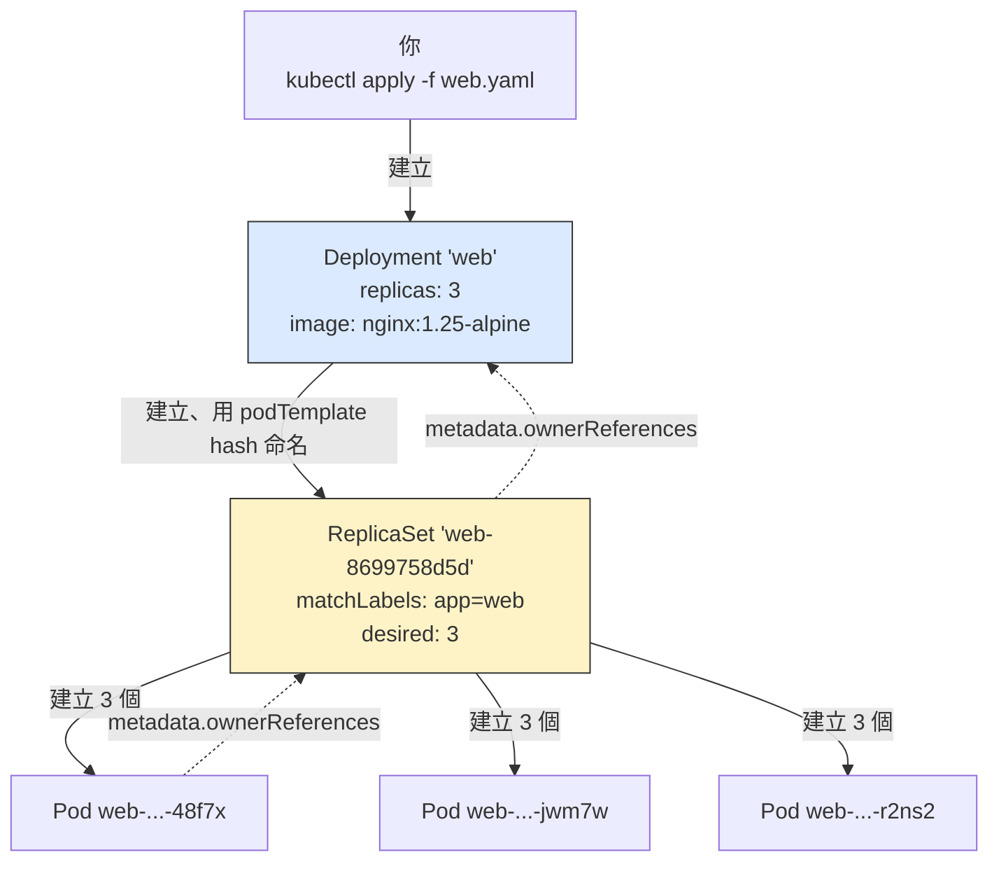
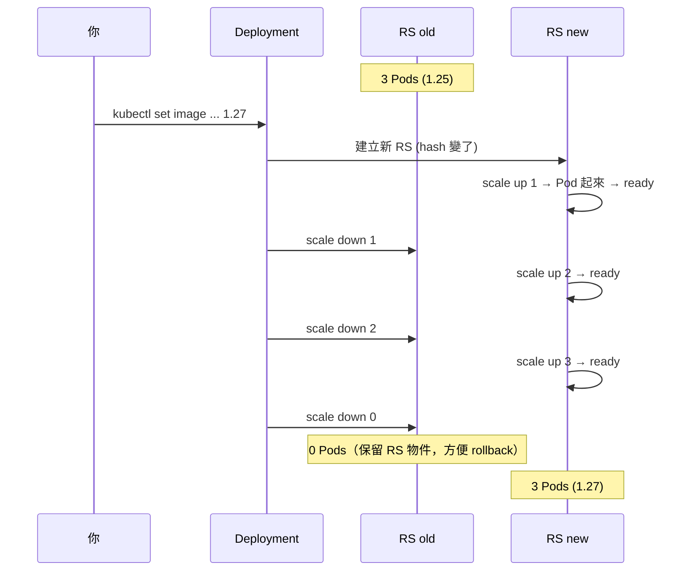
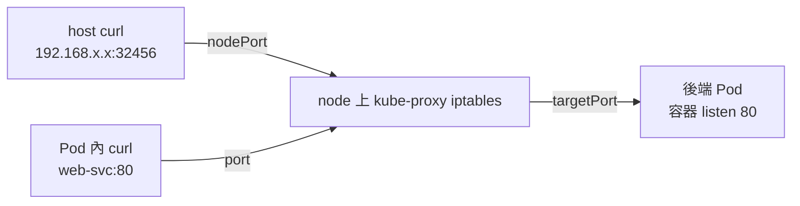
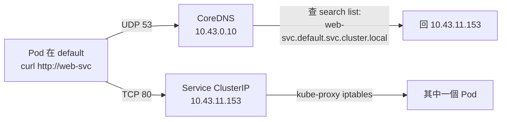

# W10｜k3s 核心物件：Pod、Deployment、Service

## 學習目標

1. 寫得出最小可跑的 `Deployment` yaml，並用一張圖講清楚 `Deployment → ReplicaSet → Pod` 三層父子鏈是怎麼透過 `ownerReferences` 串起來的——而不是「Deployment 神奇地生出 Pod」。
2. 在 k3s 上故意 `kubectl delete pod`，看 `kubectl get pod -w` 1–3 秒內補一個新 Pod 出來；解釋為什麼 Compose 的 `restart: unless-stopped` 做不到這件事。
3. 寫得出 `Service` 的 `ClusterIP` 與 `NodePort` 兩種 type、講得出 `port` / `targetPort` / `nodePort` 三個欄位各自指誰，並用 cluster 內一個 Pod 與你的 host curl 兩條路徑驗證連線。
4. 講得出 Service DNS 名稱格式 `<svc>.<ns>.svc.cluster.local`，並親手在另一個 Pod 內 `curl <svc>` 跟 `curl <svc>.default.svc.cluster.local` 得到一致的 200。
5. 用 `kubectl set image` 換 image，觀察 Deployment 起新 ReplicaSet、舊 ReplicaSet 縮到 0、Service 全程 200 不停機；再用 `kubectl rollout undo` 回到上一版，並從 `kubectl rollout history` 看到 revision 流。
6. 講得出兩個新手最痛的雷：(a) `Deployment.spec.selector` 一旦建出來就**不能改**——為什麼？(b) `Service.spec.selector` 跟 `Deployment.spec.selector` 是**兩個獨立物件**，寫錯時 Service 看起來一切正常但 endpoints 是空的、curl 永遠 timeout。

## 先備知識

- **W08**：你已經會看 yaml、會 `docker compose up -d`，今天把 yaml 換成 K8s 的、把 `docker compose` 換成 `kubectl apply`。
- **W09**：你的 k3s cluster 跑著、`kubectl get nodes` 顯示一台 Ready。今天跑的所有東西都活在這台 cluster 裡。
- **W04**：systemd / `journalctl`——本週 Pod 卡住時，`kubectl describe` 看 events 的思路其實跟 `journalctl -u xxx` 看為什麼起不來一模一樣。
- **W05**：namespace + cgroup——Kubernetes 的 Pod 不是另一種容器，底下還是 W05 那一套。

## 問題情境

W08 老闆問的四題你還記得：

1. 「我要五個副本接負載」 → 今天會用 `Deployment.spec.replicas: 5`，一行解決
2. 「凌晨 3 點 app crash 自己重起？」 → 今天親手 `kubectl delete pod`，看 ReplicaSet 1–3 秒補一個新的
3. 「上版本不要停機？」 → 今天 `kubectl set image`，看 Service 全程 200
4. 「VM 下線一小時誰接管？」 → 這題還是要等到 production 多節點才有解；今天先讓你看到「節點之上的抽象」是怎麼做出 (1)(2)(3) 的

加碼一個 W08 沒問但你會碰到的問題：

5. 「我的 Service 看起來健康（有 `CLUSTER-IP`），但連不上後端 Pod？」 → 今天會親手做這個雷給你看：**Service 是健康的、`endpoints` 是空的、curl 永遠 timeout**。學會看 endpoints 是 K8s debug 的第一招。

---

## 核心概念

### 一、Pod：K8s 的最小調度單位

> **官方定義**：Pod 是 Kubernetes 裡最小的可建可管理的計算單元。

一個 Pod 包含 1～多個容器，**這些容器共享網路（同 IP、同 port 空間）與儲存（同 Volume）**，且**永遠一起被排到同一個 node**。最常見的情境是 1 個 Pod = 1 個 container（你今天會做的）；多 container 的情境（sidecar pattern）這週先不碰。

**Pod 的生命週期 phase**（`kubectl get pod` 看到的 STATUS 大部分是這幾個）：

| Phase | 意思 |
|---|---|
| `Pending` | 物件已建立，但容器還沒全部跑起來（可能在排機器、拉 image、建 PVC …） |
| `Running` | 至少一個容器在跑，且還沒進終止態 |
| `Succeeded` | 所有容器正常結束（exit 0）。批次任務（Job）會走這裡 |
| `Failed` | 至少一個容器以非 0 結束 |
| `Unknown` | apiserver 跟負責這 Pod 的 kubelet 通訊不到 |

`restartPolicy` 控制容器掛掉時要不要重起，三個值：`Always`（Deployment-managed Pod 預設）/ `OnFailure`（Job 常用）/ `Never`。

**官方明說：不要直接建 Pod**

> Naked Pods (Pods not managed by a controller, such as Deployment or a StatefulSet) are fine for testing, but in real setups, they are risky.

理由：node 掛了 Pod 不會自己回來。**你應該寫 Deployment，讓它幫你管 Pod。** 今天接下來都不會直接 `kind: Pod`。

### 二、ReplicaSet：「永遠維持 N 個一樣的 Pod」的 controller

ReplicaSet 做一件事：盯著「我的 selector 能比對到的 Pod 數量」，少了就用我內建的 podTemplate 建一個、多了就砍一個。它不知道 Deployment 是誰、不負責 rolling update——這些是 Deployment 的事。

**官方建議：別直接寫 ReplicaSet**

> A Deployment is a higher-level concept that manages ReplicaSets and provides declarative updates to Pods along with a lot of other useful features. Therefore, we recommend using Deployments instead of directly using ReplicaSets, unless you require custom update orchestration or don't require updates at all.

直譯：除非你要**完全客製**化 update 流程或**完全不要** update，不然請用 Deployment。

ReplicaSet 怎麼認得 Pod 是「我的」？看 Pod 的 `metadata.ownerReferences`。每個 Pod 一建出來就被打上「我的 owner 是誰」的 metadata，K8s 的 garbage collector 也是看這個欄位決定「Deployment 被刪時，要連同它的 ReplicaSet 跟 Pod 都清掉」。

### 三、Deployment：Pod 的真正主人



ReplicaSet 名字後面那串 hash（例：`web-8699758d5d`）是 K8s 對 podTemplate 算出來的 hash——所以**只要你改了 image 或 env，hash 變了，K8s 就建一個全新的 ReplicaSet**，這就是 rolling update 的基礎。

#### Deployment 的 update strategy

| 欄位 | 預設值 | 意思 |
|---|---|---|
| `strategy.type` | `RollingUpdate` | 滾動更新（另一個選項是 `Recreate`：先全砍再全建，會停機） |
| `strategy.rollingUpdate.maxSurge` | `25%` | 滾動期間「可以多出來幾個 Pod」 |
| `strategy.rollingUpdate.maxUnavailable` | `25%` | 滾動期間「可以少幾個 Pod」 |

3 個副本 × 25% = 進位後 1 個。所以預設情境下，3 副本 rolling update 是「最多 4 個 Pod 同時、最少 2 個 Pod 同時」。

**rolling update 的真實步驟**（你今天會親眼看到）：



**`kubectl rollout undo` 就是把這個流程倒著跑一次**——並非「穿越時空回到舊版本」，而是**用一次新的 rolling update 把現實拉回舊版**。

### 四、Service：讓「會死的 Pod」有「不會變的入口」

Pod 是 ephemeral 的——刪一個就會被補一個，但**新 Pod 的 IP 會不一樣**。如果你 hardcode Pod IP 連，補一個就斷一條。Service 解這個問題：

> 官方定義：Service is a method for exposing a network application that is running as one or more Pods in your cluster.

Service 用 **label selector** 比對 Pod。Pod 隨便換 IP，Service 都能透過 selector 重新追蹤、自動更新後端清單（這個清單叫 EndpointSlice）。

#### 四種 type，這週只用 `ClusterIP` 跟 `NodePort`

| Type | 你拿到的 IP | 從哪裡連得到 | 適合 |
|---|---|---|---|
| `ClusterIP`（預設）| cluster 內部 VIP（例：`10.43.x.x`） | **只有 cluster 內 Pod** 能連 | 微服務內部互打 |
| `NodePort` | 每個 node 都開一個靜態 port（30000–32767） | 內部 Pod 用 ClusterIP；外部用 `<node-ip>:<nodePort>` | 從外面打第一個能用的方法 |
| `LoadBalancer` | 雲端 LB 給的 public IP | 真正的對外服務 | 公雲 production |
| `ExternalName` | 不發 IP，回 CNAME | 把外部 DNS 名包成 cluster 內服務 | 較少用，先跳過 |

**k3s 的 LoadBalancer 不是真的雲端 LB**——是 W09 講過的 Klipper-LB（servicelb）：在 node 上開 hostPort 假裝。這週**避開 LoadBalancer**：你的 Traefik 已經佔 80/443，再來一個 LoadBalancer 用 80 會搶不到 hostPort、卡 `<pending>`。

#### 三個 port 欄位的差別（背起來會少踩一半的雷）

```yaml
spec:
  type: NodePort
  selector:
    app: web
  ports:
  - port: 80         # ←─── Service 對 cluster 內暴露的 port (ClusterIP 上的)
    targetPort: 80   # ←─── 容器內真正在 listen 的 port (對應 containerPort)
    nodePort: 32456  # ←─── (NodePort type 才有) node 對外開的 port，30000-32767
```



#### Service 的 DNS 名稱：cluster 內怎麼用名字找服務

CoreDNS 給每個 Service 自動建 DNS：

```
<svc>.<ns>.svc.cluster.local
```

**從同 namespace Pod 內**，你直接用短名 `<svc>` 就能解析（resolv.conf 的 search list 自動展開）。**從別的 namespace** 必須寫到 `<svc>.<ns>` 以上。



> **想一想**：Pod 重啟後 IP 換了，但 Service 一直指對人——靠的是什麼？提示：EndpointSlice controller 在 watch 什麼？想 W09 講過的 controller reconcile loop。

### 五、兩個一定要先知道的雷

**雷 1：`Deployment.spec.selector` 是 immutable 的**

K8s 拒絕你改 Deployment 的 selector。錯誤訊息長這樣：

```
The Deployment "web" is invalid: 
* spec.template.metadata.labels: Invalid value: ...: `selector` does not match template `labels`
* spec.selector: Invalid value: ...: field is immutable
```

為什麼？因為 ownerReferences 是用 selector 比對來認領的——一旦 selector 變了，**舊的 RS 跟 Pod 還掛在原本的 selector 下**，Deployment 認不出它們是自己的，會建一組新的、舊的留在那邊變孤兒。為避免這場災難，K8s 直接禁止改。

要改 selector 的合法做法是：刪掉 Deployment、改 yaml、重建。

**雷 2：`Service.spec.selector` 跟 `Deployment.spec.selector` 是兩個獨立物件**

兩邊用同一組 label**只是慣例**，不是 K8s 強制的。寫錯一邊不會 error——你會看到：

- `kubectl get svc` → 一切正常，有 `CLUSTER-IP`、type 對、port 對
- `kubectl get endpoints <svc>` → ENDPOINTS 欄是 `<none>`
- 任何人 `curl <svc>` → 卡到 timeout 或 `HTTP 000`

K8s 的「Service 健康 ≠ 連得上」這件事，要在這個雷踩過一次才會記得。debug Service 的第一條反射動作：**`kubectl get endpoints <svc>` 看後端是不是空的。**

---

## 操作參考

整週都在 W09 那台 cluster 上做。最後留下的物件 W11/W12 還會用，**請不要砍**。

### Part A：確認 k3s 還活著

#### 步驟 1：cluster 健康

- 命令：

```bash
kubectl get nodes
kubectl get pods -A | head
mkdir -p ~/virt-container-labs/w10
cd ~/virt-container-labs/w10
```

- 預期觀察：node Ready、kube-system Pod 都 Running 或 Completed。如果 node NotReady，先回 W09「常見錯誤」處理。

> **Checkpoint A** — k3s 還在跑，準備開始操作。

---

### Part B：第一個 Deployment

我們要用 `nginx:1.25-alpine`、3 副本起一個 Deployment 名為 `web`。本 Part 示範**從 imperative 命令產 yaml、再 declarative apply**——這是真實工作流，不是「先 imperative 再 dump 改」。

#### 步驟 2：用 `--dry-run=client -o yaml` 產 yaml

- 命令：

```bash
kubectl create deployment web \
    --image=nginx:1.25-alpine \
    --replicas=3 \
    --port=80 \
    --dry-run=client -o yaml \
    | tee web-deploy.yaml
```

- 預期觀察：印出一份 yaml，重點看：
  - `kind: Deployment`、`apiVersion: apps/v1`
  - `spec.replicas: 3`
  - `spec.selector.matchLabels: {app: web}` ← 自動填的，跟 `template.metadata.labels` 一致
  - `spec.template.spec.containers` 列著一個 nginx
  - `strategy: {}` ← 空表示用預設（RollingUpdate 25%/25%）
- **這份 yaml 應該進 git**——這就是「configuration in version control」的精神。

#### 步驟 3：apply

- 命令：

```bash
kubectl apply -f web-deploy.yaml
sleep 8
kubectl get deploy,rs,pod -l app=web
```

- 預期觀察：
  - 一個 `deployment.apps/web` `READY 3/3`
  - 一個 `replicaset.apps/web-<hash>` `DESIRED=3 READY=3`
  - **三個** Pod `web-<rs-hash>-<random>` `Running`

#### 步驟 4：看物件鏈（ownerReferences）

- 命令：

```bash
kubectl get pod -l app=web -o jsonpath='{range .items[*]}{.metadata.name}{" → owner "}{.metadata.ownerReferences[0].kind}/{.metadata.ownerReferences[0].name}{"\n"}{end}'
echo
kubectl get rs -l app=web -o jsonpath='{range .items[*]}{.metadata.name}{" → owner "}{.metadata.ownerReferences[0].kind}/{.metadata.ownerReferences[0].name}{"\n"}{end}'
```

- 預期觀察：每個 Pod 的 owner 是同一個 ReplicaSet；那個 ReplicaSet 的 owner 是 `Deployment/web`。三層父子鏈成立。

#### 步驟 5：看 Deployment 的真實狀態（K8s debug 第一招：describe）

- `kubectl describe` 是 K8s 出事時的第一條反射動作，跟 W04 看 `journalctl -u xxx` 同位階。先把完整輸出印出來認一下版面：

```bash
kubectl describe deploy web | head -40
```

- 預期觀察：你會看到分塊的資訊——`Replicas: 3 desired | 3 updated | 3 total | 3 available | 0 unavailable`、`Conditions:` 兩條（`Progressing` / `Available` 都是 `True`）、`StrategyType: RollingUpdate`、`OldReplicaSets: <none>`、`NewReplicaSet: web-<hash> (3/3 replicas created)`、最後 `Events:` 會有一筆 `ScalingReplicaSet`（剛剛 ReplicaSet 把 0→3 的紀錄）。
- 之後抓重點只看預設策略，可以 grep：

```bash
kubectl describe deploy web | grep -E "^(StrategyType|RollingUpdateStrategy)"
```

- 預期觀察：

```
StrategyType:           RollingUpdate
RollingUpdateStrategy:  25% max unavailable, 25% max surge
```

#### 步驟 6：scale up / down——「我要五個副本接負載」的解法

對應問題情境 Q1。

- 命令：

```bash
kubectl scale deployment web --replicas=5
sleep 3
kubectl get pods -l app=web
```

- 預期觀察：從 3 個 Pod 變成 5 個。新增的兩個 Pod 會走 `Pending` → `ContainerCreating` → `Running`，image cached 的話 1–2 秒內全綠。
- 順便看 ReplicaSet 的數字：

```bash
kubectl get rs -l app=web
```

- 預期觀察：原本那個 RS 的 `DESIRED` 從 3 改成 5、`CURRENT` / `READY` 跟著 5。**你沒改 yaml**，但 cluster 確實 reconcile 到 5——因為 `kubectl scale` 直接改 Deployment 的 `spec.replicas`，ReplicaSet controller 看到 desired=5 / current=3 就主動補兩個。
- 收回去（之後步驟以 3 副本為基準）：

```bash
kubectl scale deployment web --replicas=3
sleep 3
kubectl get pods -l app=web
```

- 預期觀察：多出來的兩個 Pod 進 `Terminating`，最後留 3 個 `Running`。

#### 步驟 7：logs / exec——對應 W08 的 `docker logs` / `docker exec`

兩個基本操作整週後面都會用，這邊先看一次。

- 看 Pod 的 nginx log（用 `deploy/web` 前綴讓 kubectl 自動挑一個 Pod）：

```bash
kubectl logs deploy/web --tail=5
```

- 預期觀察：第一行印 `Found 3 pods, using pod/web-<hash>-<rand>`（`deploy/` 前綴讓 kubectl 隨便挑一個 Pod）；下面是 nginx 啟動時的 notice：

```
2026/.../.../... [notice] 1#1: start worker process 35
2026/.../.../... [notice] 1#1: start worker process 36
...
```

- **access log（`GET / HTTP/1.1 200`）要有人連才會出現**——之後步驟 12 從 cluster 內 curl 過後，再回頭跑 `kubectl logs deploy/web --tail=10` 就會看到 access 行。
- 進到 Pod 內跑命令（驗證容器確實在 listen 80）：

```bash
kubectl exec deploy/web -- wget -qO- localhost | head -5
```

- 預期觀察：印出 nginx 預設首頁 HTML 的開頭幾行（`<!DOCTYPE html>` + `<title>Welcome to nginx!</title>` …）。
- **為什麼用 `wget` 不用 `curl`？** `nginx:alpine` 沒裝 curl，只有 BusyBox 內建的 wget。W11 進容器排錯時這個雷會更常踩到。

> **Checkpoint B** — Deployment / ReplicaSet / Pod 三層父子鏈成立、預設 strategy 是 `RollingUpdate 25%/25%`；會用 `describe` 看完整狀態、`scale` 改副本數、`logs`/`exec` 看 log 與進容器。

---

### Part C：自癒實驗

這是 Compose 給不出的能力。

#### 步驟 8：邊看邊刪

- 這步要兩個終端。**最簡單的做法是再 ssh 一次同一台 VM** 開第二個視窗。如果你想學個比較舒服的工具，可以在 VM 內：

```bash
sudo apt-get install -y tmux   # 沒裝才需要跑
tmux new -s w10                # 進 tmux session
# 進去之後按 Ctrl-b "  上下分割成兩個 pane；Ctrl-b 上下方向鍵切換
```

- 第一個視窗（pane）跑：

```bash
kubectl get pod -l app=web -w
```

- 第二個跑（從 pod list 隨便挑一個刪）：

```bash
TARGET=$(kubectl get pod -l app=web -o name | head -1)
echo "deleting $TARGET"
kubectl delete $TARGET
```

- 預期觀察：第一個視窗你會看到事件流（順序可能略不同，但形狀類似）：

```
web-...-48f7x   1/1     Terminating
web-...-m78w2   0/1     Pending
web-...-m78w2   0/1     ContainerCreating
web-...-m78w2   1/1     Running
web-...-48f7x   0/1     Terminating
```

- **新 Pod 出現的時間**：`kubectl delete` 命令一返回，新 Pod 通常已經是 `Pending` / `ContainerCreating`（subsecond）。從 delete 到 `Running` 一般 1–3 秒（image cached），首次拉 image 會更久。
- **如果新 Pod 卡 `Pending` 超過 30 秒**：`kubectl describe pod <name>` 看 events，看是 scheduler 找不到 node、還是 image pull 失敗。

#### 步驟 9：看是「誰」補上的

- 命令：

```bash
kubectl describe rs $(kubectl get rs -l app=web -o name | head -1) | grep -A5 "Events:"
```

- 預期觀察：events 裡有 `SuccessfulCreate` 訊息——是 ReplicaSet controller 看到「現在只有 2 個」才主動建第 3 個。**ReplicaSet 才是真的補 Pod 的人**——不是 Deployment 直接動手、也不是某個看不見的 K8s 抽象層做的。

> **Checkpoint C** — 親手刪 Pod，看到 1–3 秒內被補回；能說出這件事是 ReplicaSet controller 做的，不是 Deployment。

---

### Part D：ClusterIP + DNS

#### 步驟 10：用 `kubectl expose` 建 Service（imperative 起手式）

- 命令：

```bash
kubectl expose deployment web \
    --port=80 --target-port=80 --name=web-svc
sleep 2
kubectl get svc web-svc -o wide
```

- 預期觀察：
  - `TYPE=ClusterIP`、`CLUSTER-IP` 是 `10.43.x.x`、`PORT(S)=80/TCP`、`SELECTOR=app=web`
- 為什麼自動填 `selector=app=web`？因為 `kubectl expose deployment web` 會抄 Deployment 的 `spec.selector.matchLabels`。

#### 步驟 11：看 endpoints

- 命令：

```bash
kubectl get endpoints web-svc
kubectl get endpointslices -l kubernetes.io/service-name=web-svc -o wide
```

- 預期觀察：
  - **第一條會印 deprecation warning**：`Warning: v1 Endpoints is deprecated in v1.33+; use discovery.k8s.io/v1 EndpointSlice`——**這是正常的**，K8s 1.33 起把舊的 Endpoints 物件標記 deprecated，但仍然印得出來。教學上 `endpoints` 比 `endpointslices` 好讀，先看舊的。
  - ENDPOINTS 欄會是 3 個 Pod IP，例如 `10.42.0.10:80,10.42.0.12:80,10.42.0.9:80`。
  - 第二條看到一個 `web-svc-<hash>` EndpointSlice，含同樣 3 個 IP。

#### 步驟 12：從 cluster 內 Pod 連 Service（短名 + FQDN）

- 命令：

```bash
kubectl run curltest --rm -i --restart=Never --quiet \
    --image=curlimages/curl:8.10.1 \
    -- curl -sf -o /dev/null -w "短名 web-svc → HTTP %{http_code}\n" http://web-svc/

kubectl run curltest2 --rm -i --restart=Never --quiet \
    --image=curlimages/curl:8.10.1 \
    -- curl -sf -o /dev/null -w "FQDN → HTTP %{http_code}\n" \
    http://web-svc.default.svc.cluster.local/
```

- 為什麼這四個 flag 都要：
  - `--restart=Never`：建一個 Pod 不是 Deployment（`kubectl run` 預設就會建 Pod）
  - `--rm -i`：跑完自動刪、開 stdin 看回應
  - `--quiet`：少印「If you don't see a command prompt...」/`pod "curltest" deleted` 等噪音，輸出乾淨
  - **注意**：在 ssh session 裡跑沒問題；如果你用 tmux/screen detach 又斷線，這個 Pod 可能會變孤兒；之後要 `kubectl get pod` 看一下，必要時 `kubectl delete pod curltest`。
- 預期觀察：兩條都 `HTTP 200`。短名能解析是因為 Pod 預設在 `default` namespace，resolv.conf 的 search list 把 `web-svc` 自動展開為 FQDN。

> **Checkpoint D** — Service 拿到 ClusterIP、endpoints 列出 3 個 Pod IP；短名與 FQDN 都從 cluster 內連得到 200。

---

### Part E：NodePort——讓外面打進來

#### 步驟 13：把 Service 改成 NodePort

- 命令：

```bash
kubectl patch svc web-svc -p '{"spec":{"type":"NodePort"}}'
sleep 2
kubectl get svc web-svc -o wide
```

- 預期觀察：
  - `TYPE` 變成 `NodePort`
  - `PORT(S)` 變成 `80:NNNNN/TCP`，後面那個 `NNNNN` 是 K8s 自動挑的 nodePort（**範圍 30000–32767**）
  - `CLUSTER-IP` 不變

#### 步驟 14：從你 host 連進來

- 命令（在 VM 內）：

```bash
NPORT=$(kubectl get svc web-svc -o jsonpath='{.spec.ports[0].nodePort}')
echo "nodePort = $NPORT"
curl -sf -o /dev/null -w "HTTP %{http_code}\n" http://localhost:$NPORT/
```

- 命令（在你的 Windows host / Mac host 那邊。你 VM 的 IP 從 W02 拿）：

```
curl -sf -o /dev/null -w "HTTP %{http_code}\n" http://<vm-ip>:<nodePort>/
```

- 預期觀察：兩邊都印 `HTTP 200`。
- **Mac 學生用 UTM bridged**、**Win 學生用 VMware NAT 加 port forward 或 Bridged**——這層在 W02 已處理。如果 host 連不到 VM 的 NodePort：先 `ping <vm-ip>` 確認可達，再看 VM 的 ufw 是否擋了 30000–32767。

#### 步驟 15：抓 Node IP 的小雷

- 看似簡潔的命令：

```bash
kubectl get nodes -o jsonpath='{.items[0].status.addresses[?(@.type=="InternalIP")].address}'
```

- **可能會印兩個 IP**（IPv4 + IPv6）連在一起，例如：`192.168.139.174 fd07:b51a:...:5612`。這在 k3s 1.33+ 預設啟 dual-stack 介面時會發生。
- 想只拿 IPv4，加個過濾：

```bash
kubectl get nodes -o jsonpath='{.items[0].status.addresses[?(@.type=="InternalIP")].address}' | tr ' ' '\n' | grep '^[0-9.]*$' | head -1
```

- 或更直接，從 `kubectl get nodes -o wide` 的 `INTERNAL-IP` 欄抓。

> **Checkpoint E** — NodePort 落在 30000–32767；VM 內 `localhost:NPORT` 跟 host `<vm-ip>:NPORT` 都通。

---

### Part F：故意踩雷——Service selector 寫錯

這個雷 5 分鐘就能踩過一次。學會了，未來會省你好幾小時。

#### 步驟 16：建一個 selector 對不上任何 Pod 的 Service

- 寫一份 yaml，**重點是 selector 故意指向一個不存在的 label**：

```bash
cat > wrong-svc.yaml <<'EOF'
apiVersion: v1
kind: Service
metadata:
  name: wrong-svc
spec:
  selector:
    app: nonexistent   # ← 故意對不上任何 Pod，這是這步的雷點
  ports:
  - port: 80
    targetPort: 80
EOF
kubectl apply -f wrong-svc.yaml
sleep 2
kubectl get svc wrong-svc
kubectl get endpoints wrong-svc
```

- 預期觀察：
  - `wrong-svc` 看起來**完全健康**：有 `CLUSTER-IP`、type 對、port 對
  - 但 `kubectl get endpoints wrong-svc` 印 `ENDPOINTS <none>`——後端是空的

#### 步驟 17：證實它 curl 不到

- 命令：

```bash
kubectl run curltest3 --rm -i --restart=Never --quiet \
    --image=curlimages/curl:8.10.1 \
    -- curl -sf -m 3 -o /dev/null -w "HTTP %{http_code}\n" \
    http://wrong-svc/ 2>&1 | tail -5
```

- 預期觀察：印 `HTTP 000`（curl 連不上、3 秒 timeout），且 Pod 以 Error exit。

#### 步驟 18：清掉錯誤示範

- 命令：

```bash
kubectl delete svc wrong-svc
```

> **Checkpoint F** — 看過一次「Service 健康但 endpoints 空」的雷；以後 debug Service 第一條反射就是 `kubectl get endpoints`。

---

### Part G：Rolling update + Rollback

把 nginx 從 1.25 升到 1.27，再回滾。Service 全程不停機。

#### 步驟 19：set image，看新舊 RS 並存

- 開兩個終端。第一個：

```bash
kubectl get rs -l app=web -w
```

- 第二個：

```bash
kubectl set image deployment/web nginx=nginx:1.27-alpine
kubectl rollout status deployment/web --timeout=60s
```

- 預期觀察（第一個視窗）：你會看到一個新 RS（hash 不同）`DESIRED` 從 0 →1 →2 →3，舊 RS 從 3 →2 →1 →0。
- 預期觀察（第二個視窗）：`rollout status` 會印一系列 `Waiting for deployment ... 0/1/2 out of 3 new replicas have been updated...`，最後印 `successfully rolled out`。整個過程約 10 秒（image cached 的話）；首次拉 1.27-alpine 會多幾秒。

#### 步驟 20：驗證滾動期間沒停機（從 host 那邊持續 curl）

- 在你 host 那邊另開終端：

```bash
while true; do
    curl -sIf http://<vm-ip>:<nodePort>/ 2>/dev/null | grep -i ^Server
    sleep 0.5
done
```

- 然後**回 VM 重跑**步驟 19 的 `set image`（從 1.27 回 1.25 再回 1.27 都行——任何 image 改動都會觸發 rolling）。
- 預期觀察：host 那邊一直印 `Server: nginx/1.25.5` 或 `Server: nginx/1.27.5`，**都是 200，沒中斷**。混合期間兩個版本都會出現（取決於 kube-proxy 把你連到哪個後端 Pod）。

#### 步驟 21：看 rollout history

- 命令：

```bash
kubectl rollout history deployment/web
```

- 預期觀察：

```
REVISION  CHANGE-CAUSE
1         <none>
2         <none>
```

- `CHANGE-CAUSE` 預設是空的。要把它填起來：

```bash
kubectl annotate deployment/web kubernetes.io/change-cause="bumped to 1.27" --overwrite
kubectl rollout history deployment/web
```

- 之後每次改 Deployment 之前都記得 annotate，事故時 rollback 才看得出脈絡。

#### 步驟 22：rollback

- 命令：

```bash
kubectl rollout undo deployment/web
kubectl rollout status deployment/web --timeout=60s
kubectl get pods -l app=web -o jsonpath='{range .items[*]}{.metadata.name}{" image="}{.spec.containers[0].image}{"\n"}{end}'
```

- 預期觀察：
  - 又一次 rolling update，方向相反；image cached 所以 ~3 秒
  - 結束後所有 Pod 又是 1.25-alpine
- **小細節**：再跑一次 `kubectl rollout history`，你會發現 revision 編號**不是回到 1**，而是**新增 revision 3**（同樣的 podTemplate 但時間戳新）。K8s 把舊 revision 1 dedupe 掉了。意思是：rollback **不是穿越時空，是另一次 forward 的 rolling update，方向是回到舊 spec**。

> **Checkpoint G** — 做完一次 update + rollback；解釋得出「為什麼 rollback 後 history 看到 revision 2、3 而不是 1、2」。

---

### Part H：留檔（W11 還會用）

#### 步驟 23：留檔

- 命令：

```bash
cd ~/virt-container-labs/w10
kubectl get deploy,rs,pod,svc -l app=web -o wide > final-state.txt
kubectl describe deploy web > deployment-describe.txt
kubectl get endpoints web-svc > svc-endpoints.txt
kubectl rollout history deployment/web > rollout-history.txt
```

#### 步驟 24：**不要砍** `web` Deployment 跟 `web-svc`——W11 會直接接著用

- 如果你真的要砍重來：

```bash
# kubectl delete -f web-deploy.yaml
# kubectl delete svc web-svc
```

> **Checkpoint H** — 留檔完整；`kubectl get deploy web` 仍 `3/3 Ready`；`kubectl get svc web-svc` 仍 `NodePort`。

---

## Checkpoint 總覽

> **Checkpoint A** — k3s cluster 健康。
>
> **Checkpoint B** — Deployment / ReplicaSet / Pod 三層父子鏈成立、預設 strategy 是 `RollingUpdate 25%/25%`；會用 `describe` 看完整狀態、`scale` 改副本數、`logs`/`exec` 看 log 與進容器。
>
> **Checkpoint C** — 親手刪 Pod，看到 1–3 秒內被補回；能說出是 ReplicaSet controller 做的。
>
> **Checkpoint D** — Service 拿到 ClusterIP、endpoints 列出 3 個 Pod IP；短名與 FQDN 都從 cluster 內連得到 200。
>
> **Checkpoint E** — NodePort 落在 30000–32767；VM 內 + 你 host 端都連得到。
>
> **Checkpoint F** — 看過一次「Service 健康但 endpoints 空」的雷。
>
> **Checkpoint G** — 做完一次 update + rollback；能解釋 revision 編號為什麼不是 1, 2 而是 2, 3。
>
> **Checkpoint H** — Deployment 與 Service 留著給 W11。

---

## 交付清單

必交目錄：`~/virt-container-labs/w10/`

必要檔案：

- `web-deploy.yaml`
- `final-state.txt`
- `deployment-describe.txt`
- `svc-endpoints.txt`
- `rollout-history.txt`
- `README.md`

`README.md` 必須包含：

- `kubectl get deploy,rs,pod -l app=web` 輸出（看出三層）
- 自癒實驗：刪了哪個 Pod、新 Pod 多久 ready
- ClusterIP curl 結果（短名 + FQDN）
- NodePort curl 結果（VM 內 + host 端，含 nodePort 數字）
- selector mismatch 雷的截圖：service 健康 + endpoints `<none>` + curl HTTP 000 三件事並列
- Rolling update：升 1.25→1.27 的 `rollout status` 輸出 + 期間 host 持續 curl 沒中斷的截圖 + rollback 後的版本回到 1.25
- 你填的 `kubectl annotate ... change-cause` 內容
- 至少 1 則排錯紀錄

---

## README 繳交模板

```markdown
# W10｜k3s 核心物件：Pod、Deployment、Service

## Deployment / RS / Pod 三層
- `kubectl get deploy,rs,pod -l app=web` 輸出：

## 自癒實驗
- 刪掉的 Pod：
- 新 Pod 名稱：
- 從 delete 到 Running 用了多久：
- 是「誰」補上的（看 `kubectl describe rs ... | grep -A5 Events`）：

## Service（ClusterIP）
- ClusterIP：
- endpoints 三個 Pod IP：
- 短名 curl 結果：HTTP ___
- FQDN curl 結果：HTTP ___

## Service（NodePort）
- nodePort：
- VM 內 `curl localhost:NPORT`：HTTP ___
- host 端 `curl <vm-ip>:NPORT`：HTTP ___

## Selector 雷實驗
- wrong-svc 的 endpoints：
- curl wrong-svc 結果：

## Rolling update
- `kubectl set image` 命令：
- `rollout status` 用了幾秒：
- Host 端持續 curl 期間有沒有中斷？
- `kubectl rollout history` 結果：
- annotate 後 CHANGE-CAUSE：

## Rollback
- `rollout undo` 用了幾秒：
- 結束後 Pod image：
- history 為什麼變成 revision 2, 3 而不是 1, 2？

## 排錯紀錄
- 症狀 / 診斷 / 修正 / 驗證

## 設計思考
（你會在什麼情境用 NodePort、什麼情境改用 LoadBalancer / Ingress？）
```

---

## 常見錯誤與診斷

- 錯誤：`kubectl apply -f web-deploy.yaml` 印 `error: error validating ... selector ... does not match template labels`。
  診斷：你手改 yaml 時，`spec.selector.matchLabels` 跟 `spec.template.metadata.labels` 不一致。兩邊必須完全相同（K8s 用 selector 認領 Pod；template 是 Pod 出生時被打上的 label）。

- 錯誤：改 Deployment 的 `selector` 後 apply，印 `field is immutable`。
  診斷：selector 一旦建立**不能改**（見「核心概念」雷 1）。要改：先 `kubectl delete deployment web`，再改 yaml，再 apply。

- 錯誤：`kubectl get endpoints web-svc` 印 `ENDPOINTS <none>`。
  診斷：Service 的 selector 對不上任何 Pod。比對：
  - `kubectl get svc web-svc -o yaml | grep -A2 selector:`
  - `kubectl get pod --show-labels -l app=web`
  兩邊 label 不對齊就會這樣。

- 訊息：`kubectl get endpoints` 印 `Warning: v1 Endpoints is deprecated in v1.33+`。
  診斷：**正常**。K8s 1.33 起 deprecated 舊的 Endpoints 物件，但暫時還能用。教學上看舊的 endpoints 比較直覺；`kubectl get endpointslices` 是新一代。

- 錯誤：`kubectl run curltest --rm -i ...` 跑完 Pod 還在。
  診斷：你 ssh session 中途斷線/`Ctrl-C`，`--rm` 沒觸發。手動 `kubectl delete pod curltest` 即可。

- 錯誤：`kubectl rollout status` 卡住超過 5 分鐘還沒 ready。
  診斷：`kubectl describe deploy web` 看 events、`kubectl get pods -l app=web` 看是不是新 Pod 卡 `ImagePullBackOff` 或 `CrashLoopBackOff`。最常見是 image tag 拼錯（例：`nginx:1.99-alpine` 不存在）。

- 錯誤：用 `kubectl scale deployment web --replicas=10` 後幾個 Pod 卡 `Pending`。
  診斷：node 資源不夠。`kubectl describe pod <name>` 的 events 會印 `Insufficient cpu/memory`。你的 VM 是 2 vCPU / 4 GB，跑 10 個 nginx 沒事；跑 10 個帶 256MB request 的 Pod 就會擠不下。

- 錯誤：host 端連不到 NodePort，但 VM 內 `curl localhost:NPORT` 通。
  診斷：(1) ufw 擋了 30000–32767；(2) VM 用 NAT 沒做 port forward；(3) hostname 解析錯（用 IP 確認）。

- 錯誤：`kubectl expose deployment web` 後 service 名字不是預期的那個。
  診斷：`kubectl expose` 沒指定 `--name=` 時，service 名字 = deployment 名字。如果你已經有同名 service 會 error；用 `--name=web-svc` 明確指定。

- 錯誤：`kubectl set image` 換到一個不存在的 tag，新 Pod 卡 `ImagePullBackOff`，但 Service 還是好好的。
  診斷：rolling update 是「**新 Pod ready 才砍舊 Pod**」——新的拉不下來就停在 surge=1，舊的 3 個還在 serving。所以 Service 不會掛。要回到能用：`kubectl rollout undo deployment/web`。

---

## 想一想

1. ReplicaSet 補 Pod 是「看 ownerReferences 算數量」做的。如果你**手動**建一個 Pod、label 故意對上 Deployment 的 selector，會發生什麼？提示：ReplicaSet 算數量時會把它算進去，超過 `replicas` 就會被砍掉一個——但被砍的可能就是你那個（或不是，看排序）。

2. 你的同事說：「rolling update 太麻煩了，我寫個 cron job 每天凌晨 2 點 `kubectl delete pod -l app=web` 三個一起殺，反正 ReplicaSet 會補。」這個策略哪裡危險？提示：服務全死的那段時間流量去哪？

3. 你看到一個 Service 的 `endpoints` 列了 5 個 IP，但實測只有 3 個 Pod 在 serve。可能的原因？提示：readiness probe（這週沒講，但要回想 W08 的 healthcheck 概念）；Pod 還在 terminating；EndpointSlice 還沒 sync。

4. 為什麼 `Deployment.spec.selector` 不能改、但 `Service.spec.selector` **可以改**？提示：兩個 selector 各自的「資料一致性義務」不一樣——一個關係到 ownerReferences、一個關係到 kube-proxy 的 endpoint 表。

5. 你寫了一份 yaml，包含一個 Deployment 跟一個 Service。`kubectl apply -f all.yaml` 把兩個一起建出來。**官方建議「Service 要在使用它的 workload 之前建好」**——為什麼？提示：環境變數注入（kubelet 起 Pod 時把當下存在的 Service 寫進 env）。但**現代 cluster 用 DNS 比較多，env 注入只是次要 fallback**——所以這個建議在 DNS 場景下還重要嗎？

6. 假設你連續做了 5 次 `kubectl set image`（每次換一個不同 tag），再連續 `kubectl rollout undo` 4 次，最後跑 `kubectl rollout history deployment/web` 會看到幾條 revision？編號分別是哪幾個？提示：對照步驟 22 那段「rollback 不是穿越時空、是另一次 forward」的觀察，從第 1 次 set image 開始一步一步推；同 podTemplate 的舊 revision 會被 dedupe 掉。

---

## 延伸閱讀

- `[R1]` Pods（最小單位、生命週期、phase）：<https://kubernetes.io/docs/concepts/workloads/pods/>
- `[R2]` ReplicaSet（為什麼要用 Deployment 而不是直接用 RS）：<https://kubernetes.io/docs/concepts/workloads/controllers/replicaset/>
- `[R3]` Deployment（rolling update、rollout、rollback）：<https://kubernetes.io/docs/concepts/workloads/controllers/deployment/>
- `[R4]` Service（四種 type、port/targetPort/nodePort）：<https://kubernetes.io/docs/concepts/services-networking/service/>
- `[R5]` Connect Applications with Services（`kubectl expose` 流程）：<https://kubernetes.io/docs/concepts/services-networking/connect-applications-service/>
- `[R6]` DNS for Services and Pods（FQDN 規則、search list）：<https://kubernetes.io/docs/concepts/services-networking/dns-pod-service/>
- `[R7]` Virtual IPs and Service Proxies（kube-proxy iptables/ipvs/nftables）：<https://kubernetes.io/docs/reference/networking/virtual-ips/>
- `[R8]` Updating a Deployment 教程（`kubectl set image` 的真實步驟）：<https://kubernetes.io/docs/tutorials/kubernetes-basics/update/update-intro/>
- `[R9]` Configuration Best Practices（為什麼不要 naked Pods、為什麼 Service 要先建）：<https://kubernetes.io/docs/concepts/configuration/overview/>
- `[R10]` kubectl Quick Reference（`apply` / `get` / `describe` / `logs` / `exec` / `rollout` / `scale` / `set image`）：<https://kubernetes.io/docs/reference/kubectl/quick-reference/>

---

## 下週預告

W11 我們把「設定」跟「儲存」也搬進 K8s：

- **ConfigMap**：你 W08 寫在 `compose.yaml` 的 `environment:` block，K8s 會用 ConfigMap 跟 Pod 解耦——一份設定可以掛進多個 Pod，改設定不用 rebuild image。
- **Secret**：跟 ConfigMap 像，但 base64 encoded、有 RBAC——你 W08 用 `.env` 放 db 密碼，那個位置今天會變成 Secret。
- **PVC + StorageClass**：你 W08 的 named volume，K8s 會抽象成「申請—分配」關係。k3s 內建的 `local-path-provisioner`（W09 看過）會把 PVC 真的掛到 host 上某個資料夾。
- **Ingress**：你今天用的 NodePort 可以連，但 URL 是 `<vm-ip>:32xxx`——不直覺、不能 SSL、不能多服務共用 80。Ingress 把 hostname 當作分流條件——`api.example.com` 走 service A、`web.example.com` 走 service B，全部走 80。k3s 內建的 Traefik 就是現成的 Ingress controller。

W12 是 Compose → k8s 的真實遷移實作 + 期末專題說明。今天留下的 `web` Deployment 跟 `web-svc` Service 下週都會用。
